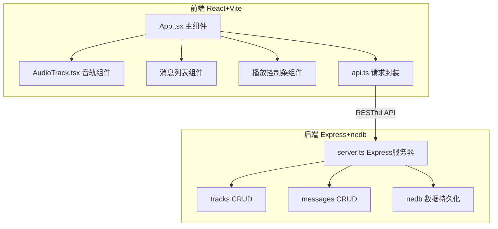
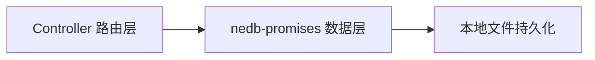
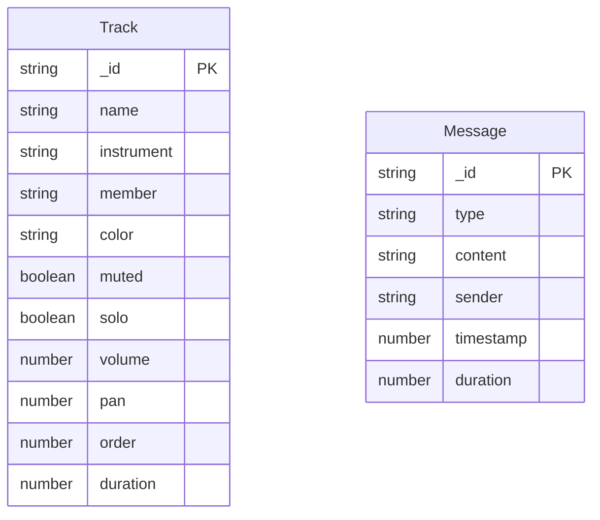

## 1. 架构设计



## 2. 技术说明

- **前端**: React 18 + Vite + TypeScript + Tailwind CSS
- **初始化工具**: vite-init (react-express-ts模板)
- **后端**: Express 4 + nedb-promises (轻量嵌入式数据库)
- **数据库**: nedb (文件持久化，音频模拟数据存JSON)
- **状态管理**: zustand
- **图标**: lucide-react
- **HTTP客户端**: axios

## 3. 路由定义

| 路由 | 用途 |
|------|------|
| / | 排练室主界面（唯一页面，包含播放控制、音轨列表、消息区） |

## 4. API 定义

### 4.1 音轨接口

```typescript
interface Track {
  _id: string;
  name: string;
  instrument: string;
  member: string;
  color: string;
  muted: boolean;
  solo: boolean;
  volume: number;
  pan: number;
  order: number;
  waveformData: number[];
  duration: number;
}

// GET /api/tracks - 获取所有音轨
// POST /api/tracks - 创建音轨
// PUT /api/tracks/:id - 更新音轨
// DELETE /api/tracks/:id - 删除音轨
// PUT /api/tracks/:id/order - 更新音轨顺序
```

### 4.2 消息接口

```typescript
interface Message {
  _id: string;
  type: 'text' | 'voice';
  content: string;
  sender: string;
  timestamp: number;
  duration?: number;
  waveformData?: number[];
}

// GET /api/messages - 获取所有消息
// POST /api/messages - 发送消息
```

## 5. 服务器架构



## 6. 数据模型

### 6.1 数据模型定义



### 6.2 初始数据

项目启动时自动插入模拟音轨数据（4条音轨：鼓、贝斯、吉他、键盘），包含随机生成的波形数据和3条示例消息（2条文字+1条语音），确保首次打开即可体验完整功能。
