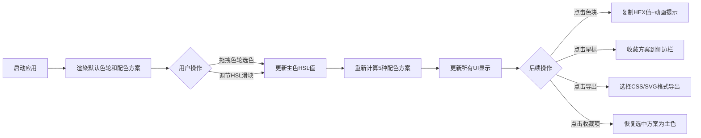

## 1. 产品概述

ColorHarmony是一款面向设计师和前端开发者的在线色轮调色板生成与配色方案推荐工具，帮助用户快速探索、保存和导出专业的色彩搭配方案。

- 核心功能：交互式色轮选色、5种经典配色方案自动生成、颜色细节微调、配色方案收藏、多格式导出
- 目标用户：UI设计师、前端开发者、平面设计师、插画师等需要专业色彩搭配的创意工作者
- 产品价值：将复杂的色彩理论简化为直观的可视化操作，显著提升色彩设计效率和方案质量

## 2. 核心特性

### 2.1 功能模块
1. **主工作区**：交互式色轮组件（Canvas 2D渲染，直径400px）、当前颜色预览块、配色方案面板
2. **颜色细节面板**：HEX/RGB/HSL多格式数值显示、色相/饱和度/明度三滑块精细调节
3. **收藏侧边栏**：可展开/收起的侧边栏，支持配色方案收藏与历史恢复
4. **导出功能区**：固定右下角的导出按钮，支持CSS变量格式和SVG色板格式导出

### 2.2 页面详情
| 页面名称 | 模块名称 | 功能描述 |
|----------|----------|----------|
| 主工作页 | 色轮区域 | Canvas 2D渲染直径400px渐变彩色环，支持鼠标拖拽选色，内圈白色圆形选择器（20px，2px描边），实时高亮色相射线 |
| 主工作页 | 当前颜色预览 | 色轮下方显示40x40px圆角色块，展示选中颜色及十六进制值 |
| 主工作页 | 配色方案面板 | 5种方案（单色/互补/分裂互补/三角/四色），每种4个色块（50x50px，圆角8px），点击复制+动画提示 |
| 颜色细节面板 | 数值显示 | 展示HEX、RGB、HSL三种格式的颜色值 |
| 颜色细节面板 | 滑块控制 | 色相0-360°、饱和度0-100%、明度0-100%三滑块，实时同步更新 |
| 收藏侧边栏 | 方案列表 | 按时间倒序排列，每条显示方案类型+5色缩略图（30x30px），点击恢复 |
| 导出功能 | CSS变量导出 | 生成--color-primary等CSS变量格式文本 |
| 导出功能 | SVG色板导出 | 生成可下载的SVG色板图形文件 |

## 3. 核心流程

用户打开应用后，默认显示色轮主色（如蓝色系），通过拖拽色轮或调节滑块选择主色，系统实时计算5种配色方案。用户可点击色块复制颜色值，点击星标收藏当前方案到侧边栏，最终通过导出按钮获取CSS或SVG格式文件。

## 4. 用户界面设计

### 4.1 设计风格
- **主题色**：深色主题，主背景#111827，面板背景#1f2937，边框色#374151
- **强调色**：#6366f1（靛蓝）用于交互元素，#10b981（翠绿）用于成功提示
- **字体**：主字体使用现代无衬线字体，方案标签14px加粗#374151色
- **按钮样式**：圆角8px，悬停背景变暗10%，过渡动画0.2s ease-in-out
- **滑块样式**：轨道#e5e7eb，圆形滑块18px直径，填充#6366f1
- **布局风格**：三栏式布局（左侧收藏栏0-280px滑出 + 中间主工作区 + 右侧细节面板320px固定）
- **过渡动画**：所有可交互元素统一0.2s ease-in-out过渡

### 4.2 页面设计概述
| 页面区域 | 模块名称 | UI元素与动画 |
|----------|----------|--------------|
| 顶部 | 标题+星标图标 | 品牌标题，右上角星标按钮触发侧边栏滑出（0.3s缓出） |
| 中央 | 色轮组件 | Canvas 2D渐变环，白色色相指示射线，拖拽时圆形选择器跟随，0.2s过渡 |
| 色轮下方 | 当前颜色预览 | 40x40px色块（圆角4px）+ HEX文字标签 |
| 配色方案区 | 5方案水平滚动 | 自定义滚动条8px宽，轨道#1f2937，滑块#4b5563，每行最多2方案 |
| 右侧 | 颜色细节面板 | 320px固定宽，左侧2px边框，三组滑块+数值标签同步更新 |
| 右下角 | 导出按钮 | 固定定位，距右20px距底20px，点击弹出格式选择浮层 |
| 色块点击 | 复制提示 | 0.3s浮动升起提示条，背景#10b981白色文字，圆角12px |

### 4.3 响应式设计
- **桌面端（≥768px）**：三栏布局，色轮400px，配色方案水平滚动2列，细节面板右侧320px
- **移动端（<768px）**：纵向堆叠布局，色轮缩小至280px，细节面板全宽移至色轮下方，配色方案改为垂直单列堆叠
- **触控优化**：所有可拖拽区域增大触控热区，滑块和色块支持触摸事件

### 4.4 性能指标
- 帧率：拖拽选色和滑块操作时稳定60fps
- 延迟：颜色值同步更新响应延迟<50ms
- 优化：初始加载预计算并缓存色环像素数据，避免重复Canvas绘制
