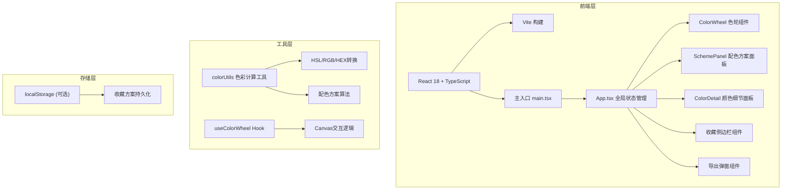

## 1. 架构设计



## 2. 技术说明

- **前端框架**：React 18 + TypeScript 5
- **构建工具**：Vite 5 + @vitejs/plugin-react
- **渲染技术**：Canvas 2D API 渲染色轮
- **状态管理**：React useState/useReducer（无需额外状态库，应用内状态简单）
- **样式方案**：原生CSS模块化（CSS-in-JS通过style标签+类名管理），不引入Tailwind以减少包体积
- **图标方案**：lucide-react 图标库
- **持久化**：localStorage 存储收藏的配色方案

## 3. 文件结构

```
auto31/
├── .trae/documents/          # 文档目录
│   ├── PRD-ColorHarmony.md
│   └── TECH-ColorHarmony.md
├── index.html                # Vite入口HTML
├── package.json              # 项目依赖与脚本
├── vite.config.ts            # Vite构建配置
├── tsconfig.json             # TypeScript配置
└── src/
    ├── main.tsx              # React应用入口
    ├── App.tsx               # 主应用组件，全局状态
    ├── components/
    │   ├── ColorWheel.tsx    # 色轮Canvas组件
    │   ├── SchemePanel.tsx   # 配色方案面板
    │   ├── ColorDetail.tsx   # 颜色细节面板
    │   ├── FavoritesBar.tsx  # 收藏侧边栏
    │   ├── ExportModal.tsx   # 导出弹窗
    │   └── Toast.tsx         # 复制提示组件
    ├── hooks/
    │   └── useColorWheel.ts  # 色轮交互Hook
    └── utils/
        └── colorUtils.ts     # 色彩转换与配色算法
```

## 4. 核心类型定义

```typescript
// 颜色值 - HSL格式（内部主存储格式）
interface HSL {
  h: number; // 0-360
  s: number; // 0-100
  l: number; // 0-100
}

// 配色方案类型
type SchemeType = 'monochromatic' | 'complementary' | 'split' | 'triadic' | 'tetradic';

// 单个配色方案
interface ColorScheme {
  type: SchemeType;
  name: string; // 中文名称
  colors: HSL[]; // 4个颜色
}

// 收藏条目
interface FavoriteEntry {
  id: string;
  timestamp: number;
  primary: HSL;
  schemes: ColorScheme[];
}
```

## 5. 配色方案算法

### 5.1 单色（Monochromatic）
- 基于主色，保持色相不变，调整饱和度和明度生成4个渐变色阶
- 明度偏移：-25%, -12.5%, 0%, +12.5%

### 5.2 互补（Complementary）
- 主色 + 色相180°的互补色，各自生成深浅两个变体共4色

### 5.3 分裂互补（Split Complementary）
- 主色 + 色相150°和210°的两个分裂互补色，共4色（主色+2个分裂色+1个变体）

### 5.4 三角（Triadic）
- 主色 + 色相120°和240°的等距三色，生成4个变体

### 5.5 四色（Tetradic）
- 矩形四角分布：主色+90°、180°、270°四色相，共4色

## 6. 性能优化策略

### 6.1 Canvas渲染优化
- 组件挂载时一次性预渲染整个色环到离屏Canvas缓存
- 交互时仅在缓存画布基础上叠加指示器（选择器、射线），避免逐帧重绘色环像素
- 使用requestAnimationFrame合并连续渲染

### 6.2 状态更新优化
- 颜色计算使用纯函数，避免重复计算
- 使用useCallback缓存事件处理器，防止子组件不必要重渲染
- 使用useMemo缓存配色方案计算结果，仅在主色变化时重算

### 6.3 CSS优化
- 滑块、色块等高频更新元素使用transform而非top/left定位
- 收藏栏滑出使用translateX配合will-change提示GPU加速

## 7. 响应式断点

| 断点 | 屏幕宽度 | 色轮尺寸 | 配色方案布局 | 细节面板位置 |
|------|----------|----------|--------------|--------------|
| 桌面端 | ≥768px | 400px | 水平滚动，2列 | 右侧固定320px |
| 移动端 | <768px | 280px | 垂直堆叠，1列 | 色轮下方全宽 |
