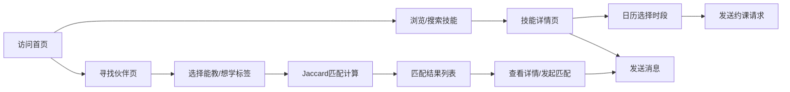

## 1. 产品概述

SkillSwap是一个面向社区技能交换爱好者的轻量在线技能交易平台，解决用户在群聊中低效寻找技能交换伙伴的痛点。用户可发布愿意教授与想学的技能，通过匹配算法寻找合适的交换伙伴，并通过内置日历和消息系统安排教学时间。

- 核心价值：以Jaccard相似系数为核心的智能匹配 + 一站式约课与消息系统，大幅提升技能交换的对接效率
- 目标用户：社区内有一技之长、同时希望学习新技能的活跃爱好者

---

## 2. 核心功能

### 2.1 用户角色

| 角色 | 注册方式 | 核心权限 |
|------|----------|----------|
| 普通用户 | 昵称+邮箱+密码注册 | 浏览技能、发布技能、匹配伙伴、预约时段、收发消息 |

### 2.2 功能模块

1. **首页**：顶部导航栏、搜索框（防抖过滤）、推荐技能卡片网格
2. **技能详情页**：两栏布局（左65%/右35%）、Markdown描述渲染、周视图日历预约、评价列表、消息发送
3. **寻找伙伴页**：最多各选3个"能教/想学"标签、Jaccard相似度匹配（阈值≥0.3）、匹配度排序展示
4. **登录/注册**：表单校验、Token鉴权
5. **消息中心**：历史会话列表、短消息收发

### 2.3 页面详情

| 页面名称 | 模块名称 | 功能描述 |
|----------|----------|----------|
| 首页 | 导航栏 | Logo（金黄圆形）、搜索框（宽320px/圆角20px/焦点边框#e94560/0.3s过渡）、登录/注册按钮 |
| 首页 | 技能卡片网格 | 卡片280×340px/圆角16px/白色投影、顶部200px色块插画、悬停上移4px+阴影加深、点击跳转详情 |
| 技能详情页 | 左栏主内容 | Markdown渲染描述、周视图日历（绿色可选/灰色已约/高32px宽60px圆角8px）、点击弹出日期选择器 |
| 技能详情页 | 右栏个人信息 | 圆形头像100px/3px#e94560边框、金色星级评分4.6/5、评价列表80px/条、100%宽发送消息按钮 |
| 寻找伙伴页 | 标签选择区 | 最多各选3个"能教"与"想学"技能标签 |
| 寻找伙伴页 | 匹配结果列表 | Jaccard系数≥0.3按高到低排序、共有技能彩色小标签（圆角6px/内边距2-8px/#3b82f6）、匹配度百分比≥0.7绿色否则橙色 |
| 消息中心 | 会话与消息 | 会话列表、消息气泡、实时输入发送 |
| 登录/注册 | 认证表单 | 输入校验、Token存储、全局状态更新 |

---

## 3. 核心流程

用户访问首页 → 浏览或搜索技能卡片 → 点击卡片进入详情页 → 查看教学者信息与评价 → 在日历上选择时段发送约课请求 → 或进入"寻找伙伴"页选择技能标签 → 系统返回匹配结果 → 发起匹配或查看详情 → 双方通过消息系统沟通 → 完成技能交换。

---

## 4. 用户界面设计

### 4.1 设计风格

- 主色调：深蓝渐变 `#1a1a2e → #16213e`，强调色 `#e94560`，金黄 `#f0a500`，辅助绿 `#22c55e`、蓝 `#3b82f6`
- 卡片：圆角16px、白色 `#ffffff`、投影 `0 6px 24px rgba(0,0,0,0.10)`，悬停上移4px + 阴影 `0 12px 32px rgba(0,0,0,0.18)`
- 按钮：圆角12px、强调色背景白色文字、0.2s ease-out 过渡
- 字体：系统字体栈 `-apple-system, BlinkMacSystemFont, "Segoe UI", Roboto`，行高1.6
- 整体基调：深色主题（导航深蓝）+ 白色卡片内容区，活力感由强调色和金黄点缀提升

### 4.2 页面设计概览

| 页面名称 | 模块名称 | UI元素 |
|----------|----------|--------|
| 首页 | 导航栏 | 60px高、深蓝渐变背景、圆形Logo40px、搜索框320px圆角20px焦点#e94560 |
| 首页 | 技能卡片 | 280×340、圆角16、白卡投影、200px顶部色块、悬停translateY(-4px) + 阴影加深 |
| 技能详情页 | 左栏 | Markdown代码块#1e1e2e背景#f8f8f2文字、周视图日历绿/灰方块 |
| 技能详情页 | 右栏 | 100px圆形头像+3px#e94560边框、金色实心五角星评分、80px评价条目 |
| 寻找伙伴页 | 匹配卡片 | 彩色小标签#3b82f6圆角6px、匹配度≥0.7#22c55e否则#fb923c、20px加粗数字 |

### 4.3 响应式

- 大屏（≥1024px）：技能卡片三列网格
- 中屏（768-1023px）：两列网格
- 小屏（≤767px）：单列网格、导航栏折叠为汉堡菜单
- Desktop-first 设计，CSS媒体查询 + flex/grid 自适应

### 4.4 性能与交互

- 搜索防抖 300ms
- 首屏 LCP ≤ 2.5s
- 列表滚动 60FPS（使用transform/opacity动画避免重排）
- 所有按钮与卡片 0.2s ease-out 过渡
