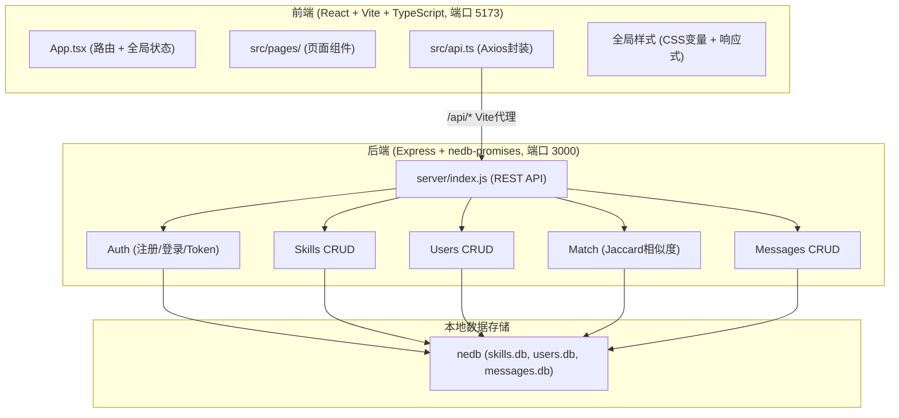
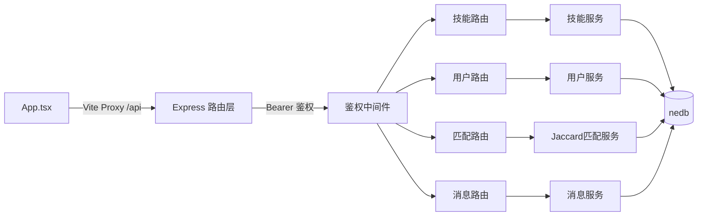
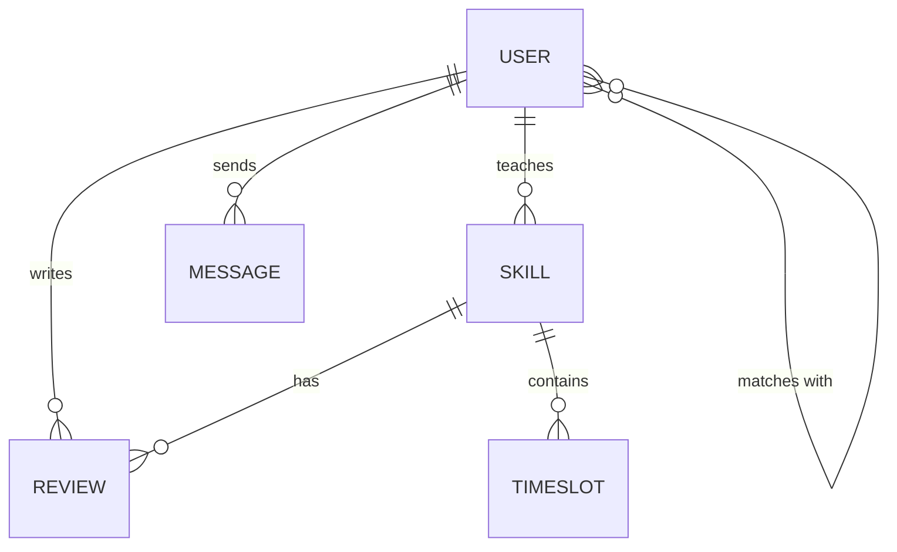

## 1. 架构设计



## 2. 技术说明

- 前端框架：React@18 + React-DOM
- 构建工具：Vite@5 + @vitejs/plugin-react
- 语言：TypeScript@5 (严格模式, target ES2020, moduleResolution: bundler)
- HTTP客户端：axios (统一拦截器附加Bearer Token)
- 路由：react-router-dom (BrowserRouter)
- 后端：Node.js + Express@4
- 数据库：nedb-promises（嵌入式文件数据库，零依赖）
- 唯一ID：uuid
- 启动方式：`npm run dev` 同时启动Vite开发服务器（前台）与Express后端（子进程）

## 3. 路由定义

| 路由 | 用途 |
|------|------|
| `/` | 首页：导航栏 + 搜索 + 技能卡片网格 |
| `/skill/:id` | 技能详情页：两栏布局 + 日历预约 + 评价 |
| `/match` | 寻找伙伴：标签选择 + Jaccard匹配结果列表 |
| `/messages` | 消息中心：会话与消息收发 |
| `/login` | 登录表单 |
| `/register` | 注册表单 |

## 4. API 定义

### 4.1 TypeScript 类型

```typescript
interface User {
  _id: string;
  nickname: string;
  email: string;
  password?: string;
  avatar: string;
  rating: number;         // 0-5
  bio: string;            // Markdown
  canTeach: string[];     // 技能标签
  wantLearn: string[];    // 技能标签
  token?: string;
  createdAt: number;
}

interface Skill {
  _id: string;
  title: string;
  category: string;
  description: string;    // Markdown
  coverColor: string;     // #e94560 | #0f3460 | #533483 | #f0a500
  teacherId: string;
  teacherName: string;
  teacherAvatar: string;
  availableSlots: TimeSlot[];
  createdAt: number;
}

interface TimeSlot {
  id: string;
  dayOfWeek: number; // 0-6 (周日-周六)
  time: string;      // "09:00"
  booked: boolean;
  bookedBy?: string;
}

interface Review {
  _id: string;
  skillId: string;
  userId: string;
  userName: string;
  userAvatar: string;
  rating: number;
  content: string;
  createdAt: number;
}

interface Message {
  _id: string;
  from: string;
  to: string;
  content: string;
  read: boolean;
  createdAt: number;
}

interface MatchResult {
  user: User;
  similarity: number;           // Jaccard ∈ [0,1]
  commonCanTeach: string[];     // 我想学 & 他能教
  commonWantLearn: string[];    // 我能教 & 他想学
}
```

### 4.2 接口列表

| 方法 | 路径 | 说明 | 请求体 | 响应 |
|------|------|------|--------|------|
| POST | `/api/register` | 注册 | `{nickname, email, password}` | `{token, user}` |
| POST | `/api/login` | 登录 | `{email, password}` | `{token, user}` |
| GET  | `/api/skills` | 技能列表(支持?q=) | query | `Skill[]` |
| GET  | `/api/skills/:id` | 技能详情 | - | `Skill & {teacher: User, reviews: Review[]}` |
| GET  | `/api/users` | 用户列表 | - | `User[]` |
| GET  | `/api/users/:id` | 用户详情 | - | `User` |
| GET  | `/api/match` | Jaccard匹配 | query:`canTeach[],wantLearn[]` | `MatchResult[]` |
| POST | `/api/skills/:id/book` | 预约时段 | `{slotId, date}` | `{ok}` |
| GET  | `/api/messages/:peerId` | 与某人的消息 | - | `Message[]` |
| POST | `/api/messages` | 发送消息 | `{to, content}` | `Message` |
| GET  | `/api/reviews/:skillId` | 某技能评价 | - | `Review[]` |

## 5. 服务器架构图



## 6. 数据模型

### 6.1 实体关系图



### 6.2 种子数据（初始化插入）

- 6 名示例用户（覆盖能教/想学多种标签：吉他、编程、烹饪、绘画、摄影、英语、瑜伽、烘焙、书法、游泳）
- 8 条技能（含 Markdown 描述与可约时段）
- 6 条评价（含评分与文本）
- 4 条示例消息

## 7. 前端代码结构

```
src/
├── App.tsx              # 路由 + 全局状态（user/skills）
├── api.ts               # Axios 实例 + 所有接口函数
├── main.tsx             # 入口
├── index.css            # 全局样式、CSS变量、响应式
└── pages/
    ├── Home.tsx         # 首页：导航/搜索/卡片网格
    ├── Detail.tsx       # 技能详情两栏 + 日历 + 评价
    ├── Match.tsx        # 寻找伙伴 + Jaccard结果
    ├── Messages.tsx     # 消息中心
    ├── Login.tsx        # 登录
    └── Register.tsx     # 注册
```
