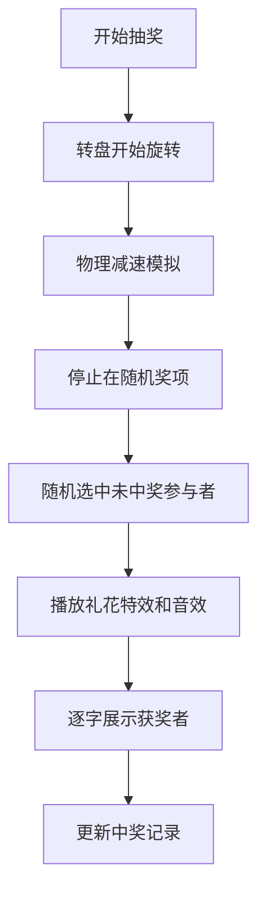

## 1. 产品概述
LotteryBoard是一款为公司年会或社区活动设计的在线抽奖转盘应用，提供大屏沉浸式抽奖体验。
- 主要用途：组织活动现场抽奖，替代传统PPT动画，提供更酷炫的视觉效果
- 目标用户：活动组织者、年会主持人

## 2. 核心功能

### 2.1 功能模块
1. **大屏抽奖展示界面**：中央转盘、粒子礼花效果、获奖者滚动展示
2. **左侧控制面板**：奖项设置、参与者列表管理
3. **右侧中奖记录**：实时展示中奖历史

### 2.2 页面详情
| 页面名称 | 模块名称 | 功能描述 |
|-----------|-------------|---------------------|
| 首页(大屏) | 转盘展示区 | Canvas绘制转盘，支持旋转动画，外圈灯泡闪烁效果 |
| 首页(大屏) | 粒子礼花效果 | 抽中后全屏播放500个粒子喷出动画 |
| 首页(大屏) | 获奖者展示 | 逐字动画展示获奖者姓名 |
| 左侧面板 | 奖项设置 | 4个预设奖项，可编辑颜色和人数 |
| 左侧面板 | 参与者列表 | 50条模拟数据，支持按部门过滤，排除已中奖者 |
| 右侧面板 | 中奖记录 | 时间倒序展示，emoji图标，自定义滚动条 |

## 3. 核心流程
组织者设置奖项和参与者 → 点击开始抽奖 → 转盘旋转减速 → 随机选中奖项 → 随机选中未中奖参与者 → 触发粒子礼花和音效 → 展示获奖者 → 记录中奖历史

## 4. 用户界面设计
### 4.1 设计风格
- 主色调：深蓝渐变 #0a0a23 到 #1a1a3e
- 强调色：#e94560（红色按钮）
- 扇区色：红#ff6b6b、金#feca57、蓝#48dbfb、绿#0abde3、紫#a29bfe
- 灯泡色：金色#ffd700呼吸闪烁
- 按钮：宽180px高56px，圆角28px，hover亮度+20%，点击缩放0.95
- 字体：系统无衬线字体，主标题48px字重300，副标题20px
- 视觉效果：文字阴影#00000080，光晕效果

### 4.2 页面设计概述
| 页面名称 | 模块名称 | UI元素 |
|-----------|-------------|-------------|
| 首页 | 转盘区 | Canvas转盘、外圈灯泡、开始按钮、获奖者文字动画 |
| 首页 | 左侧面板 | 半透明背景300px宽、奖项编辑框、参与者列表带头像 |
| 首页 | 右侧面板 | 中奖记录列表、自定义滚动条、emoji图标 |

### 4.3 响应式
- 桌面优先设计，适配1920x1080和1440x900两种分辨率
- 转盘和按钮尺寸等比缩放
