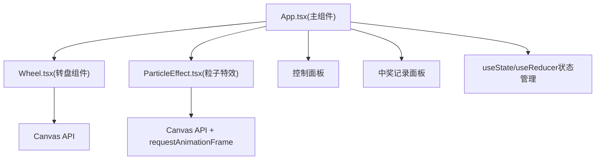

## 1. 架构设计


## 2. 技术描述
- 前端：React@18 + TypeScript + Vite
- 状态管理：React useState + useReducer
- 动画：Canvas API + requestAnimationFrame (60fps)
- 音频：Web Audio API (440Hz正弦波音效)
- 纯前端项目，数据为模拟数据

## 3. 文件结构
```
├── package.json
├── index.html
├── vite.config.ts
├── tsconfig.json
└── src/
    ├── App.tsx           # 主组件，布局+状态管理
    ├── Wheel.tsx         # 转盘Canvas组件
    ├── ParticleEffect.tsx # 粒子礼花Canvas组件
    └── styles.css        # 全局样式
```

## 4. 数据模型
### 4.1 参与者 Participant
```typescript
interface Participant {
  id: string;
  name: string;
  department: string;
  hasWon: boolean;
  winHistory: { prize: string; time: string }[];
}
```

### 4.2 奖项 Prize
```typescript
interface Prize {
  id: string;
  name: string;
  count: number;
  color: string;
  emoji: string;
}
```

### 4.3 中奖记录 WinRecord
```typescript
interface WinRecord {
  id: string;
  participantName: string;
  prizeName: string;
  prizeColor: string;
  prizeEmoji: string;
  time: string;
}
```

## 5. 性能要求
- 转盘动画和粒子礼花保持60fps
- 抽奖逻辑响应时间 < 50ms
- 使用requestAnimationFrame驱动所有Canvas动画
