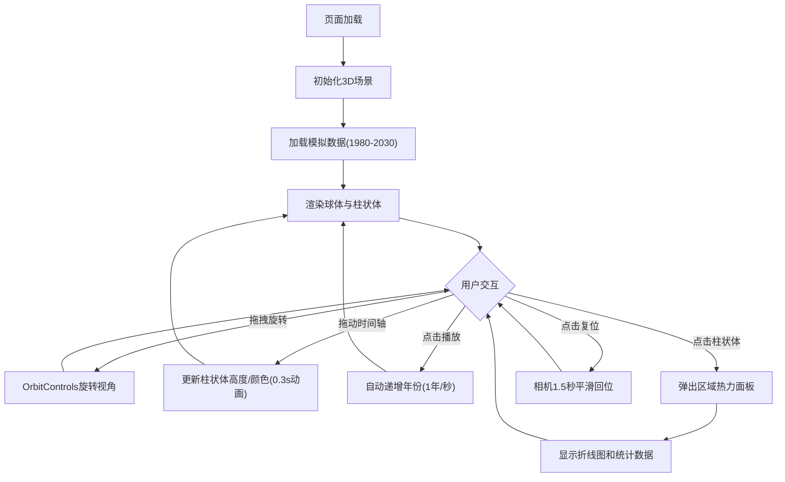

## 1. 产品概述

GlacialDrift 是一款3D全球冰川消融数据动态可视化应用，面向数据新闻记者和公众观众，将1980-2030年间全球主要冰川区域的消融观测数据转化为可交互的3D球体地图。用户可旋转视角、拖动时间轴，直观观察阿拉斯加、青藏高原、安第斯山脉等区域的体积变化趋势和热力分布，旨在以沉浸式可视化方式传达气候变化的紧迫性。

## 2. 核心功能

### 2.1 功能模块

1. **全球3D球体可视化页**：半透明球体 + 经纬线网格 + 径向柱状体 + 光晕粒子层
2. **年份时间轴交互**：底部水平滑块，实时平滑更新柱状体高度/颜色
3. **区域热力数据面板**：点击柱状体弹出悬浮窗口，显示名称、消融速率、海拔变化、历史折线图
4. **视角控制与相机动画**：OrbitControls + 复位按钮（1.5秒平滑回归初始视角）
5. **模拟数据自动播放**：播放/暂停按钮，自动递增年份，交互时自动暂停

### 2.2 页面详情

| 页面名称 | 模块名称 | 功能描述 |
|---------|---------|---------|
| 主场景 | 3D球体地图 | 半透明球体（半径5，颜色#1a1a2e）、经纬线网格（#333355，透明度0.4）、径向柱状体（半径0.3，高度映射消融体积，颜色#0044cc→#ff6633渐变）、半透明光晕粒子层（透明度0.3） |
| 主场景 | 年份时间轴 | 水平滑块（宽600px，轨道高4px #444466，滑块按钮直径20px #ff6633），拖动时柱状体0.3秒ease-out动画更新，左上角面板显示年份数字和总消融量 |
| 主场景 | 区域热力面板 | 点击柱状体弹出悬浮窗（居中偏右，背景#1a1a2e透明度0.9，圆角12px，宽320px），含区域名称、消融速度、海拔变化、Canvas折线图 |
| 主场景 | 视角控制 | OrbitControls旋转/平移/缩放，复位按钮（右下角，直径48px，背景#ff6633透明度0.8，悬停不透明），1.5秒平滑回位 |
| 主场景 | 自动播放 | 播放/暂停按钮（时间轴左侧，直径36px，#3366cc），年份自动递增，交互时暂停 |

## 3. 核心流程

用户打开页面 → 3D球体渲染完成（默认显示1980年数据）→ 用户可拖拽旋转球体查看各冰川区域 → 拖动时间轴或点击播放按钮切换年份 → 柱状体高度和颜色平滑变化 → 点击某柱状体弹出详细面板 → 点击复位按钮回到初始视角

## 4. 界面设计

### 4.1 设计风格

- **主色调**：深色科技感主题，背景#0a0a1a，面板#1a1a2e，边框#333355
- **按钮风格**：圆角8px，半透明磨砂玻璃效果，统一阴影#00000040偏移0 4px blur12px
- **字体**：无衬线字体（Inter / Roboto），数据标签白色加粗
- **布局风格**：全屏3D场景 + 浮动UI面板叠加
- **色彩渐变**：柱状体#0044cc→#ff6633，时间轴#3366cc→#6633ff，强调色#ff6633

### 4.2 页面设计概览

| 页面名称 | 模块名称 | UI元素 |
|---------|---------|--------|
| 主场景 | 左上角信息面板 | 磨砂玻璃效果，显示当前年份（大号白色加粗）和总消融量 |
| 主场景 | 底部时间轴 | 居中600px宽滑块，左侧播放按钮，轨道渐变#3366cc→#6633ff |
| 主场景 | 右下角复位按钮 | 圆形48px，#ff6633半透明，悬停不透明，图标为旋转箭头 |
| 主场景 | 区域热力悬浮窗 | 居中偏右320px，磨砂玻璃，含折线图Canvas |
| 主场景 | 鼠标悬停柱状体 | 边缘发光线框#ff6633，1.5单位半径，0.3秒动画 |

### 4.3 响应式适配

- **桌面优先**：默认布局，屏幕宽度>1200px时展示更多区域数据标签
- **平板适配**：屏幕宽度768-1200px，标准布局
- **移动适配**：屏幕宽度<768px，相机距离增大到22单位，时间轴和面板堆叠排列

### 4.4 3D场景指引

- **环境氛围**：深空背景#0a0a1a，半透明球体#1a1a2e营造地球轮廓感
- **灯光设置**：环境光（低强度）+ 方向光（模拟太阳角度），突出柱状体立体感
- **相机设置**：初始方位角0度、仰角30度、距离18单位，支持OrbitControls自由旋转
- **交互与动画**：柱状体高度变化0.3秒ease-out，相机复位1.5秒平滑，悬停发光0.3秒
- **后期效果**：光晕粒子层营造大气感，柱状体颜色渐变传达数据含义
- **性能预算**：30 FPS以上，批量更新几何体顶点，缓存高斯模糊贴图
