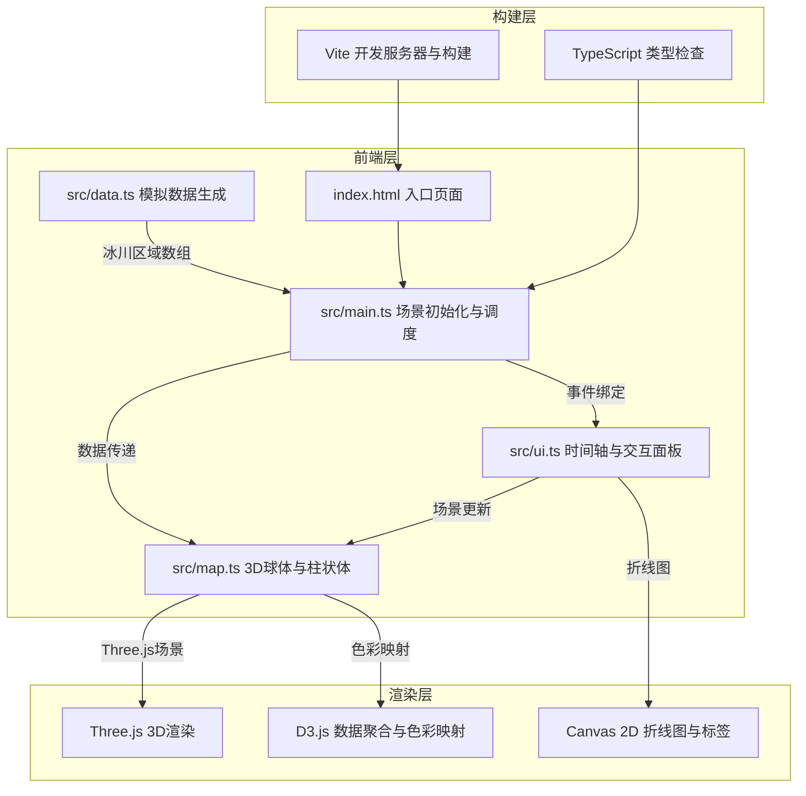
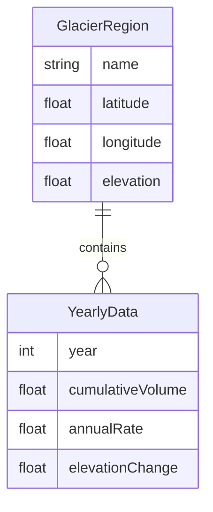

## 1. 架构设计



## 2. 技术说明

- **前端框架**：纯 TypeScript + Three.js + D3.js（无React/Vue，按用户需求使用原生模块化架构）
- **构建工具**：Vite + TypeScript
- **3D渲染**：Three.js（球体、柱状体、粒子系统、OrbitControls）
- **数据处理**：D3.js（数据聚合、色彩映射#0044cc→#ff6633）
- **2D绘制**：Canvas 2D API（折线图、年份标签、统计面板）
- **无后端**：所有数据为前端模拟生成

## 3. 路由定义

| 路由 | 用途 |
|------|------|
| / | 单页应用，包含3D球体、时间轴、面板等所有交互组件 |

## 4. API定义

无后端API，所有数据由 `src/data.ts` 前端模拟生成。

### 数据接口定义

```typescript
interface GlacierRegion {
  name: string;
  latitude: number;
  longitude: number;
  elevation: number;
  yearlyData: YearlyData[];
}

interface YearlyData {
  year: number;
  cumulativeVolume: number;
  annualRate: number;
  elevationChange: number;
}
```

## 5. 服务器架构图

无服务器端，纯前端应用。

## 6. 数据模型

### 6.1 数据模型定义



### 6.2 模拟数据说明

- **时间范围**：1980-2030年（51个年份）
- **冰川区域**：阿拉斯加、青藏高原、安第斯山脉、阿尔卑斯、冰岛、帕米尔、斯堪的纳维亚、喜马拉雅、落基山脉、高加索等10个区域
- **数据特征**：累计消融体积随年份递增，年均速率有波动，海拔变化为负值递增

## 7. 文件调用关系与数据流向

```
index.html
  └── src/main.ts（入口，初始化场景/相机/渲染器/OrbitControls）
        ├── src/data.ts（模拟数据生成）→ 输出 GlacierRegion[]
        │     └── 数据流向 → main.ts
        ├── src/map.ts（3D球体+柱状体+粒子层）
        │     └── 接收数据 ← main.ts，输出3D场景对象 → main.ts
        └── src/ui.ts（时间轴+面板+按钮）
              └── 接收数据 ← main.ts，触发场景更新 → main.ts → map.ts
```

## 8. 性能策略

- **帧率控制**：requestAnimationFrame + 帧率限制确保30FPS+
- **批量更新**：柱状体高度变化时批量更新几何体顶点位置，不逐个重建
- **缓存优化**：鼠标悬停光环效果使用缓存高斯模糊贴图
- **动画平滑**：CSS transition处理UI动画，Three.js tween处理3D动画
