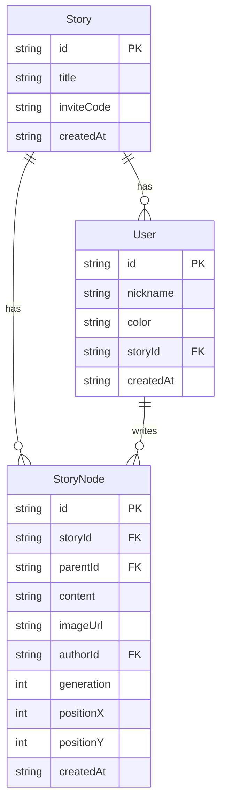

## 1. 架构设计

```mermaid
graph TB
    "前端 React+Vite" --> "Vite Dev Server :5173"
    "Vite Dev Server :5173" --> "API代理 /api → :3001"
    "Vite Dev Server :5173" --> "WebSocket :3001"
    "后端 Express :3001" --> "REST API /api/*"
    "后端 Express :3001" --> "Socket.io WebSocket"
    "后端 Express :3001" --> "better-sqlite3 数据库"
```

## 2. 技术说明

- **前端**：React@18 + TypeScript + Vite + react-router-dom + axios + socket.io-client
- **初始化工具**：vite-init（react-express-ts模板）
- **后端**：Express@4 + TypeScript + ts-node + better-sqlite3 + socket.io + uuid
- **数据库**：SQLite（better-sqlite3），文件存储在 `server/data/tribetales.db`
- **样式方案**：CSS Modules + CSS变量（非Tailwind，因用户需求高度定制化）
- **状态管理**：React Context + useReducer（轻量级，无需zustand）

## 3. 路由定义

| 路由 | 用途 |
|------|------|
| `/` | 首页 - 故事森林概览 |
| `/story/:id` | 故事详情页 - 故事树交互 |
| `/join/:inviteCode` | 邀请链接加入页面 |

## 4. API定义

### 4.1 故事数据 API

```typescript
// GET /api/stories - 获取故事列表
interface Story {
  id: string;
  title: string;
  createdAt: string;
  nodeCount: number;
  contributorCount: number;
  latestSummary: string;
  inviteCode: string;
}
interface StoryListResponse { stories: Story[]; }

// POST /api/stories - 创建新故事
interface CreateStoryRequest { title: string; content: string; imageUrl?: string; userId: string; }
interface CreateStoryResponse { story: Story; rootNode: StoryNode; }

// GET /api/stories/:id - 获取故事详情（含所有节点）
interface StoryNode {
  id: string;
  storyId: string;
  parentId: string | null;
  content: string;
  imageUrl: string | null;
  authorId: string;
  generation: number;
  createdAt: string;
  positionX: number;
  positionY: number;
}
interface StoryDetailResponse { story: Story; nodes: StoryNode[]; }

// POST /api/stories/:id/nodes - 续写节点
interface CreateNodeRequest { parentId: string; content: string; imageUrl?: string; userId: string; }
interface CreateNodeResponse { node: StoryNode; }
```

### 4.2 用户管理 API

```typescript
// POST /api/users - 创建/加入用户
interface CreateUserRequest { nickname: string; inviteCode: string; }
interface CreateUserResponse { user: User; token: string; }

// GET /api/users/:id - 获取用户信息
interface User {
  id: string;
  nickname: string;
  color: string;
  storyId: string;
  createdAt: string;
}

// GET /api/stories/:id/contributors - 获取故事贡献者
interface Contributor { user: User; generation: number; nodeCount: number; }
interface ContributorsResponse { contributors: Contributor[]; }

// GET /api/stories/:id/timeline - 获取故事时间线
interface TimelineEvent { date: string; description: string; nodeCount: number; }
interface TimelineResponse { events: TimelineEvent[]; }
```

### 4.3 WebSocket事件

```typescript
// 客户端 → 服务器
"node:lock"       // { storyId: string; nodeId: string; userId: string; }
"node:unlock"     // { storyId: string; nodeId: string; userId: string; }
"node:create"     // { storyId: string; parentId: string; content: string; userId: string; }

// 服务器 → 客户端
"node:locked"     // { storyId: string; nodeId: string; userId: string; nickname: string; color: string; }
"node:unlocked"   // { storyId: string; nodeId: string; }
"node:created"    // { storyId: string; node: StoryNode; }
```

## 5. 服务器架构图

```mermaid
graph LR
    "Controller 路由层" --> "Service 业务层"
    "Service 业务层" --> "Repository 数据层"
    "Repository 数据层" --> "SQLite 数据库"
```

- **Controller**：Express路由处理HTTP请求，参数校验，调用Service
- **Service**：业务逻辑处理（故事CRUD、分支计算、用户管理）
- **Repository**：better-sqlite3数据库操作
- **WebSocket**：socket.io事件处理，独立于HTTP路由

## 6. 数据模型

### 6.1 数据模型定义



### 6.2 数据定义语言

```sql
CREATE TABLE stories (
  id TEXT PRIMARY KEY,
  title TEXT NOT NULL,
  inviteCode TEXT NOT NULL UNIQUE,
  createdAt TEXT NOT NULL DEFAULT (datetime('now'))
);

CREATE TABLE story_nodes (
  id TEXT PRIMARY KEY,
  storyId TEXT NOT NULL REFERENCES stories(id),
  parentId TEXT REFERENCES story_nodes(id),
  content TEXT NOT NULL,
  imageUrl TEXT,
  authorId TEXT NOT NULL REFERENCES users(id),
  generation INTEGER NOT NULL DEFAULT 0,
  positionX INTEGER NOT NULL DEFAULT 0,
  positionY INTEGER NOT NULL DEFAULT 0,
  createdAt TEXT NOT NULL DEFAULT (datetime('now'))
);

CREATE TABLE users (
  id TEXT PRIMARY KEY,
  nickname TEXT NOT NULL,
  color TEXT NOT NULL,
  storyId TEXT NOT NULL REFERENCES stories(id),
  createdAt TEXT NOT NULL DEFAULT (datetime('now'))
);

CREATE INDEX idx_nodes_story ON story_nodes(storyId);
CREATE INDEX idx_nodes_parent ON story_nodes(parentId);
CREATE INDEX idx_users_story ON users(storyId);
```
