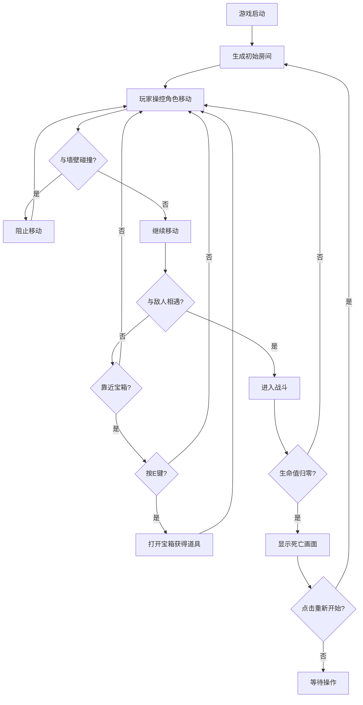

## 1. 产品概述
DungeonRogue是一款带有roguelike元素的2D地牢闯关游戏，玩家在随机生成的地牢房间中探索、战斗和收集道具，死亡后解锁新要素。
- 面向独立游戏爱好者和roguelike游戏玩家，提供可复现的随机地牢体验
- 产品核心价值：每次冒险都有独特体验，通过渐进解锁机制提供长期可玩性

## 2. 核心特性

### 2.1 用户角色
| 角色 | 注册方式 | 核心权限 |
|------|----------|----------|
| 玩家 | 无需注册，直接游玩 | 操控角色、探索地牢、收集道具、重新开始 |

### 2.2 功能模块
1. **游戏主界面**：Canvas画布渲染、HUD信息显示、死亡画面
2. **地牢生成系统**：随机房间布局、敌人放置、宝箱生成
3. **玩家操控系统**：WASD移动、碰撞检测、道具交互
4. **敌人AI系统**：追逐行为、移动攻击、不同敌人特性
5. **道具系统**：宝箱开启、随机奖励、属性加成、背包显示

### 2.3 页面详情
| 页面名称 | 模块名称 | 功能描述 |
|----------|----------|----------|
| 游戏主界面 | Canvas画布 | 800x600像素黑色背景，深灰色边框，居中显示地牢地图、玩家、敌人和道具 |
| 游戏主界面 | HUD信息栏 | 毛玻璃效果，显示生命值（红色心形）、金币（金色图标）、道具栏和房间编号 |
| 游戏主界面 | 死亡画面 | 半透明灰色遮罩，居中显示"你已死亡"文字和"重新开始"按钮 |

## 3. 核心流程
玩家进入游戏后操控角色探索随机生成的地牢房间，通过WASD键移动避开墙壁，接近敌人时触发战斗，靠近宝箱按E键获取道具。生命值归零时显示死亡画面，点击重新开始重置游戏并保留已解锁道具。

## 4. 用户界面设计

### 4.1 设计风格
- 主色调：深黑色背景 #0a0a0a，深灰边框 #1a1a1a
- 强调色：玩家绿色 #00ff00，蝙蝠敌人红色 #ff4444，骷髅敌人灰色 #888888，生命红色 #ff4444，金币金色 #ffd700
- 字体：系统默认无衬线字体，HUD数字清晰易读，死亡文字48px大号
- 布局：画布居中，HUD位于画布上方，死亡画面全屏半透明遮罩
- 图标：生命心形❤、金币金币形🪙，道具栏40x40px白色边框

### 4.2 页面设计概览
| 页面名称 | 模块名称 | UI元素 |
|----------|----------|--------|
| 游戏主界面 | Canvas画布 | 800x600px黑色画布，深灰色4px边框，居中显示，地图格子40x40px |
| 游戏主界面 | HUD信息栏 | 毛玻璃背景 #ffffff1a，圆角8px，内边距10px，显示生命❤、金币🪙、道具框、房间号 |
| 游戏主界面 | 死亡画面 | 半透明灰色背景 #80808080，居中白色48px"你已死亡"文字，下方"重新开始"按钮 |

### 4.3 响应式
桌面端优先，固定画布尺寸800x600px，页面整体居中布局。

### 4.4 动画效果
- 房间切换：0.3秒渐隐动画（alpha 1→0→新房间）
- 敌人移动：平滑位置更新
- 道具获得：视觉反馈
