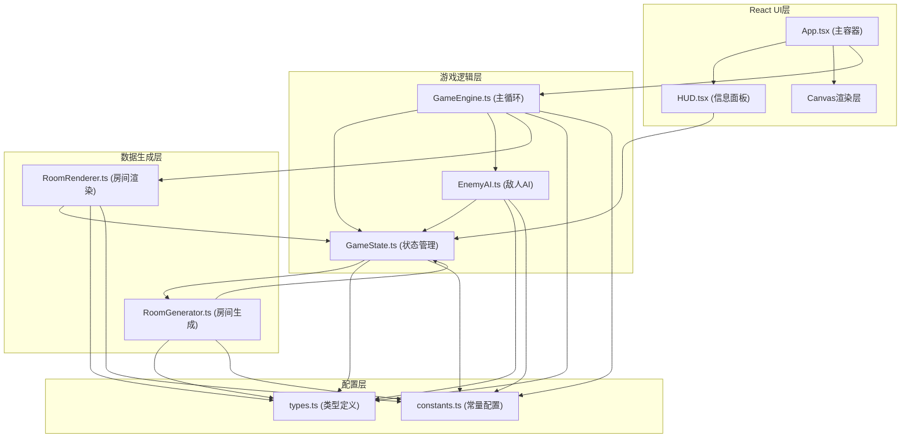

## 1. 架构设计



数据流向：
- GameEngine → 从GameState读取状态 → 调用RoomRenderer渲染 → 调用EnemyAI更新
- RoomGenerator → 基于种子生成Room对象 → 写入GameState
- HUD → 从GameState读取玩家数据 → 更新DOM显示
- EnemyAI → 从GameEngine接收环境数据 → 计算动作返回

## 2. 技术描述
- 前端：React 18 + TypeScript + Vite
- 渲染：Canvas API (2D上下文)
- 状态管理：自定义状态类（无外部状态库）
- 构建工具：Vite
- 样式：原生CSS (内联样式 + style标签)

## 3. 目录结构
```
src/
├── App.tsx              # 主应用组件
├── main.tsx             # 入口文件
├── index.css            # 全局样式
├── types.ts             # 类型定义
├── constants.ts         # 游戏常量
├── game/
│   ├── GameEngine.ts    # 游戏主循环
│   └── GameState.ts     # 全局状态管理
├── rooms/
│   ├── RoomGenerator.ts # 随机房间生成
│   └── RoomRenderer.ts  # Canvas房间渲染
├── enemies/
│   └── EnemyAI.ts       # 敌人AI逻辑
└── ui/
    └── HUD.tsx          # HUD界面组件
```

## 4. 数据模型

### 4.1 核心类型定义
```typescript
// 格子类型
type TileType = 'floor' | 'wall' | 'door';

// 道具类型
type ItemType = 'heal' | 'attack' | 'gold';

// 敌人类型
type EnemyType = 'bat' | 'skeleton';

// 位置坐标
interface Position {
  x: number;
  y: number;
}

// 玩家状态
interface Player {
  x: number;
  y: number;
  hp: number;
  maxHp: number;
  attack: number;
  gold: number;
  speed: number;
  inventory: Item[];
}

// 敌人实体
interface Enemy {
  id: string;
  type: EnemyType;
  x: number;
  y: number;
  hp: number;
  maxHp: number;
  speed: number;
  damage: number;
}

// 宝箱
interface Chest {
  id: string;
  x: number;
  y: number;
  opened: boolean;
  item: Item;
}

// 道具
interface Item {
  id: string;
  type: ItemType;
  value: number;
  name: string;
}

// 房间
interface Room {
  id: number;
  width: number;
  height: number;
  tiles: TileType[][];
  enemies: Enemy[];
  chests: Chest[];
  seed: number;
}

// 游戏状态
type GameStatus = 'playing' | 'dead' | 'transitioning';
```

## 5. 性能优化策略
1. **帧率控制**：requestAnimationFrame实现60FPS稳定帧率
2. **AI降频**：敌人AI每5帧更新一次决策，减少计算开销
3. **视野裁剪**：Canvas仅渲染当前视野内元素（完整房间为视野范围）
4. **状态缓存**：GameState使用引用优化，避免不必要的重渲染
5. **渐变动画**：房间切换使用CSS opacity过渡，GPU加速
