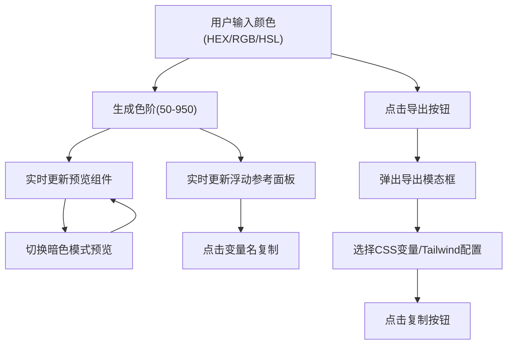

## 1. 产品概述

ChromaChord 是一款面向前端开发者和设计师的浏览器端 UI 色彩主题构建工具，让用户在浏览器中可视化地构建和微调完整的 UI 色彩主题（主色、辅色、中性色、成功/警告/错误状态色），并实时预览颜色在不同组件上的应用效果，一键导出为 CSS 变量或 Tailwind 配置代码，消除在 Figma 和编辑器之间反复切换的痛点。

## 2. 核心功能

### 2.1 功能模块

1. **色彩编辑器页面**：左侧色彩编辑面板（色块预览、颜色输入、色阶滑块、色阶卡片展示、导出按钮）
2. **组件预览画布**：右侧实时预览区（按钮、卡片、输入框、导航栏），支持暗色模式切换
3. **浮动参考面板**：左下角毛玻璃浮层，展示全部 CSS 变量名和色值，支持一键复制
4. **导出模态框**：居中弹窗，支持 CSS 变量和 Tailwind 配置两种导出格式切换和复制

### 2.2 页面详情

| 页面名称 | 模块名称 | 功能描述 |
|---------|---------|---------|
| 主页 | 色彩编辑面板 | 支持输入 HEX/RGB/HSL 值，圆形色块预览带缩放动画，色阶滑块生成50-950共10个色阶，竖排卡片展示色阶，底部导出按钮 |
| 主页 | 组件预览画布 | 横向排列按钮（填充/轮廓）、卡片、输入框、导航栏，暗色模式切换开关，切换时0.3秒配色过渡 |
| 主页 | 浮动参考面板 | 固定左下角，毛玻璃背景，两列网格展示CSS变量名和色值方块，变量名可一键复制 |
| 主页 | 导出模态框 | 居中弹窗，CSS变量和Tailwind配置两个Tab，深色复制按钮带闪烁反馈 |

## 3. 核心流程

用户在左侧面板输入或选择颜色 → 颜色实时生成色阶并同步到右侧预览 → 用户切换暗色模式查看效果 → 参考面板实时展示所有CSS变量 → 点击导出按钮打开模态框 → 选择格式并复制代码

## 4. 用户界面设计

### 4.1 设计风格

- 主色调：用户自定义（默认 #6366f1）
- 编辑器背景：深灰 #1e1e2e
- 预览区背景：暖白 #f8f9fa / 暗色 #1a1a2e
- 毛玻璃效果：rgba(255,255,255,0.6) + backdrop-filter blur
- 按钮：圆角8-12px，带悬停阴影和亮度变化动画
- 字体：JetBrains Mono（代码/变量）+ DM Sans（界面文字）
- 布局：左右分栏，左侧固定360px，右侧自适应最小600px
- 动画：所有交互0.1-0.3秒平滑缓动

### 4.2 页面设计概览

| 页面名称 | 模块名称 | UI元素 |
|---------|---------|--------|
| 主页 | 色彩编辑面板 | 深灰背景#1e1e2e，圆形色块48px，输入框圆角8px，滑块轨道6px高，色阶卡片44px高，导出按钮圆角12px |
| 主页 | 组件预览画布 | 暖白背景，填充按钮44px高，轮廓按钮2px边框，卡片200x160px圆角12px，输入框44px高，导航栏56px高 |
| 主页 | 浮动参考面板 | 毛玻璃#ffffff99，圆角12px，色值方块24x24px，两列网格 |
| 主页 | 导出模态框 | 宽480px，圆角16px，scale入场动画0.2秒，Tab切换渐隐渐显0.15秒 |

### 4.3 响应式

- 桌面优先设计，左侧面板固定360px不随视口变化
- 右侧预览区最小宽度600px，低于时显示"需要更大屏幕"提示
- 浮动参考面板固定定位不随滚动移动

## 5. 性能要求

- 同时编辑6个颜色并实时更新30个预览组件时帧率≥55FPS
- 导出代码生成时间≤100ms
- 所有颜色计算使用节流/防抖优化
