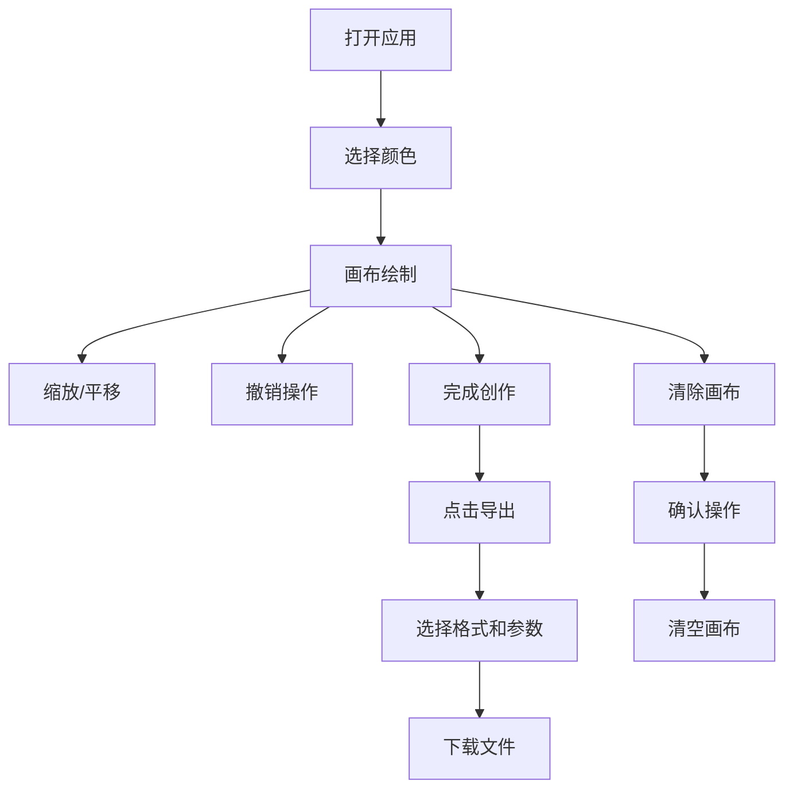

## 1. 产品概述

ColorBurst是一款基于浏览器的像素风格全景图创作工具，用户可以通过拖拽和组合颜色块来创作像素艺术作品，并支持导出为PNG或SVG格式。

- 主要用途：让爱好者和创作者能够快速创作像素风格的数字艺术作品
- 目标用户：像素艺术爱好者、游戏开发者、UI设计师、创意工作者
- 核心价值：提供简洁高效的像素绘画体验，支持无损导出，零门槛创作

## 2. 核心功能

### 2.1 用户角色

| 角色 | 注册方式 | 核心权限 |
|------|----------|----------|
| 普通用户 | 无需注册，直接使用 | 完整的绘画、导出、撤销功能 |

### 2.2 功能模块

1. **像素画布**：可绘制的网格画布，支持缩放、平移操作
2. **颜色选择面板**：48种预设颜色 + 自定义取色器
3. **工具栏**：导出、撤销、清除画布功能
4. **导出系统**：PNG（1x/2x/4x缩放）和SVG格式导出

### 2.3 页面详情

| 页面名称 | 模块名称 | 功能描述 |
|---------|----------|----------|
| 主应用页面 | 像素画布 | 32x32网格画布，支持鼠标拖拽绘制，滚轮缩放，右键平移 |
| 主应用页面 | 颜色面板 | 48种预设颜色网格，自定义取色器，当前颜色高亮显示 |
| 主应用页面 | 工具栏 | 导出按钮、撤销按钮、清除画布按钮 |
| 导出弹窗 | 导出选项 | 选择导出格式（PNG/SVG）、PNG缩放比例（1x/2x/4x） |
| 确认弹窗 | 清除确认 | 确认是否清空画布，操作不可撤销 |

## 3. 核心流程

用户打开应用 → 选择颜色 → 在画布上拖拽绘制 → 可缩放/平移查看细节 → 可撤销错误操作 → 完成创作后导出作品 → 选择格式和参数 → 下载文件

## 4. 用户界面设计

### 4.1 设计风格

- **主色调**：深色主题，背景#1e1e2e，工具栏#2a2a3e，主按钮#4a90e2
- **辅助色**：警示色#ff4444，网格线#ddd，画布背景#fff
- **按钮风格**：圆角设计，导出按钮圆角8px，工具栏圆角12px
- **字体**：现代无衬线字体，清晰易读
- **布局风格**：左侧固定工具栏 + 中央画布区域，卡片式设计
- **交互反馈**：所有可交互元素都有0.2秒过渡动画，色块悬停放大1.1倍

### 4.2 页面设计概述

| 页面名称 | 模块名称 | UI元素 |
|---------|----------|--------|
| 主应用 | 像素画布 | 32x32网格，白色背景，浅灰网格线，支持拖拽绘制 |
| 主应用 | 颜色面板 | 8行6列颜色网格（30x30px色块，圆角4px），50x50px当前颜色展示（圆角8px，边框2px） |
| 主应用 | 工具栏 | 顶部导出按钮（120x40px，蓝色），底部撤销按钮（圆形40px）和清除按钮 |
| 弹窗 | 导出选项 | 居中白色卡片，圆角12px，阴影效果，格式和缩放选择 |
| 弹窗 | 清除确认 | 居中红色警示卡片，圆角8px，确认/取消按钮 |

### 4.3 响应式设计

- **桌面端（≥768px）**：左侧固定工具栏（宽220px），中央画布区域
- **移动端（<768px）**：工具栏变为底部固定栏（高80px，水平滚动），画布高度自适应
- **触摸优化**：支持触摸绘制，按钮尺寸适合手指点击

### 4.4 动画与交互

- 色块悬停：放大1.1倍，0.2秒过渡
- 按钮悬停：背景色变化，0.2秒过渡
- 撤销按钮点击：0.1秒缩小再复原动画
- 弹窗出现：平滑淡入效果
- 画布平移：光标变为抓取手势（grab）

## 5. 非功能需求

### 5.1 性能要求

- 画布最大支持64x64像素
- 所有操作（绘制、撤销、缩放、平移）帧率不低于30fps
- 4x缩放PNG导出时间不超过2秒
- 文件命名格式：colorburst_YYYYMMDD_HHmmss.png/svg

### 5.2 技术约束

- 使用TypeScript + React + Vite实现
- 导出功能使用file-saver库
- 撤销历史最多保存50步
- 缩放范围：0.5x到4x
