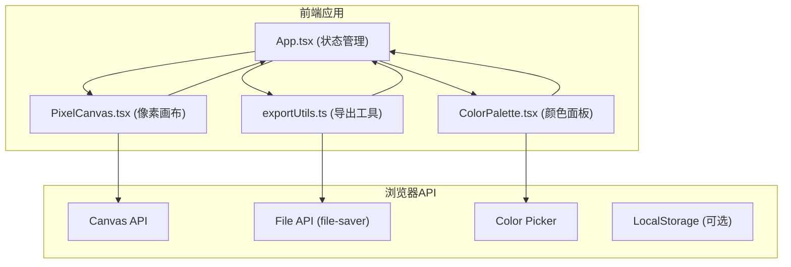
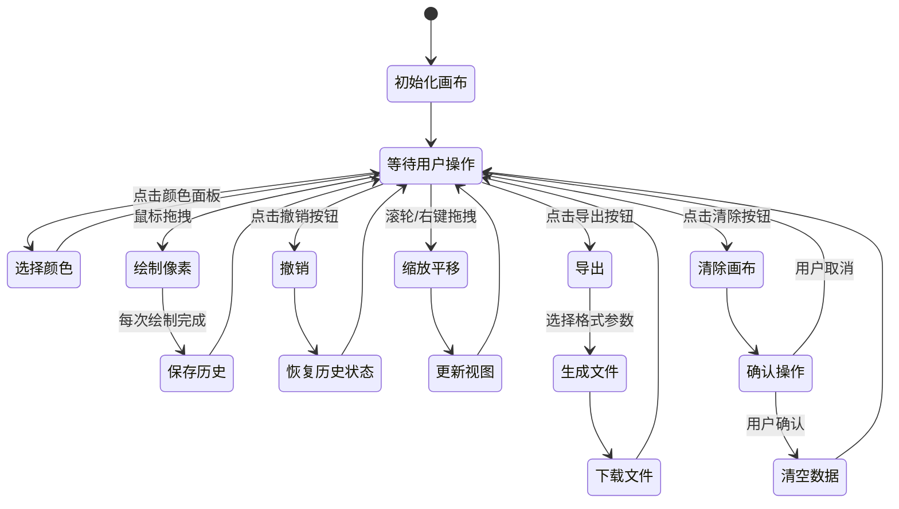

## 1. 架构设计



## 2. 技术描述

- **前端框架**: React 18 + TypeScript
- **构建工具**: Vite 5
- **核心依赖**: 
  - react, react-dom (UI框架)
  - @vitejs/plugin-react (Vite React插件)
  - typescript (类型系统)
  - @types/react, @types/react-dom (类型定义)
  - file-saver (文件下载)
  - @types/file-saver (类型定义)
- **后端**: 无，纯前端应用
- **数据库**: 无，数据保存在内存中

## 3. 目录结构

```
auto60/
├── package.json              # 项目配置和依赖
├── tsconfig.json             # TypeScript配置
├── vite.config.ts            # Vite配置
├── index.html                # HTML入口
└── src/
    ├── main.tsx              # React应用入口
    ├── App.tsx               # 主应用组件
    ├── components/
    │   ├── ColorPalette.tsx  # 颜色选择面板
    │   └── PixelCanvas.tsx   # 像素画布组件
    └── utils/
        └── exportUtils.ts    # 导出工具函数
```

## 4. 数据模型

### 4.1 类型定义

```typescript
// 单个像素数据
interface Pixel {
  x: number;
  y: number;
  color: string;
}

// 画布数据 - 使用Map存储，key为"x,y"格式，value为颜色值
type CanvasData = Map<string, string>;

// 撤销历史记录
interface HistoryState {
  data: CanvasData;
  timestamp: number;
}

// 视图状态
interface ViewState {
  scale: number;       // 缩放比例 0.5-4
  offsetX: number;     // X轴平移偏移
  offsetY: number;     // Y轴平移偏移
}

// 导出选项
interface ExportOptions {
  format: 'png' | 'svg';
  scale: 1 | 2 | 4;    // PNG缩放比例
}
```

### 4.2 预设颜色

48种预设颜色，按色彩渐变排列，8行6列：
- 第1行：灰色系（从白到黑）
- 第2行：红色系
- 第3行：橙色系
- 第4行：黄色系
- 第5行：绿色系
- 第6行：青色系
- 第7行：蓝色系
- 第8行：紫色系

## 5. 核心组件设计

### 5.1 App.tsx - 主应用组件

**状态管理**:
- `canvasData: Map<string, string>` - 当前画布像素数据
- `selectedColor: string` - 当前选中的颜色
- `history: HistoryState[]` - 撤销历史（最多50条）
- `historyIndex: number` - 当前历史位置
- `viewState: ViewState` - 视图缩放和平移状态
- `showExportModal: boolean` - 导出弹窗显示状态
- `showClearConfirm: boolean` - 清除确认弹窗显示状态
- `isMobile: boolean` - 是否为移动端视图

**核心方法**:
- `handlePixelDraw(x, y)` - 绘制像素
- `handleUndo()` - 撤销操作
- `handleClearCanvas()` - 清空画布
- `handleExport(options)` - 导出作品
- `handleViewChange(newViewState)` - 更新视图状态

### 5.2 ColorPalette.tsx - 颜色面板组件

**Props**:
- `selectedColor: string` - 当前选中颜色
- `onColorSelect: (color: string) => void` - 颜色选择回调

**内部状态**:
- `customColor: string` - 自定义颜色值

**渲染内容**:
- 当前颜色放大展示（50x50px）
- 48色预设网格（8行6列，30x30px色块）
- 自定义取色器按钮

### 5.3 PixelCanvas.tsx - 像素画布组件

**Props**:
- `canvasData: Map<string, string>` - 画布数据
- `selectedColor: string` - 当前选中颜色
- `viewState: ViewState` - 视图状态
- `gridSize: number` - 网格大小（默认32）
- `cellSize: number` - 单元格大小（默认20px）
- `onPixelDraw: (x: number, y: number) => void` - 绘制回调
- `onViewChange: (view: ViewState) => void` - 视图变化回调

**交互处理**:
- 鼠标左键拖拽绘制
- 鼠标滚轮缩放（0.5x-4x）
- 鼠标右键拖拽平移
- 触摸事件支持

### 5.4 exportUtils.ts - 导出工具

**导出函数**:
- `exportToPNG(canvasData, gridSize, cellSize, scale)` - 导出PNG
- `exportToSVG(canvasData, gridSize, cellSize)` - 导出SVG
- `generateFileName(extension)` - 生成文件名（colorburst_YYYYMMDD_HHmmss）

## 6. 性能优化策略

### 6.1 画布渲染优化
- 使用Canvas API进行绘制，而非DOM元素
- 只在数据变化时重绘画布
- 使用requestAnimationFrame确保流畅动画

### 6.2 数据结构优化
- 使用Map存储像素数据，O(1)时间复杂度访问
- 撤销历史保存完整状态快照，限制最多50条

### 6.3 事件处理优化
- 拖拽绘制使用节流或直接在mousemove中处理
- 缩放平移使用CSS transform，不改变Canvas数据
- 触摸事件与鼠标事件统一处理

### 6.4 导出性能优化
- PNG导出使用离屏Canvas
- 大尺寸导出分块处理，避免阻塞主线程
- SVG直接拼接字符串，高效生成

## 7. 状态管理流程


