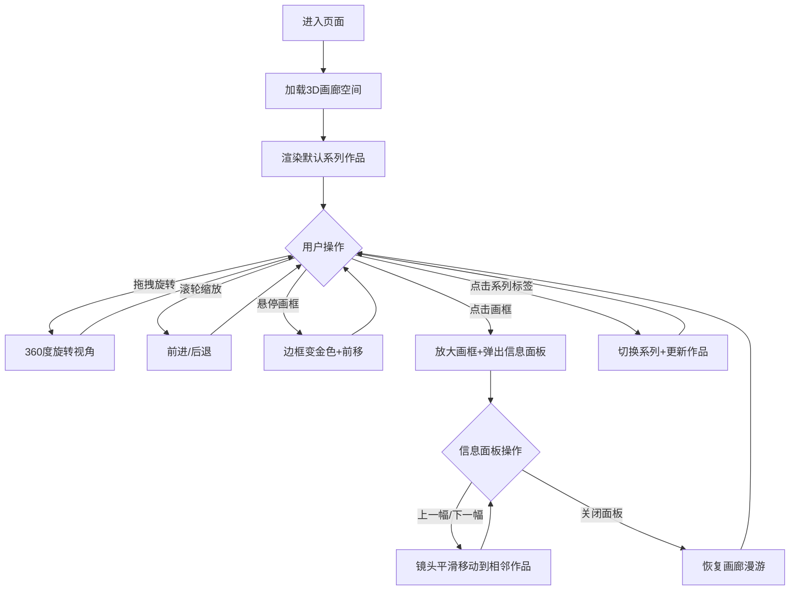

## 1. 产品概述

GalleryWalk 是一款基于浏览器的3D虚拟画廊展览应用，为独立插画师提供数字手绘作品的在线展览空间。访客可以在虚拟画廊中自由漫游，浏览不同系列的作品，并通过交互查看作品细节与高清大图。

- 目标用户：独立插画师、艺术爱好者、画廊访客
- 核心价值：沉浸式3D画廊体验，模拟真实画廊漫步感，支持系列切换与作品交互

## 2. 核心功能

### 2.1 用户角色

| 角色 | 注册方式 | 核心权限 |
|------|----------|----------|
| 访客 | 无需注册 | 浏览画廊、查看作品详情、切换展览系列 |

### 2.2 功能模块

1. **画廊漫游页面**: 3D虚拟画廊空间，鼠标拖拽360度旋转，滚轮缩放前进后退
2. **作品展示**: 墙壁上悬挂8幅画框，展示程序生成的抽象渐变/几何图案
3. **作品交互**: 悬停高亮、点击放大、信息面板展示详情、前后切换
4. **系列切换**: 顶部导航栏切换3个系列，作品全部更新

### 2.3 页面详情

| 页面名称 | 模块名称 | 功能描述 |
|----------|----------|----------|
| 画廊主页 | 3D画廊空间 | 地面灰色纹理、墙壁暖白色、天花板暖色射灯，营造温馨艺术氛围 |
| 画廊主页 | 作品画框 | 左右墙壁各4幅，木色边框，内展示抽象渐变图案 |
| 画廊主页 | 悬停交互 | 边框木色→金色过渡0.3秒，画框前移0.1单位产生立体感 |
| 画廊主页 | 点击交互 | 画框放大至屏幕中央0.5秒缓出，弹出半透明信息面板 |
| 画廊主页 | 作品切换 | 信息面板下方上一幅/下一幅按钮，0.5秒镜头平滑移动 |
| 画廊主页 | 系列导航 | 顶部毛玻璃导航栏，3个系列标签，点击切换全部8幅作品 |

## 3. 核心流程

用户进入页面后，系统自动加载3D画廊空间并展示默认系列作品。用户通过鼠标拖拽旋转视角，滚轮缩放。悬停画框时边框变金色并前移，点击画框放大并弹出详情面板，可通过按钮切换相邻作品。顶部导航栏可切换不同展览系列。

## 4. 用户界面设计

### 4.1 设计风格

- **主色调**: 暖色艺术风格，深色背景(#1a1a2e)，暖白墙壁(#f5f0e1)，浅灰地面(#d4cdc0)
- **强调色**: 金色(#ffd700)用于高亮和交互反馈
- **边框色**: 木色(#8b7355)用于画框
- **字体**: Inter，正文14px，行高1.6
- **布局**: 全屏3D画布 + 固定顶部导航栏 + 浮动信息面板
- **动画缓动**: cubic-bezier(0.25, 0.46, 0.45, 0.94)，时长不超过0.5秒

### 4.2 页面设计概览

| 页面名称 | 模块名称 | UI元素 |
|----------|----------|--------|
| 画廊主页 | 导航栏 | 高60px，半透明毛玻璃(rgba(245,240,225,0.5)，blur(8px))，3个系列标签，选中标签金色下划线3px |
| 画廊主页 | 3D画廊 | 全屏画布，地面#d4cdc0，墙壁#f5f0e1，暖色射灯2700K，8幅画框均匀分布 |
| 画廊主页 | 信息面板 | rgba(0,0,0,0.7)背景，圆角12px，内边距20px，白色14px字体，行高1.6 |
| 画廊主页 | 切换按钮 | 宽120px高36px，圆角8px，背景#ffd700，文字#1a1a2e，悬停#e6c200 |

### 4.3 响应式设计

- 桌面优先设计，页面宽度<768px时:
  - 导航栏标签字号缩小至14px
  - 画廊相机FOV从60度调整为75度以适应小屏

### 4.4 3D场景指导

- **环境**: 室内画廊空间，暖色调氛围
- **灯光**: 环境光 + 方向光(柔和阴影) + 天花板隐藏式暖色点光源(2700K, 强度0.5)
- **相机**: 透视相机，高度1.6米(人眼高度)，FOV 60度(小屏75度)
- **构图**: 左右墙壁各4幅画框，间距1.5米，画框中心对齐相机高度
- **交互**: 拖拽旋转(水平360度，垂直-15到60度，阻尼0.9)、滚轮缩放(速度0.1，范围1-10)、射线检测点击
- **动画**: 悬停0.3秒金色过渡+前移，点击0.5秒缓出放大，切换0.5秒镜头平滑移动
- **性能**: 30FPS以上帧率，纹理加载<2秒
