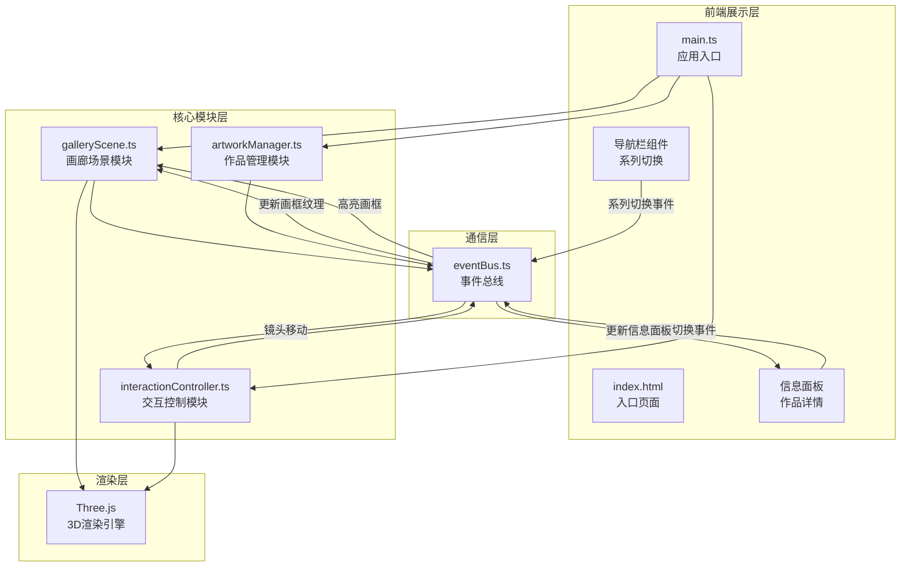
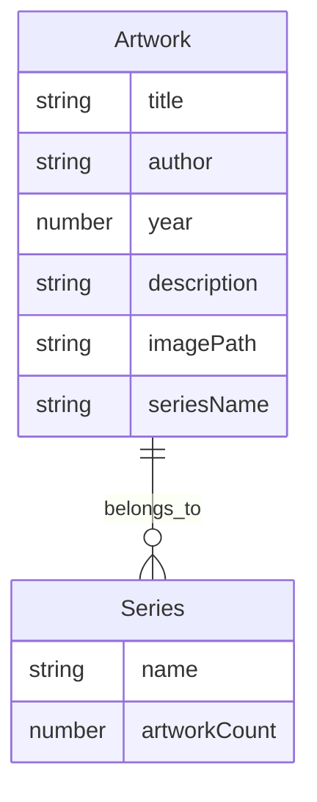

## 1. 架构设计



## 2. 技术说明

- **前端**: TypeScript + Three.js + Vite
- **构建工具**: Vite (HMR, 输出目录dist)
- **3D引擎**: Three.js + three/addons
- **通信机制**: 自定义事件总线(EventBus)，模块间松耦合
- **后端**: 无(纯前端应用)
- **数据**: 程序生成的模拟作品数据

## 3. 路由定义

| 路由 | 用途 |
|------|------|
| / | 画廊主页，3D虚拟画廊展览 |

## 4. 数据模型

### 4.1 数据模型定义



### 4.2 数据结构定义

```typescript
interface Artwork {
  title: string
  author: string
  year: number
  description: string
  imagePath: string
  seriesName: string
}

interface Series {
  name: string
  artworks: Artwork[]
}
```

## 5. 文件结构与调用关系

```
GalleryWalk/
├── package.json                    # 依赖: three, three/addons, vite, typescript等
├── vite.config.ts                  # Vite构建配置，HMR，输出dist
├── tsconfig.json                   # 严格模式，ESNext模块
├── index.html                      # 入口页面，#app容器，Inter字体
└── src/
    ├── main.ts                     # 应用入口 → 初始化场景/相机/渲染器
    │                               #   → 加载galleryScene
    │                               #   → 启动interactionController
    │                               #   → 启动artworkManager
    ├── eventBus.ts                 # 事件总线 → 模块间通信
    │   事件: series-changed, artwork-clicked,
    │         artwork-hover, artwork-unhover,
    │         navigate-artwork, frame-texture-update
    ├── galleryScene.ts             # 画廊场景模块
    │   ← 接收: frame-texture-update (更新画框纹理)
    │   ← 接收: artwork-hover/unhover (高亮/取消高亮边框)
    │   ← 接收: navigate-artwork (镜头移动动画)
    │   → 发送: artwork-clicked (射线检测点击画框)
    │   → 发送: artwork-hover (射线检测悬停画框)
    ├── artworkManager.ts           # 作品管理模块
    │   → 发送: frame-texture-update (画框纹理数据)
    │   → 发送: series-changed (系列切换完成)
    │   ← 接收: series-changed (切换系列请求)
    │   ← 接收: artwork-clicked (获取作品详情)
    └── interactionController.ts    # 交互控制模块
        ← 接收: navigate-artwork (镜头移动到指定画框)
        → 发送: artwork-clicked (点击事件)
        → 发送: artwork-hover (悬停事件)
        → 发送: artwork-unhover (离开事件)
```

## 6. 数据流向

```
用户操作 → interactionController → eventBus → galleryScene/artworkManager
系列标签点击 → eventBus(series-changed) → artworkManager → 生成新纹理数据
artworkManager → eventBus(frame-texture-update) → galleryScene → 更新画框
画框点击 → interactionController → eventBus(artwork-clicked) → 信息面板
上一幅/下一幅 → eventBus(navigate-artwork) → interactionController → 镜头动画
```
