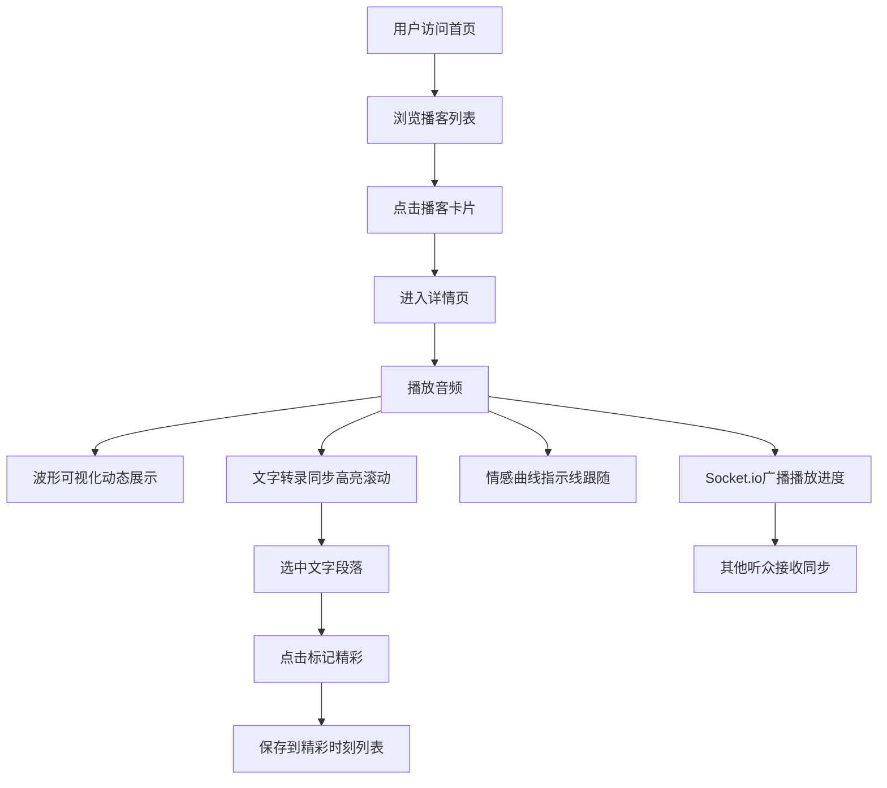

## 1. 产品概述

AriaVault 是一个交互式播客平台，让播客创作者上传音频片段后自动生成带时间轴的文字转录和情感曲线图，听众可以边听边看文字高亮滚动，还能对特定段落发表评论和标记精彩时刻，提供远超传统播客平台的交互感和可探索性。

- 目标用户：播客创作者（上传和管理内容）和听众（沉浸式收听与互动）
- 核心价值：将被动收听转化为主动探索，通过文字同步、情感可视化和社区互动重新定义播客体验

## 2. 核心功能

### 2.1 用户角色

| 角色 | 注册方式 | 核心权限 |
|------|----------|----------|
| 播客创作者 | 邮箱注册 | 上传音频、管理播客、查看互动数据 |
| 听众 | 邮箱注册 / 游客浏览 | 收听播客、查看转录、标记精彩时刻、发表评论 |

### 2.2 功能模块

1. **首页**：播客列表展示、搜索过滤、卡片式布局
2. **播客详情页**：音频播放器 + 波形可视化、文字转录同步高亮、情感曲线图、精彩时刻标记与管理

### 2.3 页面详情

| 页面名称 | 模块名称 | 功能描述 |
|----------|----------|----------|
| 首页 | 播客卡片网格 | 展示播客列表，每张卡片含封面图、标题、作者、时长，悬停上浮动效 |
| 首页 | 响应式布局 | 桌面端多列网格，移动端单列堆叠 |
| 播客详情页 | 播放器区域（左45%） | 波形可视化、进度条、播放/暂停、倍速切换（1x/1.5x/2x） |
| 播客详情页 | 文字转录区（右55%） | 按时间戳分段显示，当前句子紫色高亮并平滑滚动 |
| 播客详情页 | 情感曲线图 | Canvas绘制贝塞尔曲线，渐变色，tooltip交互 |
| 播客详情页 | 精彩时刻 | 选中文字标记精彩，列表展示，支持删除 |
| 播客详情页 | 播放同步 | 文字高亮与音频同步（偏移≤100ms），情感曲线垂直指示线 |
| 全局 | 移动端适配 | <768px侧边栏汉堡菜单、上下堆叠、字体14px、卡片100%宽 |

## 3. 核心流程

用户打开首页浏览播客列表 → 点击卡片进入详情页 → 左侧播放器播放音频，波形动态可视化 → 右侧转录文字随播放进度高亮滚动 → 情感曲线随播放位置更新指示线 → 用户选中文字点击"标记精彩"保存到列表 → 通过socket.io实时同步播放进度给其他听众

## 4. 用户界面设计

### 4.1 设计风格

- 主色：#7c3aed（紫色），辅色：#a78bfa（浅紫）
- 中性色：#f5f3ff（浅紫背景）、#1e1e2e（深色文字/tooltip背景）
- 成功色：#34d399，警告色：#fbbf24，错误色：#f87171
- 按钮风格：圆角胶囊按钮、悬浮阴影动效
- 字体：系统字体栈，正文14-16px，标题20-28px
- 布局：卡片式网格布局 + 双栏详情页
- 图标：lucide-react图标库

### 4.2 页面设计概览

| 页面名称 | 模块名称 | UI元素 |
|----------|----------|--------|
| 首页 | 播客卡片 | 320px宽、圆角16px、白色背景、阴影0 4px 20px rgba(0,0,0,0.08)，封面120x120圆角8px，悬停上浮4px阴影加深，过渡0.25s ease-out |
| 播客详情页 | 播放器区域 | 45%宽、背景#f5f3ff、波形条10-60px高渐变#7c3aed到#a78bfa、播放时0.3s闪烁、进度条+控制按钮 |
| 播客详情页 | 转录区 | 55%宽、背景#fafafa、圆角12px、高亮句紫色背景#ede9fe、scroll-behavior:smooth |
| 播客详情页 | 情感曲线 | 120px高Canvas、贝塞尔曲线、渐变#f87171到#34d399、填充opacity0.2、tooltip圆角8px背景#1e1e2e白色文字 |
| 播客详情页 | 精彩时刻 | 标记按钮100x36px圆角18px背景#7c3aed、卡片白色圆角12px边框1px、删除按钮圆形28px背景#fee2e2悬停旋转90度0.3s |
| 播客详情页 | 指示线 | 2px宽、颜色#a78bfa、半透明垂直线 |

### 4.3 响应式

- 桌面优先设计，移动端（<768px）自适应
- 侧边栏收起为汉堡菜单
- 两栏布局变为上下堆叠（播放器在上，转录区在下）
- 字体大小调整为14px
- 卡片宽度100%
- 触摸优化：按钮最小点击区域44x44px

### 4.4 性能要求

- 转录文字高亮和情感曲线更新帧率≥30fps
- 页面首次加载LCP<2秒
- 音频加载后播放响应≤300ms
