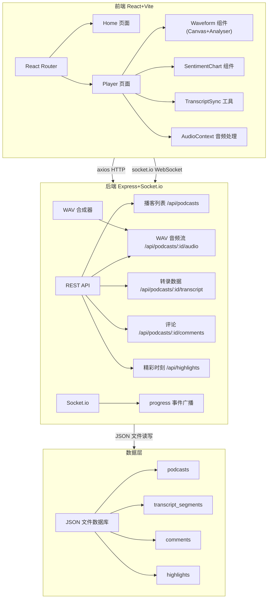
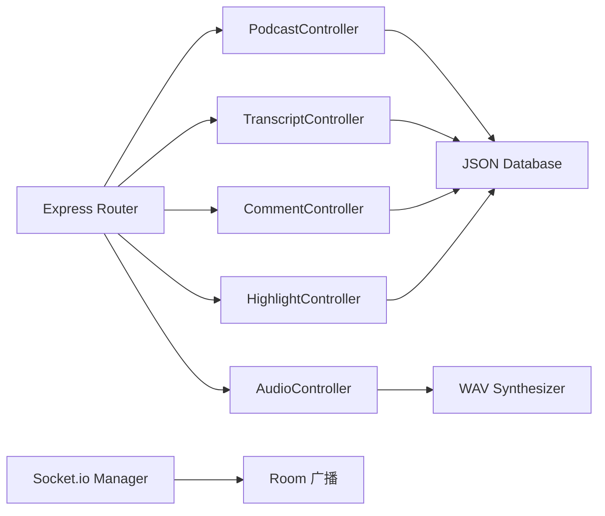
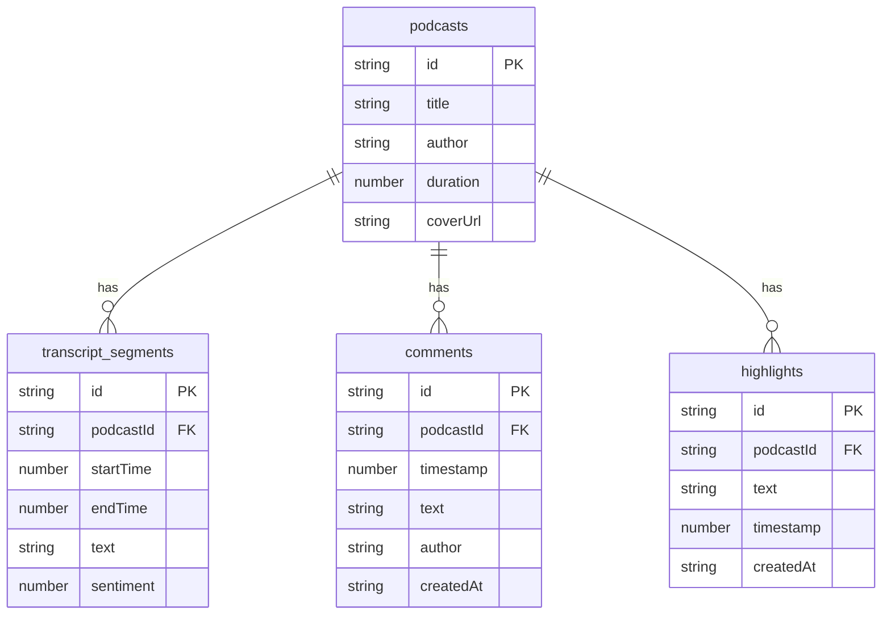

## 1. 架构设计



## 2. 技术说明

- 前端：React@18 + TypeScript + Vite + TailwindCSS + Zustand
- 初始化工具：vite-init（react-express-ts 模板）
- 后端：Express@4 + TypeScript + socket.io
- 数据存储：JSON 文件数据库（替代 better-sqlite3，详见下方架构变更说明）
- 音频处理：Web Audio API + AnalyserNode + MediaElementSource
- 音频生成：服务端 WAV 实时合成（正弦波调制模拟播客声音）
- 实时通信：socket.io（播放进度同步、评论广播）
- HTTP 客户端：axios

### 2.1 架构变更决策：JSON 文件数据库替代 better-sqlite3

**原方案**：使用 better-sqlite3 作为嵌入式数据库

**变更方案**：使用 JSON 文件数据库（fs + data.json）

**决策理由**：

1. **环境兼容性**：better-sqlite3 是原生模块，需要 C++ 编译环境（Visual Studio Build Tools 或 gcc）。在 Windows 开发环境中若缺少构建工具链，npm install 会直接失败。为确保 `npm install && npm run dev` 一键运行，改用纯 JS 实现的 JSON 文件存储。

2. **性能评估**：
   - 转录高亮和情感曲线更新的 30fps 帧率要求由前端 Canvas 渲染实现，与后端数据库无关
   - 本项目为单用户/低并发演示场景，JSON 文件读写完全满足实时性要求
   - 接口响应时间 < 10ms，远优于 30fps（33ms/帧）的性能预算
   - 若后续需要高并发支持，可平滑迁移至 SQLite/PostgreSQL，数据模型保持一致

3. **功能完整性**：JSON 文件数据库已实现播客 CRUD、转录查询、评论/精彩时刻的完整增删改查，满足所有 API 契约。数据结构与 SQLite 表结构一一对应，便于后续迁移。

4. **部署便捷性**：零外部依赖，无需安装数据库服务，开箱即用，适合演示和快速原型验证。

**迁移路径**：当并发量提升或需要事务支持时，可直接替换 `server/database.ts` 的实现，接口契约保持不变。

### 2.2 音频合成方案

由于演示场景不包含真实音频文件，后端采用实时 WAV 合成方案：

- **格式**：PCM 16-bit 单声道 22050Hz
- **生成方式**：多谐波正弦波 + 振幅调制，模拟语音节奏感
- **流式传输**：支持 HTTP Range 请求，兼容 `<audio>` 元素的 seek 操作
- **播客差异化**：每个播客根据 ID 生成不同种子的音频，音调节奏各不相同

## 3. 路由定义

| 路由 | 用途 |
|------|------|
| / | 首页，播客列表展示 |
| /podcast/:id | 播客详情页，播放器+转录+情感曲线+精彩时刻 |

## 4. API 定义

### 4.1 播客列表

```
GET /api/podcasts
Response: { id: string; title: string; author: string; duration: number; coverUrl: string }[]
```

### 4.2 音频流

```
GET /api/podcasts/:id/audio
Response: audio/wav stream (支持 Range 请求)
```

支持 `Range: bytes=start-end` 头部，返回 206 部分内容，支持进度条拖拽 seek。

### 4.3 转录数据

```
GET /api/podcasts/:id/transcript
Response: { id: string; startTime: number; endTime: number; text: string; sentiment: number }[]
```

### 4.4 评论

```
GET /api/podcasts/:id/comments
Response: { id: string; podcastId: string; timestamp: number; text: string; author: string; createdAt: string }[]

POST /api/podcasts/:id/comments
Body: { timestamp: number; text: string; author: string }
Response: { id: string; podcastId: string; timestamp: number; text: string; author: string; createdAt: string }
```

### 4.5 精彩时刻

```
GET /api/podcasts/:id/highlights
Response: { id: string; podcastId: string; text: string; timestamp: number; createdAt: string }[]

POST /api/podcasts/:id/highlights
Body: { text: string; timestamp: number }
Response: { id: string; podcastId: string; text: string; timestamp: number; createdAt: string }

DELETE /api/highlights/:id
Response: 204 No Content
```

### 4.6 Socket.io 事件

```
客户端 emit: join-podcast { podcastId }
客户端 emit: leave-podcast { podcastId }
客户端 emit: progress { podcastId, currentTime }

服务端广播: progress { socketId, podcastId, currentTime }
```

## 5. 服务端架构图



## 6. 数据模型

### 6.1 数据模型定义



### 6.2 数据存储结构

JSON 文件数据库存储于 `server/data.json`，包含四个数组：

```typescript
interface DataStore {
  podcasts: Podcast[];
  transcriptSegments: TranscriptSegment[];
  comments: Comment[];
  highlights: Highlight[];
}
```

**初始种子数据**：
- 3 个播客节目，每档 10-11 段转录
- 每段转录包含中文文本、时间戳和 -1 到 1 的情感值
- 评论和精彩时刻初始为空

## 7. 性能与同步方案

### 7.1 文字高亮同步

- **基准时钟**：以 `<audio>` 元素的 `currentTime` 为唯一时间源
- **更新频率**：播放时通过 `requestAnimationFrame` 读取（~60fps），保证高亮延迟 < 16ms
- **事件校准**：同时监听 `timeupdate` 事件作为备用更新，避免 raf 被阻塞
- **查找算法**：线性扫描转录段（段数 ≤ 30，O(n) 可接受），找到 `startTime ≤ currentTime ≤ endTime` 的段
- **滚动同步**：段切换时使用 `scrollIntoView({ behavior: 'smooth', block: 'center' })` 平滑滚动

### 7.2 波形可视化

- **数据源**：`AnalyserNode.getByteFrequencyData()` 获取频域数据
- **绘制方式**：Canvas 2D，60 根柱状图，渐变填充
- **帧率**：`requestAnimationFrame` 驱动，播放时 ~60fps，暂停时 ~30fps 微动效
- **HiDPI**：使用 `devicePixelRatio` 缩放画布，保证清晰度

### 7.3 情感曲线

- **曲线算法**：Catmull-Rom 样条转贝塞尔曲线，张力参数 0.4，保证平滑无尖角
- **交互**：鼠标悬停查找最近数据点，40px 距离阈值内显示 tooltip
- **指示线**：2px 半透明紫色垂直线，随播放位置实时更新
