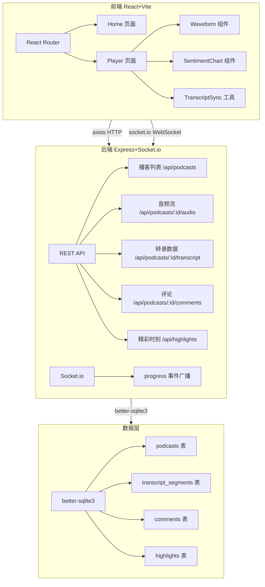
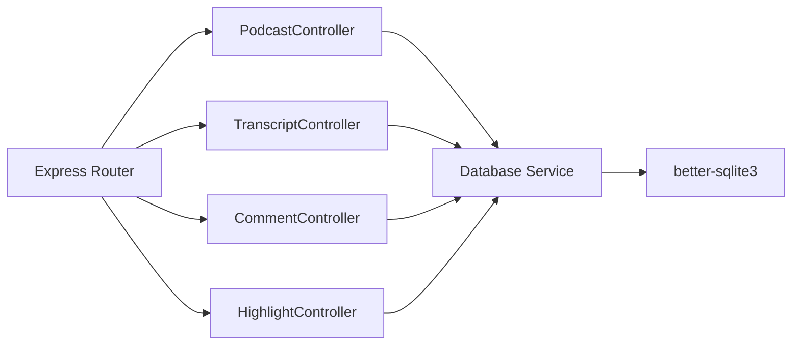
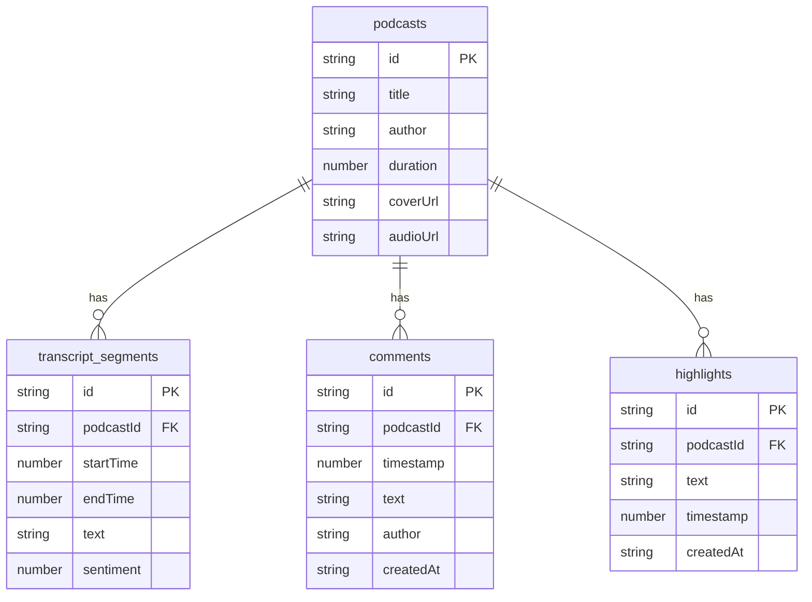

## 1. 架构设计



## 2. 技术说明

- 前端：React@18 + TypeScript + Vite + TailwindCSS + Zustand
- 初始化工具：vite-init（react-express-ts 模板）
- 后端：Express@4 + TypeScript + better-sqlite3 + socket.io
- 数据库：SQLite（better-sqlite3 嵌入式，无需外部服务）
- 实时通信：socket.io（播放进度同步、评论广播）
- HTTP 客户端：axios

## 3. 路由定义

| 路由 | 用途 |
|------|------|
| / | 首页，播客列表展示 |
| /podcast/:id | 播客详情页，播放器+转录+情感曲线+精彩时刻 |

## 4. API 定义

### 4.1 播客列表

```
GET /api/podcasts
Response: { id: string; title: string; author: string; duration: number; coverUrl: string }[]
```

### 4.2 音频流

```
GET /api/podcasts/:id/audio
Response: audio/mpeg stream
```

### 4.3 转录数据

```
GET /api/podcasts/:id/transcript
Response: { id: string; startTime: number; endTime: number; text: string; sentiment: number }[]
```

### 4.4 评论

```
GET /api/podcasts/:id/comments
Response: { id: string; podcastId: string; timestamp: number; text: string; author: string; createdAt: string }[]

POST /api/podcasts/:id/comments
Body: { timestamp: number; text: string; author: string }
Response: { id: string; podcastId: string; timestamp: number; text: string; author: string; createdAt: string }
```

### 4.5 精彩时刻

```
GET /api/podcasts/:id/highlights
Response: { id: string; podcastId: string; text: string; timestamp: number; createdAt: string }[]

POST /api/podcasts/:id/highlights
Body: { text: string; timestamp: number }
Response: { id: string; podcastId: string; text: string; timestamp: number; createdAt: string }

DELETE /api/highlights/:id
Response: { success: boolean }
```

### 4.6 Socket.io 事件

```
emit: progress { podcastId: string; currentTime: number }
on: progress { podcastId: string; currentTime: number }
```

## 5. 服务端架构图



## 6. 数据模型

### 6.1 数据模型定义



### 6.2 数据定义语言

```sql
CREATE TABLE podcasts (
  id TEXT PRIMARY KEY,
  title TEXT NOT NULL,
  author TEXT NOT NULL,
  duration INTEGER NOT NULL,
  coverUrl TEXT NOT NULL,
  audioUrl TEXT NOT NULL
);

CREATE TABLE transcript_segments (
  id TEXT PRIMARY KEY,
  podcastId TEXT NOT NULL REFERENCES podcasts(id),
  startTime REAL NOT NULL,
  endTime REAL NOT NULL,
  text TEXT NOT NULL,
  sentiment REAL NOT NULL
);

CREATE TABLE comments (
  id TEXT PRIMARY KEY,
  podcastId TEXT NOT NULL REFERENCES podcasts(id),
  timestamp REAL NOT NULL,
  text TEXT NOT NULL,
  author TEXT NOT NULL,
  createdAt TEXT NOT NULL
);

CREATE TABLE highlights (
  id TEXT PRIMARY KEY,
  podcastId TEXT NOT NULL REFERENCES podcasts(id),
  text TEXT NOT NULL,
  timestamp REAL NOT NULL,
  createdAt TEXT NOT NULL
);
```
