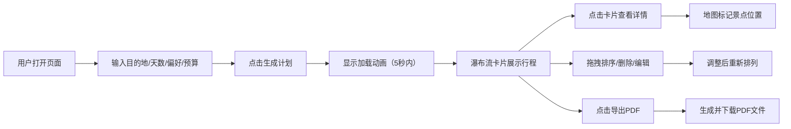

## 1. 产品概述

智能旅行规划助手，用户输入目的地、天数、偏好和预算后，5秒内自动生成结构化的每日行程方案，包含景点、美食、时间安排和地图标注，解决自由行用户信息过载、方案整合困难的痛点。

- 核心价值：将海量旅行信息转化为清晰可执行的个性化行程
- 目标用户：自由行爱好者、年轻旅行者、预算规划者
- 市场定位：轻量级、智能化的一站式旅行规划工具

## 2. 核心功能

### 2.1 用户角色

| 角色 | 注册方式 | 核心权限 |
|------|----------|----------|
| 普通用户 | 无需注册 | 生成行程、查看详情、编辑调整、导出PDF |

### 2.2 功能模块

1. **搜索面板**：目的地输入、天数选择、偏好标签、预算范围、生成按钮
2. **行程瀑布流**：卡片式行程展示、拖拽排序、删除功能、编辑模式
3. **详情模态框**：时间线展示、地图标注、景点信息
4. **PDF导出**：封面页、每日行程页、附录页

### 2.3 页面详情

| 页面名称 | 模块名称 | 功能描述 |
|----------|----------|----------|
| 主页面 | 左侧搜索面板 | 360px固定宽度，背景#f5f0eb，包含所有输入控件和生成按钮 |
| 主页面 | 右侧内容区 | 自适应宽度，瀑布流卡片展示每日行程，支持编辑操作 |
| 模态弹窗 | 详情视图 | 从右侧滑入，55%宽度，时间线+Leaflet地图标注 |
| 悬浮控件 | PDF导出按钮 | 右下角固定位置，一键导出完整计划书 |

## 3. 核心流程

## 4. 用户界面设计

### 4.1 设计风格

- **主色调**：暖米白 #faf8f5（背景）、胭脂红 #e85d3a（品牌色）、深灰 #2d3436（文字）
- **按钮风格**：圆角8px，高48px，深色背景配白色文字，悬停过渡0.2秒
- **字体**：Noto Sans SC（Google Fonts），标题20px sans-serif
- **布局风格**：左右分栏（左360px固定，右自适应），卡片式瀑布流
- **动效**：卡片入场从下渐入上移20px，依次延迟0.1秒；模态框从右侧滑入ease-out；所有交互0.2-0.3秒过渡

### 4.2 页面设计概述

| 页面名称 | 模块名称 | UI元素 |
|----------|----------|----------|
| 主页面 | 搜索面板 | 目的地输入框、数字选择器、圆角胶囊标签（选中#e85d3a白字）、下拉预算、深色生成按钮 |
| 主页面 | 行程卡片 | 360px宽卡片，圆角12px，白色背景，阴影0 4px 16px rgba(0,0,0,0.08)，8px圆形时间点，16:9渐变图片占位，#fef3c7餐厅标签 |
| 模态框 | 详情视图 | 55%宽度，背景#faf8f5，左边缘圆角24px，#d1d5db竖线时间轴，12px圆形时间点，24px自定义地图标记 |
| 全局 | 悬浮按钮 | 直径56px圆形，#e85d3a背景，下载图标，阴影0 4px 12px rgba(232,93,58,0.4)，悬停放大1.1倍 |

### 4.3 响应式设计

- **桌面端**（≥1024px）：左右分栏布局，左侧360px固定
- **平板端**（640-1024px）：左侧面板折叠为64px高顶部导航条，汉堡菜单展开
- **移动端**（<640px）：卡片全宽显示，顶部导航条

### 4.4 性能指标

- 页面初始加载 ≤ 2秒
- 计划生成耗时 ≤ 5秒
- 动画帧率保持 60fps
