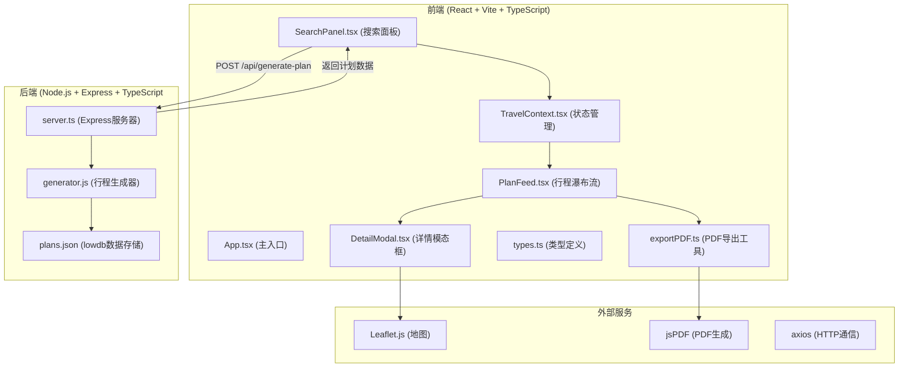
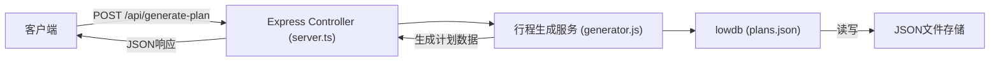
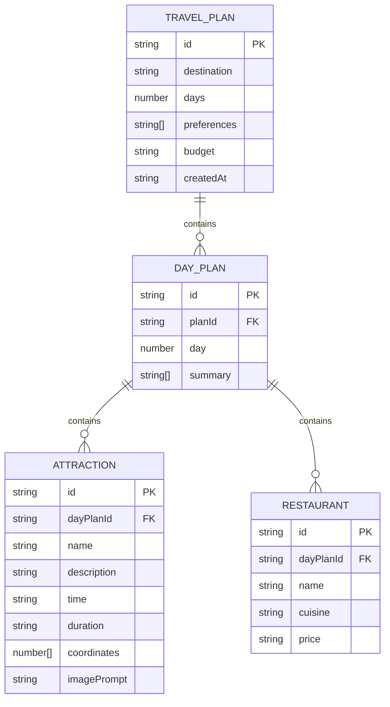

## 1. 架构设计



## 2. 技术栈说明

- **前端框架**：React 18 + TypeScript + Vite 5
- **状态管理**：React Context API
- **HTTP客户端**：axios 1.6
- **地图服务**：Leaflet 1.9 + @types/leaflet
- **PDF生成**：jspdf 2.5
- **路由**：react-router-dom 6
- **UI图标**：lucide-react
- **后端框架**：Express 4
- **数据存储**：lowdb 7 (JSON文件)
- **ID生成**：uuid 9
- **并行启动**：concurrently 8
- **代理配置**：Vite代理 /api → 后端端口 3001

## 3. 路由定义

| 路由路径 | 组件 | 用途 |
|----------|------|------|
| / | App.tsx | 主页面，包含左右分栏布局 |

## 4. API 定义

### 4.1 类型定义

```typescript
interface PlanRequest {
  destination: string;
  days: number;
  preferences: string[];
  budget: string;
}

interface Attraction {
  id: string;
  name: string;
  description: string;
  time: string;
  duration: string;
  coordinates: [number, number];
  imagePrompt: string;
}

interface Restaurant {
  id: string;
  name: string;
  cuisine: string;
  price: string;
}

interface DayPlan {
  id: string;
  day: number;
  summary: string[];
  attractions: Attraction[];
  restaurants: Restaurant[];
}

interface TravelPlan {
  id: string;
  destination: string;
  days: number;
  preferences: string[];
  budget: string;
  dailyPlans: DayPlan[];
  createdAt: string;
}
```

### 4.2 请求/响应格式

**POST /api/generate-plan

请求体：
```json
{
  "destination": "京都",
  "days": 5,
  "preferences": ["文化", "美食"],
  "budget": "中等"
}
```

成功响应（200）：
```json
{
  "id": "uuid",
  "destination": "京都",
  "days": 5,
  "preferences": ["文化", "美食"],
  "budget": "中等",
  "dailyPlans": [...],
  "createdAt": "2026-06-14T..."
}
```

## 5. 服务器架构



## 6. 数据模型

### 6.1 ER图



### 6.2 项目文件结构

```
auto66/
├── .trae/documents/
│   ├── PRD.md
│   └── TECH_ARCHITECTURE.md
├── package.json
├── vite.config.ts
├── tsconfig.json
├── index.html
├── src/
│   ├── frontend/
│   │   ├── App.tsx
│   │   ├── main.tsx
│   │   ├── index.css
│   │   ├── context/
│   │   │   └── TravelContext.tsx
│   │   ├── components/
│   │   │   ├── SearchPanel.tsx
│   │   │   ├── PlanFeed.tsx
│   │   │   ├── PlanCard.tsx
│   │   │   ├── DetailModal.tsx
│   │   │   ├── MapMarker.tsx
│   │   │   └── LoadingSpinner.tsx
│   │   ├── utils/
│   │   │   ├── types.ts
│   │   │   └── exportPDF.ts
│   │   └── api/
│   │       └── client.ts
│   └── backend/
│       ├── server.ts
│       ├── generator.js
│       └── data/
│           └── plans.json
```
