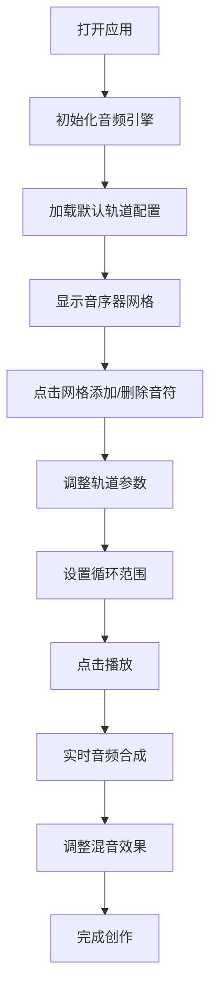

## 1. 产品概述
多轨音乐协作音序器是一款面向个人音乐人和小型乐队的浏览器端实时协作创作工具，解决远程合作时乐手无法共同即兴演奏、记录灵感、快速调整编曲的痛点。通过在线多轨录音室式的交互体验，支持多人实时编辑音序和参数。

### 2. 核心功能

### 2.1 用户角色
| 角色 | 注册方式 | 核心权限 |
|------|----------|----------|
| 音乐创作者 | 无需注册，直接使用 | 创建/编辑音序、调整参数、播放预览、导出作品 |
| 协作者 | 通过链接加入 | 实时编辑轨道、调整混音参数 |

### 2.2 功能模块
1. **多轨音序器面板**：时间网格矩阵、音符编辑、播放进度指示
2. **轨道控制面板**：乐器选择、音量控制、静音/独奏、移调、速度调整
3. **全局播放控制**：播放/停止、循环范围设置、BPM/拍号调整
4. **混音面板**：电平表、声像控制、效果器插槽（混响/延迟/合唱）

### 2.3 页面详情
| 页面名称 | 模块名称 | 功能描述 |
|----------|----------|----------|
| 主工作区 | 工具栏 | 播放控制按钮、BPM显示、拍号选择 |
| 主工作区 | 轨道列表面板 | 左侧260px宽面板，包含各轨道独立控制 |
| 主工作区 | 音序编辑区 | 中央时间网格矩阵，支持点击添加/删除音符 |
| 主工作区 | 混音面板 | 底部可折叠面板，200px高度，包含电平表和效果器 |

## 3. 核心流程
用户打开应用 → 初始化默认轨道配置 → 点击网格添加音符 → 调整轨道参数（音量、移调、速度）→ 拖拽循环标记设置播放范围 → 点击播放按钮预览 → 调整混音效果 → 完成创作

## 4. 用户界面设计

### 4.1 设计风格
- **主色调**：深色主题，主背景 `#0b0b1a`，内容区背景 `#12122a`
- **强调色**：紫色渐变 `#667eea` → `#764ba2`
- **文字颜色**：主色 `#e0e0e0`，次级 `#888899`
- **乐器颜色**：钢琴 `#4fc3f7`，鼓 `#ff7043`，贝司 `#81c784`
- **按钮样式**：静音/独奏按钮圆角6px，背景`#3a3a4e`，激活时`#ff6b6b`
- **字体**：Inter，全局导入
- **网格线**：`#2a2a3e`，线宽1px

### 4.2 页面设计概述
| 页面名称 | 模块名称 | UI元素 |
|----------|----------|--------|
| 主工作区 | 工具栏 | 40px圆形播放按钮（紫色渐变）、BPM大字显示（24px）、拍号下拉 |
| 主工作区 | 轨道面板 | 24x24px乐器图标、0-100音量滑块、静音/独奏按钮、移调下拉(-12~+12)、速度倍增下拉(0.5x/1x/2x) |
| 主工作区 | 音序器 | 16分音符网格、音符块（乐器色）、悬停呼吸动画（0.2s缩放1.1倍）、音符信息浮标、播放进度白线（2px宽，发光动画0.3s）、循环三角形标记 |
| 主工作区 | 混音面板 | 120pxx8px电平条（绿#66bb6a→红#ff5252渐变）、32px声像旋钮、3个效果器插槽 |

### 4.3 响应式
- 桌面优先设计，最小宽度1280px，最小高度720px
- 窗口超出时显示滚动条
- 各区域按比例自适应

### 4.4 动效与交互
- 按钮/滑块悬停0.2s过渡动画
- 音符块悬停0.2s呼吸动画（缩放1.1倍）
- 播放进度线0.3s发光动画
- 拖拽循环标记时吸附到网格边界
- 混音面板平滑展开/收起动画

### 4.5 性能指标
- 8轨道×32小节×16网格负载下保持60fps
- 音符添加响应时间<16ms
- 参数调整即时生效，无需重新生成
