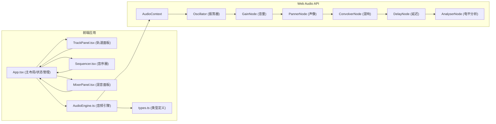
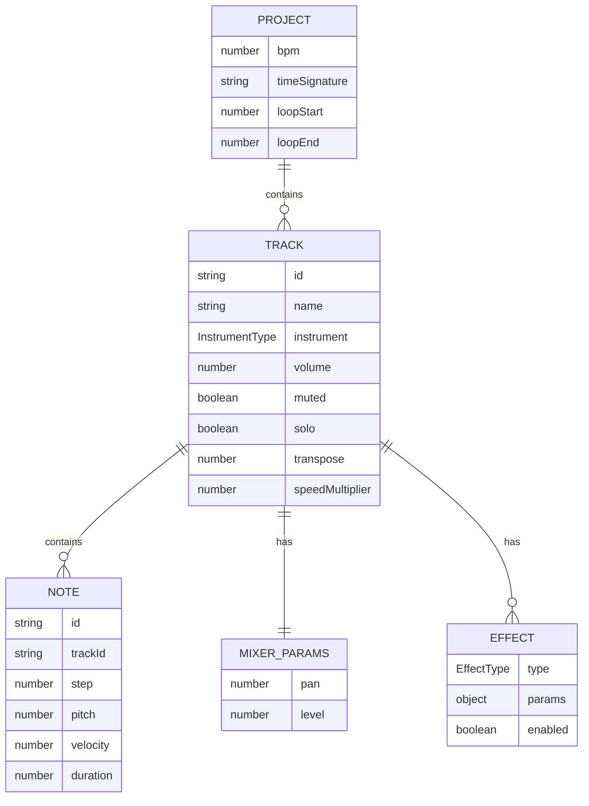

## 1. 架构设计



## 2. 技术描述

- **前端框架**：React@18 + TypeScript@5 + Vite@5
- **状态管理**：React useState/useReducer（本地状态）+ Zustand（跨组件共享）
- **音频引擎**：Web Audio API（原生浏览器API，无需第三方库）
- **样式方案**：CSS Modules + CSS Variables（主题系统）
- **图标库**：lucide-react
- **构建工具**：Vite
- **包管理器**：npm

### 依赖清单
```json
{
  "react": "^18.2.0",
  "react-dom": "^18.2.0",
  "lucide-react": "^0.344.0"
}
```

### 开发依赖
```json
{
  "typescript": "^5.4.0",
  "@types/react": "^18.2.0",
  "@types/react-dom": "^18.2.0",
  "vite": "^5.2.0",
  "@vitejs/plugin-react": "^4.2.0"
}
```

## 3. 路由定义
| 路由 | 用途 |
|------|------|
| / | 主工作区（单页应用，无额外路由） |

## 4. 数据模型

### 4.1 数据模型定义



### 4.2 类型定义（types.ts）

```typescript
export type InstrumentType = 'piano' | 'drums' | 'bass';
export type EffectType = 'reverb' | 'delay' | 'chorus';
export type TimeSignature = '4/4' | '3/4' | '6/8';

export interface Note {
  id: string;
  trackId: string;
  step: number;
  pitch: number;
  velocity: number;
  duration: number;
}

export interface MixerParams {
  pan: number;
  level: number;
}

export interface Effect {
  type: EffectType;
  params: Record<string, number>;
  enabled: boolean;
}

export interface Track {
  id: string;
  name: string;
  instrument: InstrumentType;
  volume: number;
  muted: boolean;
  solo: boolean;
  transpose: number;
  speedMultiplier: number;
  mixer: MixerParams;
  effects: Effect[];
}

export interface ProjectState {
  bpm: number;
  timeSignature: TimeSignature;
  tracks: Track[];
  notes: Note[];
  loopStart: number;
  loopEnd: number;
  isPlaying: boolean;
  currentStep: number;
}
```

## 5. 核心模块设计

### 5.1 AudioEngine（单例模式）
- 管理 AudioContext 生命周期
- 创建振荡器节点合成不同乐器音色
- 实现混响/延迟/合唱效果节点
- 提供 start/stop/setBPM/addNote 等控制方法
- 通过 AnalyserNode 实时输出电平数据

### 5.2 App.tsx（主容器）
- 管理全局项目状态（tracks, notes, bpm, loop等）
- 协调子组件间通信
- 处理播放循环逻辑（requestAnimationFrame）
- 集成 AudioEngine 实例

### 5.3 Sequencer.tsx（音序器核心）
- 渲染时间网格矩阵（32小节 × 16步）
- 处理音符点击添加/删除事件
- 实时更新播放进度线位置
- 处理循环标记拖拽（吸附网格）
- 音符悬停浮标提示

### 5.4 TrackPanel.tsx（轨道面板）
- 渲染乐器图标（24×24px）
- 音量滑块控制（0-100）
- 静音/独奏按钮切换
- 移调下拉选择（-12 ~ +12半音）
- 速度倍增下拉（0.5x / 1x / 2x）

### 5.5 MixerPanel.tsx（混音面板）
- 可折叠面板（高度200px）
- 实时电平表（绿→红渐变）
- 声像旋钮（拖拽旋转）
- 3个效果器插槽（拖拽添加）
- 效果参数滑块调整

## 6. 性能优化策略

1. **虚拟滚动**：音序器网格使用虚拟滚动，仅渲染可视区域
2. **requestAnimationFrame**：播放进度更新使用 RAF，确保60fps
3. **事件委托**：网格点击使用事件委托，避免大量事件监听器
4. **Web Audio 节点池**：复用振荡器节点，避免频繁创建销毁
5. **状态分片**：使用 React.memo 优化子组件重渲染
6. **批量更新**：音符操作使用状态批量更新，减少渲染次数

## 7. 项目结构

```
auto69/
├── package.json
├── tsconfig.json
├── vite.config.ts
├── index.html
└── src/
    ├── App.tsx
    ├── Sequencer.tsx
    ├── TrackPanel.tsx
    ├── MixerPanel.tsx
    ├── AudioEngine.ts
    └── types.ts
```
