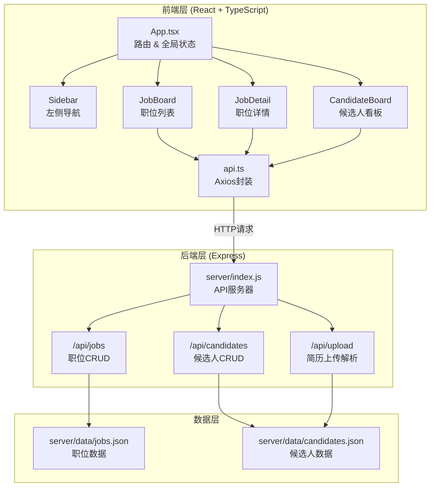
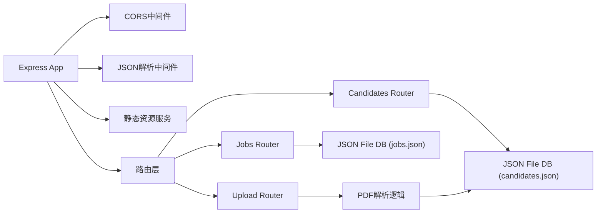
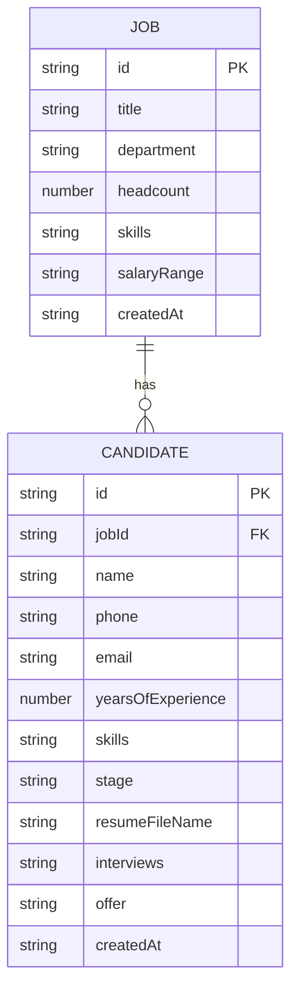

## 1. 架构设计



## 2. 技术说明

- 前端框架：React@18 + TypeScript@5
- 构建工具：Vite@5 + @vitejs/plugin-react
- 状态管理：React Hooks (useState, useContext)
- 前后端通信：Axios@1
- 后端：Express@4
- 跨域处理：cors
- 数据存储：JSON文件模拟数据库
- 唯一标识：uuid

## 3. 路由定义

| 路由 | 用途 | 组件 |
|------|------|------|
| / | 职位管理首页 | JobBoard |
| /jobs/:id | 职位详情页 | JobDetail |
| /candidates | 候选人看板页 | CandidateBoard |

## 4. API 定义

### 4.1 类型定义

```typescript
type CandidateStage = 'new' | 'screening' | 'interview' | 'offer' | 'hired';

interface Job {
  id: string;
  title: string;
  department: string;
  headcount: number;
  skills: string[];
  salaryRange: string;
  createdAt: string;
}

interface Interview {
  id: string;
  date: string;
  timeSlot: string;
  createdAt: string;
}

interface OfferInfo {
  salary: string;
  onboardDate: string;
  notes: string;
}

interface Candidate {
  id: string;
  jobId: string;
  name: string;
  phone: string;
  email: string;
  yearsOfExperience: number;
  skills: string[];
  stage: CandidateStage;
  resumeFileName?: string;
  interviews: Interview[];
  offer?: OfferInfo;
  createdAt: string;
}
```

### 4.2 API端点

| 方法 | 路径 | 说明 | 请求体 | 响应 |
|------|------|------|--------|------|
| GET | /api/jobs | 获取所有职位 | - | Job[] |
| POST | /api/jobs | 创建新职位 | Omit<Job, 'id' \| 'createdAt'> | Job |
| GET | /api/jobs/:id | 获取单个职位 | - | Job |
| GET | /api/candidates | 获取所有候选人 | - | Candidate[] |
| GET | /api/candidates?jobId=xxx | 按职位获取候选人 | - | Candidate[] |
| POST | /api/candidates | 创建候选人 | Omit<Candidate, 'id' \| 'createdAt' \| 'interviews' \| 'stage'> | Candidate |
| PUT | /api/candidates/:id | 更新候选人信息 | Partial<Candidate> | Candidate |
| DELETE | /api/candidates/:id | 删除候选人 | - | { success: boolean } |
| POST | /api/upload | 上传PDF并解析 | multipart/form-data (file, jobId) | Candidate |

## 5. 服务器架构图



## 6. 数据模型

### 6.1 ER图



### 6.2 初始数据

jobs.json 初始示例：
```json
[
  {
    "id": "job-001",
    "title": "前端工程师",
    "department": "技术部",
    "headcount": 3,
    "skills": ["React", "TypeScript", "Node.js"],
    "salaryRange": "15-25K",
    "createdAt": "2026-06-01T10:00:00.000Z"
  }
]
```

candidates.json 初始示例：
```json
[
  {
    "id": "cand-001",
    "jobId": "job-001",
    "name": "张三",
    "phone": "13800138000",
    "email": "zhangsan@example.com",
    "yearsOfExperience": 3,
    "skills": ["React", "Vue", "TypeScript"],
    "stage": "new",
    "interviews": [],
    "createdAt": "2026-06-10T10:00:00.000Z"
  }
]
```

## 7. 文件结构

```
auto73/
├── package.json
├── index.html
├── tsconfig.json
├── vite.config.ts
├── src/
│   ├── App.tsx
│   ├── types.ts
│   ├── utils/
│   │   └── api.ts
│   ├── styles/
│   │   └── global.css
│   └── components/
│       ├── Sidebar.tsx
│       ├── JobBoard.tsx
│       ├── JobDetail.tsx
│       ├── CandidateBoard.tsx
│       ├── CandidateCard.tsx
│       ├── CreateJobModal.tsx
│       ├── InterviewModal.tsx
│       └── OfferModal.tsx
├── server/
│   ├── index.js
│   └── data/
│       ├── jobs.json
│       └── candidates.json
└── .trae/
    └── documents/
        ├── PRD.md
        └── TechnicalArchitecture.md
```

## 8. 数据流说明

1. **JobBoard数据流向**：axios GET /api/jobs → response拦截处理 → useState保存jobs → 渲染职位卡片网格
2. **CandidateBoard数据流向**：axios GET /api/candidates → 按stage分组 → 五泳道渲染 → 拖拽更新stage → axios PUT /api/candidates/:id → 刷新本地state
3. **简历上传数据流**：文件选择 → FormData包装 → POST /api/upload → 后端解析PDF生成Candidate → 返回新候选人 → 前端添加到新简历泳道
4. **入职提醒数据流**：定时或渲染时筛选offer阶段且onboardDate距今≤7天的候选人 → 计算数量 → 顶部徽章渲染
