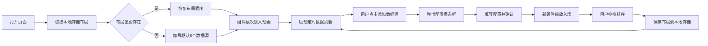

## 1. 产品概述

PulseBoard 是一个实时数据监控面板，让用户可以在浏览器中同时监控多个实时数据源（股票价格、网站访问量、传感器读数等），以多种仪表盘组件并排展示，数据自动刷新并带有平滑过渡动画。

- 解决问题：替代传统Excel表格监控方式，提供更直观、更具视觉冲击力的实时数据展示
- 目标用户：数据分析师、运维工程师、产品运营人员等需要实时监控多维度数据的人群
- 产品价值：提升数据监控效率，快速发现数据异常，提供沉浸式的数据可视化体验

## 2. 核心功能

### 2.1 用户角色
| 角色 | 注册方式 | 核心权限 |
|------|----------|----------|
| 普通用户 | 无需注册 | 查看仪表盘、添加数据源、拖拽排序、保存布局 |

### 2.2 功能模块
1. **监控面板首页**：标题栏、仪表盘网格、实时数据展示
2. **添加数据源**：模态框表单、数据源配置
3. **拖拽排序**：组件拖拽重排、布局持久化
4. **数据刷新**：定时自动刷新、平滑动画过渡

### 2.3 页面详情
| 页面名称 | 模块名称 | 功能描述 |
|----------|----------|----------|
| 监控面板 | 标题栏 | Logo呼吸动画、项目标题、添加数据源按钮 |
| 监控面板 | 仪表盘网格 | 2列x3行布局、卡片淡入动画、多种组件类型 |
| 监控面板 | 数据卡片 | 实时数据标题、主数据值、历史迷你趋势图 |
| 监控面板 | 环形进度条 | SVG实现、进度动画、数值居中显示 |
| 添加数据源 | 模态框 | 半透明遮罩、表单输入、滑块配置 |
| 拖拽排序 | 交互 | 拖拽半透明效果、虚线占位框、本地存储布局 |

## 3. 核心流程

用户打开页面 → 从本地存储恢复布局（或默认布局）→ 组件依次淡入展示 → 数据定时自动刷新 → 用户点击添加数据源 → 弹出模态框 → 填写配置确认添加 → 新组件缩放入场 → 用户拖拽排序组件 → 布局自动保存

## 4. 用户界面设计

### 4.1 设计风格
- **主色调**：深色主题，背景 `#0d1117`，卡片背景 `#161b22`
- **强调色**：蓝色 `#58a6ff`、绿色 `#3fb950`、红色 `#f85149`
- **字体**：`'Courier New'` 等宽字体，营造科技感
- **布局风格**：卡片式网格布局，2列x3行
- **圆角风格**：统一使用圆角设计（12px卡片、8px按钮、6px输入框）
- **动画风格**：平滑过渡、淡入效果、呼吸动画、数值变化动画

### 4.2 页面设计概述
| 页面名称 | 模块名称 | UI元素 |
|----------|----------|--------|
| 监控面板 | 标题栏 | 高度56px，背景#161b22，Logo发光呼吸动画，Courier New字体 |
| 监控面板 | 仪表盘网格 | 2列x3行，卡片宽48%，圆角12px，间距16px，依次淡入（间隔0.1s，时长0.3s ease-out） |
| 数据卡片 | 标题 | 字号14px，颜色#c9d1d9 |
| 数据卡片 | 主数值 | 字号32px，颜色#f0f6fc |
| 数据卡片 | 迷你趋势图 | 宽100%，高60px，背景#0d1117，圆角6px，折线#58a6ff，线宽1.5px，填充#1f6feb透明度0.1，数据点白色半径3px |
| 环形进度条 | 外观 | 直径120px，环宽12px，底色#21262d，进度色#3fb950，数值居中24px |
| 添加数据源 | 按钮 | 宽160px，高40px，圆角8px，背景#238636，白色文字，悬停#2ea043，过渡0.2s |
| 添加数据源 | 模态框 | 背景rgba(0,0,0,0.5)，内容区宽420px，圆角16px，背景#161b22，边框1px solid #30363d |
| 添加数据源 | 输入框 | 圆角6px，背景#0d1117，边框1px solid #30363d，聚焦边框#58a6ff |
| 添加数据源 | 滑块 | 范围1-60秒，轨道#21262d，滑块按钮#58a6ff |
| 拖拽排序 | 效果 | 拖拽时半透明0.6，虚线占位框（2px dashed #30363d） |

### 4.3 响应式
- 桌面端优先设计，2列网格布局
- 暂不考虑移动端适配，专注桌面端体验

### 4.4 性能要求
- 页面FPS不低于50帧
- 数据更新时只更新变化的数据点，不引起整个卡片重新渲染
- 使用 `requestAnimationFrame` 做动画循环
