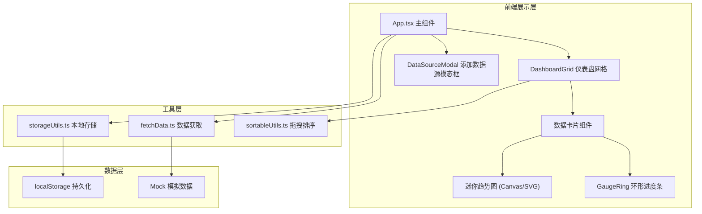

## 1. 架构设计



## 2. 技术描述

- **前端框架**：React 18 + TypeScript
- **构建工具**：Vite 5
- **开发服务器端口**：3000
- **样式方案**：原生CSS + CSS Modules（内联样式用于动态值）
- **动画方案**：CSS transitions + requestAnimationFrame
- **数据持久化**：localStorage
- **数据模拟**：内置Mock数据生成函数

## 3. 目录结构

```
src/
├── App.tsx              # 主组件，状态管理、定时刷新
├── DashboardGrid.tsx    # 仪表盘网格，拖拽排序
├── DataSourceModal.tsx  # 添加数据源模态框
├── GaugeRing.tsx        # 环形进度条组件
└── utils/
    ├── fetchData.ts     # 模拟数据获取
    ├── sortableUtils.ts # 拖拽排序工具
    └── storageUtils.ts  # 本地存储工具
```

## 4. 数据类型定义

### 4.1 数据源类型
```typescript
interface DataSource {
  id: string;
  name: string;
  type: 'stock' | 'traffic' | 'sensor' | 'progress' | 'revenue' | 'users';
  value: number;
  unit: string;
  history: number[];
  refreshInterval: number; // 秒
  maxValue?: number; // 用于进度条类型
}
```

### 4.2 布局配置
```typescript
interface DashLayout {
  order: string[]; // 数据源ID的顺序数组
}
```

## 5. 组件通信

- **App.tsx** → **DashboardGrid**: props 传递 `dataSources` 数组和 `onReorder` 回调
- **App.tsx** → **DataSourceModal**: props 传递 `isOpen`、`onClose`、`onAdd`
- **DashboardGrid** → **数据卡片**: props 传递单个 `dataSource` 数据
- **数据卡片** → **GaugeRing**: props 传递 `value`、`maxValue`、`color`

## 6. 性能优化策略

1. **React.memo**：数据卡片组件使用 memo 包装，避免不必要的重渲染
2. **useMemo/useCallback**：合理使用 hooks 缓存计算结果和回调函数
3. **增量更新**：数据刷新时只更新变化的数据点，而非整个历史数组
4. **requestAnimationFrame**：动画循环使用 rAF 保证流畅性
5. **CSS transforms**：使用 transform 而非 top/left 做动画，触发GPU加速
6. **Canvas 绘图**：迷你趋势图使用 Canvas 绘制，性能优于 SVG

## 7. 核心功能实现方案

### 7.1 拖拽排序
- 使用 HTML5 Drag and Drop API
- 拖拽时记录源索引和目标索引
- 拖拽结束后重新排列数组并保存到 localStorage

### 7.2 数据刷新
- 使用 setInterval 定时触发数据更新
- 每个数据源独立计时，支持不同刷新间隔
- 使用 Mock 函数模拟实时数据变化

### 7.3 动画效果
- 入场动画：CSS keyframes + animation-delay 实现依次淡入
- 数据变化：requestAnimationFrame 实现数值平滑过渡
- 进度条动画：SVG stroke-dasharray + CSS transition
