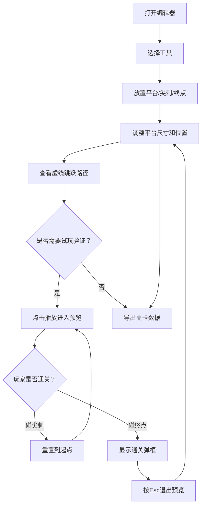

## 1. 产品概述
2D平台关卡编辑器，帮助游戏设计师在开发早期快速搭建和测试平台关卡，直观评估跳跃路线和平台间距的合理性。
- 解决手工绘制关卡难以评估玩家跳跃路径的问题，通过可视化连接线和试玩预览验证关卡可玩性
- 目标用户：2D平台游戏设计师和关卡策划

## 2. 核心功能

### 2.1 功能模块
1. **关卡编辑器页面**: 工具面板、绘制画布、试玩预览、导出功能

### 2.2 页面详情
| 页面名称 | 模块名称 | 功能描述 |
|----------|----------|----------|
| 关卡编辑器 | 左侧工具面板 | 选择/平台/尖刺/终点四种工具切换，点击切换光标模式 |
| 关卡编辑器 | 中央绘制画布 | 网格画布，支持拖拽平移和滚轮缩放，放置和编辑关卡元素 |
| 关卡编辑器 | 平台编辑 | 拖拽放置矩形平台，边缘手柄调整宽高，Delete删除，平台间虚线连接 |
| 关卡编辑器 | 尖刺与终点 | 放置三角形尖刺和圆形终点，悬停提示标签，终点呼吸动画 |
| 关卡编辑器 | 试玩预览 | 播放按钮启动预览，白色方块玩家自动跳跃，碰尖刺重置，碰终点通关 |
| 关卡编辑器 | 导出功能 | 导出JSON格式关卡数据，下载为.level文件 |

## 3. 核心流程

用户打开编辑器 → 选择工具（平台/尖刺/终点）→ 在画布上点击放置元素 → 调整平台尺寸 → 查看虚线跳跃路径 → 点击播放试玩 → 验证关卡可通行性 → 导出关卡数据

## 4. 用户界面设计

### 4.1 设计风格
- 主色调：深色主题（主背景#0d1117，面板背景#161b22，边框#30363d）
- 强调色：平台蓝#4a9eff、尖刺红#ff4444、终点金#ffd700、播放绿#2ecc71、导出紫#8b5cf6
- 按钮样式：圆角按钮，平滑过渡0.2s ease，悬停亮度+15%
- 字体：系统默认无衬线字体，白色文字
- 布局：顶部工具栏56px + 左侧工具面板200px + 中央画布填满剩余空间

### 4.2 页面设计概览
| 页面名称 | 模块名称 | UI元素 |
|----------|----------|--------|
| 关卡编辑器 | 顶部工具栏 | 深色背景#161b22，高度56px，包含播放按钮(绿色#2ecc71,120x40px,圆角20px)和导出按钮(紫色#8b5cf6,100x36px,圆角6px) |
| 关卡编辑器 | 左侧工具面板 | 宽200px，背景#2d2d3f，四个工具按钮48x48px，圆角8px，背景#3d3d55，选中#ff6b6b |
| 关卡编辑器 | 中央画布 | 背景#1a1a2e，网格#2a2a3e，1px线宽，50px间距 |
| 关卡编辑器 | 平台元素 | 矩形80x20px，#4a9eff，圆角4px，边框2px solid #2a7acc，拖拽手柄8x8px白色 |
| 关卡编辑器 | 尖刺元素 | 三角形底24px高20px，#ff4444 |
| 关卡编辑器 | 终点元素 | 圆形直径40px，#ffd700，呼吸动画0.8-1.1倍周期2秒 |
| 关卡编辑器 | 悬停提示 | 背景rgba(0,0,0,0.7)，白色12px字体，圆角4px，上方偏移10px |
| 关卡编辑器 | 通关弹框 | 背景#2ecc71，白色文字，圆角12px，居中显示 |

### 4.3 响应式
- 桌面优先，目标分辨率1920x1080，最小宽度1280px
- 不考虑移动端适配

### 4.4 3D场景指引
- 使用Three.js 2D正交投影相机进行画布渲染
- 网格线使用LineSegments绘制
- 元素使用Mesh和ShapeGeometry绘制
- 坐标变换通过相机位置和缩放实现平移和缩放
