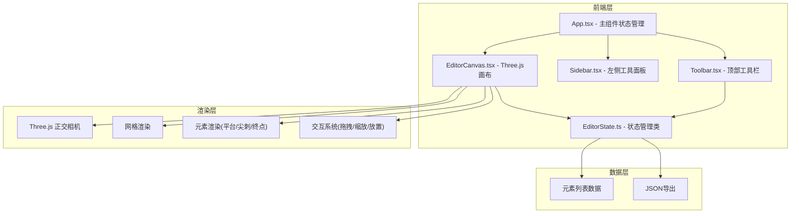
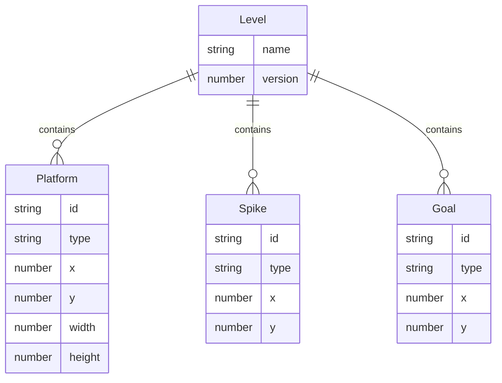

## 1. 架构设计



## 2. 技术说明
- 前端：React@18 + TypeScript + Vite
- 渲染引擎：Three.js（2D正交投影）
- 状态管理：自定义EditorState类（非Zustand，因需与Three.js紧密耦合）
- 初始化工具：Vite
- 后端：无
- 数据库：无（纯前端，数据通过JSON导出）

## 3. 路由定义
| 路由 | 用途 |
|------|------|
| / | 关卡编辑器（单页面应用） |

## 4. API定义
无后端API

## 5. 服务器架构图
无后端服务

## 6. 数据模型

### 6.1 数据模型定义



### 6.2 数据定义语言

```typescript
interface LevelData {
  name: string;
  version: number;
  elements: ElementData[];
}

interface PlatformData {
  id: string;
  type: 'platform';
  x: number;
  y: number;
  width: number;
  height: number;
}

interface SpikeData {
  id: string;
  type: 'spike';
  x: number;
  y: number;
}

interface GoalData {
  id: string;
  type: 'goal';
  x: number;
  y: number;
}

type ElementData = PlatformData | SpikeData | GoalData;
```

## 7. 文件组织
- package.json - 项目依赖和启动脚本
- index.html - 入口HTML
- tsconfig.json - TypeScript配置
- vite.config.js - Vite配置
- src/main.tsx - React入口
- src/App.tsx - 主组件
- src/editor/EditorCanvas.tsx - Three.js画布组件
- src/editor/EditorState.ts - 状态管理类
- src/editor/Toolbar.tsx - 顶部工具栏
- src/editor/Sidebar.tsx - 左侧工具面板
