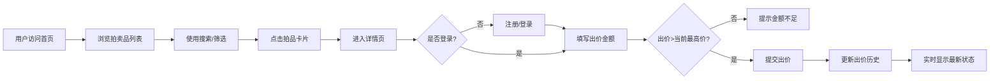

## 1. 产品概述

ArtifactAuction是一个高端在线拍卖行应用，专注于稀有藏品的交易，包括古董钱币、签名球衣、复古海报等珍贵物品。平台为收藏爱好者提供安全、透明、实时的竞拍体验，解决传统拍卖信息不对称、交易不便捷的痛点。

- 面向全球收藏爱好者，提供稀有藏品浏览、搜索、竞拍服务
- 核心价值：实时竞拍、透明记录、安全交易、优质用户体验

## 2. 核心功能

### 2.1 用户角色

| 角色 | 注册方式 | 核心权限 |
|------|----------|----------|
| 普通用户 | 用户名+密码注册 | 浏览拍卖品、搜索筛选、参与竞拍、查看出价历史、个人信息管理 |
| 访客 | 无需注册 | 浏览拍卖品列表、搜索筛选、查看详情和出价历史 |

### 2.2 功能模块

1. **首页拍卖列表**：瀑布流网格展示、缩略图、当前最高价、倒计时、筛选搜索
2. **单品详情页**：大图展示、详细描述、出价表单、历史出价记录表格
3. **用户系统**：注册登录、密码加密、头像展示、退出登录
4. **实时竞拍**：出价验证、历史记录、状态更新

### 2.3 页面详情

| 页面名称 | 模块名称 | 功能描述 |
|----------|----------|----------|
| 首页 | 拍卖品瀑布流 | 响应式网格布局，卡片悬停动效，倒计时数字跳动动画 |
| 首页 | 搜索筛选 | 关键词搜索、类别筛选（钱币/体育/艺术/玩具）、防抖搜索 |
| 首页 | 导航栏 | 固定顶部、用户信息、登录入口、汉堡菜单响应式 |
| 详情页 | 商品展示 | 大图居中、详细描述、当前价格高亮显示 |
| 详情页 | 出价功能 | 出价表单、价格验证、提交按钮渐变效果 |
| 详情页 | 历史记录 | 出价历史表格、动态数字颜色、相对时间显示 |
| 登录/注册 | 用户认证 | 表单验证、密码加密、登录状态保持 |

## 3. 核心流程

## 4. 用户界面设计

### 4.1 设计风格

- **整体风格**：深色奢华主题，高端收藏品拍卖氛围，沉稳神秘
- **主色调**：背景 `#0f0f1a`，卡片 `#1e1e2e`，强调色 `#6366f1`（紫蓝）和 `#facc15`（金黄）
- **按钮风格**：圆角8px，线性渐变背景，悬停亮度提升，过渡0.2s
- **字体**：现代无衬线字体，标题加粗，正文清晰，数字等宽
- **布局**：卡片式布局，居中最大宽度1200px，顶部固定导航
- **图标风格**：线性简约图标，与深色背景高对比度

### 4.2 页面设计概述

| 页面名称 | 模块名称 | UI元素 |
|----------|----------|--------|
| 首页 | 瀑布流网格 | 卡片宽280px，圆角12px，4:3缩略图，悬停上浮4px，阴影加深，过渡0.25s |
| 首页 | 搜索框 | 宽度60%，圆角24px，背景`#0f0f1a`，焦点边框变色，过渡0.2s |
| 首页 | 倒计时 | 红色数字跳动动画，实时更新剩余时间 |
| 详情页 | 商品大图 | 最大宽600px，圆角12px，阴影`0 4px 24px rgba(0,0,0,0.3)` |
| 详情页 | 当前价格 | 字号24px，颜色`#facc15`，加粗突出 |
| 详情页 | 出价表单 | 输入框高48px，渐变按钮，悬停亮度1.2倍 |
| 详情页 | 历史表格 | 表头`#2a2a3e`，行高48px，交替行色，悬停高亮 |

### 4.3 响应式

- **桌面优先**，移动端自适应
- 窗口宽度<768px时：瀑布流变为1列，导航栏折叠为汉堡菜单
- 触摸交互优化：按钮最小点击区域48x48px
- 所有卡片和元素间距按比例缩放

### 4.4 动效细节

- 卡片悬停：上浮4px + 阴影加深，过渡0.25s ease
- 倒计时：数字跳动动画，每秒更新
- 价格变化：红升绿降动态颜色
- 页面加载：元素渐入，瀑布流错位延迟
- 搜索聚焦：边框平滑过渡变色
