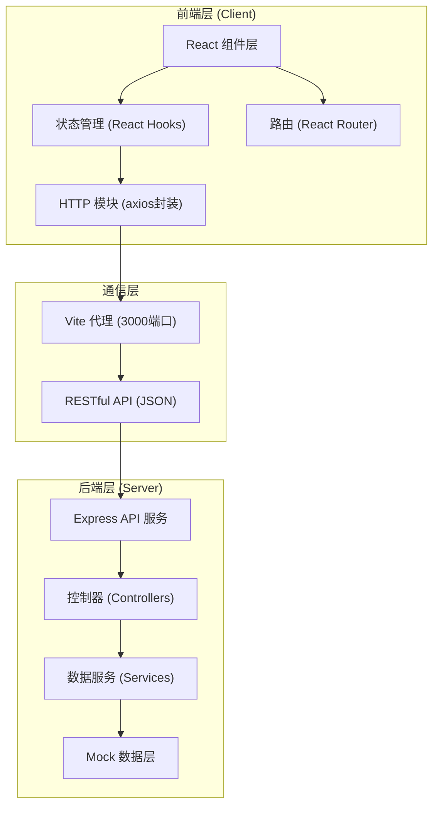
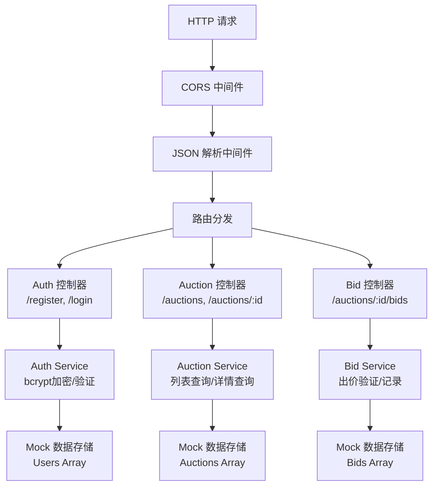
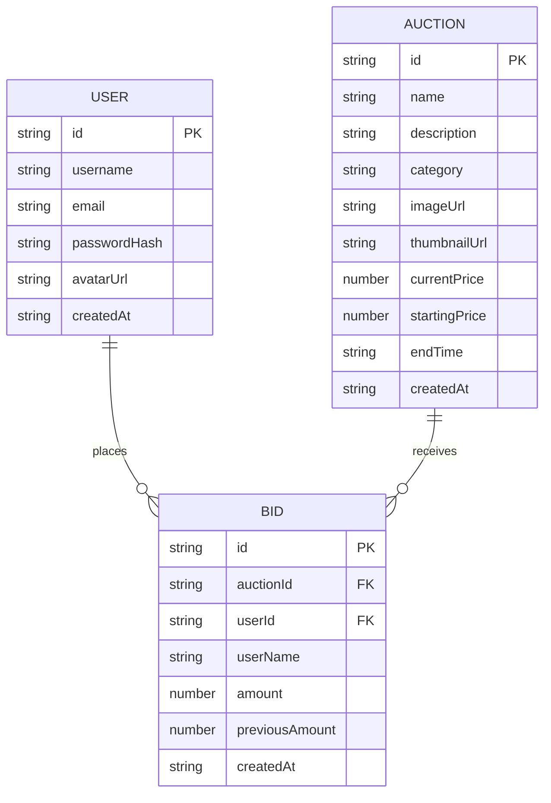

## 1. 架构设计



## 2. 技术描述

- **前端**：React@18 + TypeScript@5 + Vite@5 + React Router@6 + Axios@1
- **构建工具**：Vite，配置代理转发到后端3000端口
- **后端**：Express@4 + TypeScript@5 + bcrypt@5（密码加密）+ cors@2
- **数据存储**：内存Mock数据，包含拍卖品、用户、出价记录
- **样式方案**：CSS Modules / 内联样式，CSS变量管理主题色

## 3. 目录结构

```
auto76/
├── package.json                 # 根目录依赖和脚本
├── index.html                   # Vite入口HTML
├── tsconfig.json                # TypeScript配置（严格模式）
├── vite.config.js               # Vite配置（代理）
├── server/
│   ├── package.json             # 后端依赖
│   └── src/
│       └── app.ts               # Express服务入口
└── client/
    ├── package.json             # 前端依赖
    └── src/
        ├── App.tsx              # React根组件
        ├── components/
        │   ├── AuctionList.tsx  # 拍卖品列表
        │   └── AuctionDetail.tsx # 单品详情
        └── utils/
            └── http.ts          # axios封装
```

## 4. 路由定义

### 前端路由

| 路由 | 页面 | 说明 |
|------|------|------|
| `/` | 首页 | 拍卖品列表、搜索筛选 |
| `/auction/:id` | 详情页 | 单品详情、出价、历史记录 |
| `/login` | 登录页 | 用户登录 |
| `/register` | 注册页 | 用户注册 |

### 后端API路由

| 方法 | 路径 | 功能 |
|------|------|------|
| GET | `/api/auctions` | 获取拍卖品列表（支持搜索、分类筛选） |
| GET | `/api/auctions/:id` | 获取单拍品详情 |
| GET | `/api/auctions/:id/bids` | 获取出价历史 |
| POST | `/api/auctions/:id/bids` | 提交出价 |
| POST | `/api/auth/register` | 用户注册 |
| POST | `/api/auth/login` | 用户登录 |

## 5. API 定义

### 类型定义

```typescript
// 拍卖品
interface AuctionItem {
  id: string;
  name: string;
  description: string;
  category: 'coin' | 'sports' | 'art' | 'toy';
  imageUrl: string;
  thumbnailUrl: string;
  currentPrice: number;
  startingPrice: number;
  endTime: string;
  createdAt: string;
}

// 出价记录
interface Bid {
  id: string;
  auctionId: string;
  userId: string;
  userName: string;
  amount: number;
  previousAmount: number;
  createdAt: string;
}

// 用户
interface User {
  id: string;
  username: string;
  email: string;
  passwordHash: string;
  avatarUrl: string;
  createdAt: string;
}

// API响应
interface ApiResponse<T> {
  success: boolean;
  data?: T;
  error?: string;
}
```

### 请求/响应示例

**GET /api/auctions?search=钱币&category=coin**

响应：
```json
{
  "success": true,
  "data": [
    {
      "id": "1",
      "name": "1889年摩根银币",
      "description": "保存完好的稀有摩根银币...",
      "category": "coin",
      "imageUrl": "...",
      "currentPrice": 2500,
      "endTime": "2026-06-15T12:00:00Z"
    }
  ]
}
```

**POST /api/auctions/:id/bids**

请求：
```json
{
  "userId": "u1",
  "amount": 3000
}
```

响应：
```json
{
  "success": true,
  "data": {
    "id": "b1",
    "auctionId": "1",
    "userName": "收藏家小王",
    "amount": 3000,
    "previousAmount": 2500,
    "createdAt": "2026-06-14T10:30:00Z"
  }
}
```

## 6. 服务器架构图



## 7. 数据模型

### 7.1 数据模型定义



### 7.2 初始化数据

```typescript
// Mock 拍卖品数据
const initialAuctions: AuctionItem[] = [
  {
    id: '1',
    name: '1889年摩根银币',
    description: '美国1889年发行的摩根银元，品相极佳，是钱币收藏中的珍品...',
    category: 'coin',
    imageUrl: 'https://images.unsplash.com/photo-1621761191319-c6fb62004040?w=800',
    thumbnailUrl: 'https://images.unsplash.com/photo-1621761191319-c6fb62004040?w=400',
    currentPrice: 2500,
    startingPrice: 1000,
    endTime: new Date(Date.now() + 86400000 * 2).toISOString(),
    createdAt: new Date(Date.now() - 86400000 * 5).toISOString()
  },
  // ... 更多示例数据
];

// 类别映射
const categoryMap: Record<string, string> = {
  coin: '钱币',
  sports: '体育',
  art: '艺术',
  toy: '玩具'
};
```

## 8. 性能优化点

1. **防抖搜索**：输入防抖300ms，避免频繁请求
2. **请求取消**：切换搜索条件时取消未完成的请求，避免竞态
3. **React.memo**：列表项组件优化，避免不必要重渲染
4. **懒加载**：图片懒加载，瀑布流分页加载
5. **本地缓存**：用户登录状态localStorage存储
6. **状态管理**：合理使用useMemo/useCallback优化渲染
