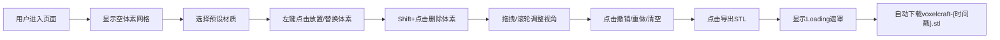

## 1. 产品概述
VoxelCraft是一款面向3D打印爱好者和设计师的浏览器内体素建模工具。用户通过简单的点击和拖拽操作，在10x10x10的3D体素网格上搭建类似Minecraft风格的立体模型，无需学习专业建模软件即可快速创作，并一键导出标准STL文件用于3D打印。
- 目标用户：3D打印爱好者、模型设计师、教育工作者、学生
- 核心价值：极低学习成本的体素化建模，所见即所得，直接对接3D打印流程

## 2. 核心功能

### 2.1 用户角色
无需注册，所有用户直接以访客身份使用全部功能。

### 2.2 功能模块
1. **工具栏模块**：材质选择器（12种预设材质）、撤销/重做/清空操作按钮、STL导出按钮
2. **3D场景模块**：10x10x10体素网格可视化、相机旋转/平移/缩放、体素放置/删除/替换、删除动画
3. **信息面板模块**：体素总数统计、当前材质信息、相机方位角/俯仰角显示
4. **导出模块**：STL文件生成、Loading遮罩动画、文件自动下载

### 2.3 页面详情
| 页面名称 | 模块名称 | 功能描述 |
|-----------|-------------|---------------------|
| 主页面 | 工具栏 | 12种材质40x40px预览，选中2px金色边框；撤销/重做/清空按钮44px宽圆角8px；导出按钮红色背景 |
| 主页面 | 3D场景区域 | 剩余空间占满，10x10x10半透明浅蓝网格(#4a90d9, 0.3)，支持左键旋转、右键平移、滚轮缩放 |
| 主页面 | 信息面板 | 右下角200px宽半透明面板，显示体素数、材质名+色值、方位角+俯仰角 |
| 主页面 | 导出遮罩 | 半透明黑色背景，中央64px直径金色旋转动画 |

## 3. 核心流程
用户打开页面 → 默认看到10x10x10空网格 → 从顶部工具栏选择材质 → 左键点击网格位置放置体素 → 点击已有体素可替换材质 → Shift+点击删除体素 → 通过拖拽旋转、平移、滚轮缩放调整视角 → 观察右下角面板实时数据 → 点击撤销/重做/清空管理操作历史 → 完成建模后点击导出按钮 → 显示loading遮罩 → STL文件自动下载。

## 4. 用户界面设计
### 4.1 设计风格
- 主背景色：暗色调科技风 #20202e
- 主色（霓虹蓝）：#4a90d9（用于网格、点缀）
- 强调色（金色）：#ffd700（用于选中边框、loading动画）
- 危险/行动色：#ff6b6b（用于导出按钮）
- 工具栏背景：#2c2c3a，高度56px
- 按钮默认背景：#3d3d55，悬停 #5a5a7a
- 信息面板背景：#1e1e2e，透明度0.85，圆角12px
- 所有交互元素过渡：0.2s ease，按钮悬停0.15s ease
- 字体：'Segoe UI', sans-serif

### 4.2 页面设计概览
| 页面名称 | 模块名称 | UI元素 |
|-----------|-------------|-------------|
| 主页面 | 工具栏 | 横向布局，材质选择器12格40x40px，操作按钮组44px宽8px圆角，导出按钮独立红色 |
| 主页面 | 3D场景 | Three.js Canvas全屏剩余区域，浅灰色#444466网格线1px宽，默认相机(15,12,15)看向原点 |
| 主页面 | 信息面板 | 固定右下角，白色文字，4项信息分开展示，面板内边距16px |
| 主页面 | 遮罩层 | 全屏fixed，黑色半透明0.5，中央旋转环动画64px直径金色 |

### 4.3 响应式适配
- **≥1280px**：保持设计稿布局，工具栏一行展示
- **1024px-1279px**：工具栏按钮与材质选择器换行显示，信息面板字体缩小至14px
- **<1024px**：继续缩小间距，保持可用性

### 4.4 3D场景指引
- **环境**：深色背景#20202e，方向光+环境光组合营造立体感
- **光照**：1个环境光(0xffffff, 0.4) + 1个方向光(0xffffff, 0.8)从右上方照射
- **相机**：PerspectiveCamera，fov 50度，OrbitControls控制，俯仰角限制-85°~85°，缩放范围5~30
- **交互**：Raycaster拾取网格，左键放置/替换，Shift+左键删除，删除时scale从1动画到0(0.2s ease-out)
- **性能优化**：体素>2000启用LOD（<10单位全六面，10-20单位三面，>20单位单色方块），使用InstancedMesh
- **LOD说明**：由于用户明确要求使用拆分模块架构，实际采用基于距离的材质简化策略，结合InstancedMesh批量渲染保证性能
