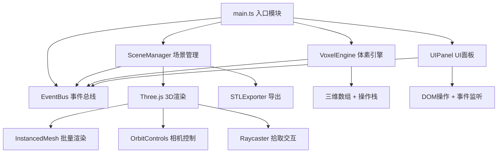

## 1. 架构设计
本项目采用纯前端模块化架构，通过事件总线（EventBus）实现模块间解耦通信，不依赖后端服务。



## 2. 技术描述
- **前端框架**：无框架，原生TypeScript模块化开发
- **3D引擎**：Three.js r160+，含OrbitControls、STLExporter
- **构建工具**：Vite 5.x + @vitejs/plugin-typescript
- **语言**：TypeScript 5.x，严格模式，target ES2020，module ESNext
- **包管理器**：npm
- **启动方式**：`npm run dev`

## 3. 模块划分与文件结构
```
auto80/
├── package.json
├── tsconfig.json
├── vite.config.js
├── index.html
└── src/
    ├── main.ts           # 入口：初始化场景/渲染器/控制器/事件总线
    ├── eventBus.ts       # 事件总线：emit/on/off，类型安全事件
    ├── voxelEngine.ts    # 体素引擎：网格数据、增删改、撤销重做栈(50步)
    ├── sceneManager.ts   # 场景管理：Three.js渲染、InstancedMesh、相机、导出
    └── uiPanel.ts        # UI面板：工具栏、信息面板、导出遮罩、DOM事件
```

## 4. 事件类型定义（EventBus）
采用TypeScript字符串字面量联合类型确保事件类型安全：
| 事件名 | 携带数据 | 触发方 | 监听方 | 说明 |
|--------|---------|--------|--------|------|
| `voxelsUpdated` | `{ grid: number[][][], count: number }` | VoxelEngine | SceneManager, UIPanel | 体素变更后通知更新渲染和UI |
| `materialChanged` | `{ materialId: number }` | UIPanel | VoxelEngine, UIPanel | 用户切换选中材质 |
| `undo` | 无 | UIPanel | VoxelEngine | 执行撤销操作 |
| `redo` | 无 | UIPanel | VoxelEngine | 执行重做操作 |
| `clearAll` | 无 | UIPanel | VoxelEngine | 清空所有体素 |
| `exportSTL:request` | 无 | UIPanel | SceneManager | 请求导出STL |
| `exportSTL:ready` | `{ blob: Blob, filename: string }` | SceneManager | UIPanel | STL生成完毕，携带Blob数据 |
| `cameraChanged` | `{ azimuth: number, pitch: number }` | SceneManager | UIPanel | 相机视角变更（每帧节流触发） |

## 5. 数据模型

### 5.1 体素网格数据
```typescript
// 10x10x10三维数组，值为材质ID（0-11表示12种材质，-1表示空）
type VoxelGrid = number[][][]; // grid[x][y][z] = materialId | -1

// 预设材质定义
interface MaterialDef {
  id: number;
  name: string;
  color: string;        // 十六进制色值，如"#8B4513"
  hex: number;          // Three.js用数值，如0x8B4513
}

// 操作栈条目（用于撤销/重做）
interface OperationEntry {
  type: 'add' | 'remove' | 'replace';
  x: number; y: number; z: number;
  prevMaterial: number; // 变更前材质ID
  newMaterial: number;  // 变更后材质ID
}
```

### 5.2 12种预设材质表
| ID | 名称 | 颜色 |
|----|------|------|
| 0 | 泥土 Dirt | #8B4513 |
| 1 | 石头 Stone | #808080 |
| 2 | 木头 Wood | #A0522D |
| 3 | 玻璃 Glass | #87CEEB |
| 4 | 草皮 Grass | #228B22 |
| 5 | 沙子 Sand | #F4A460 |
| 6 | 砖块 Brick | #B22222 |
| 7 | 铁锭 Iron | #C0C0C0 |
| 8 | 金块 Gold | #FFD700 |
| 9 | 钻石 Diamond | #00CED1 |
| 10 | 黑曜石 Obsidian | #2F1B41 |
| 11 | 雪块 Snow | #FFFAFA |

## 6. 核心算法要点

### 6.1 体素拾取（Raycaster）
1. 监听Canvas的pointerdown事件，获取NDC坐标
2. `Raycaster.setFromCamera(ndc, camera)` 发射射线
3. 与网格辅助线平面（y=0~10层）求交，确定点击的(x,y,z)网格坐标
4. 若命中已有体素：根据Shift键判断是替换还是删除
5. 若未命中但命中网格平面：执行放置

### 6.2 LOD策略（体素数>2000时启用）
- 每个体素计算其世界坐标到相机位置的欧氏距离
- 距离<10：使用全细节材质（含边框线EdgesGeometry）
- 距离10~20：仅使用朝向相机的3个面材质，无背面
- 距离>20：使用简化的无纹理纯色方块，无边框

### 6.3 撤销/重做机制
- 维护两个栈：`undoStack: OperationEntry[]`（最多50条）、`redoStack: OperationEntry[]`
- 每次操作压入undoStack，清空redoStack
- 撤销：从undoStack弹出，反向执行（prev↔new），压入redoStack
- 重做：从redoStack弹出，正向执行，压入undoStack
- 超过50条时undoStack.shift()丢弃最旧记录

### 6.4 STL导出
1. 遍历当前网格所有非空(x,y,z)
2. 对每个体素创建BoxGeometry(1,1,1)，平移至对应位置
3. 合并所有几何体为单个BufferGeometry（使用BufferGeometryUtils.mergeGeometries）
4. 调用STLExporter.parse()生成ASCII或Binary STL字符串
5. 封装为Blob，通过a标签download属性触发下载，文件名含时间戳
