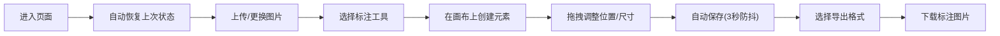
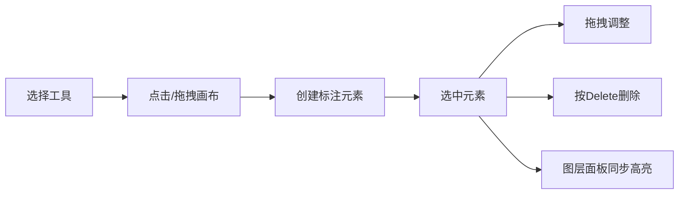

## 1. 产品概述

GraphiqueAnnotator 是一款在线交互式图表注释工具，允许用户上传图片并添加多种标注元素，适用于学术研究、工程设计、数据分析等场景下的图表标记与说明。

- 核心用途：在自定义图表图片上添加锚点路径、文本说明、箭头指示和量尺测量
- 目标用户：研究人员、工程师、数据分析师、教师学生等需要对图表进行标注的专业人士
- 产品价值：提供轻量级、无需安装的在线标注解决方案，支持导出高质量标注图片

## 2. 核心特性

### 2.1 用户角色

| 角色 | 注册方式 | 核心权限 |
|------|----------|----------|
| 普通用户 | 无需注册，直接使用 | 上传图片、添加标注、导出图片、本地自动保存 |

### 2.2 功能模块

1. **主工作区**：图片加载、画布渲染、元素绘制与交互
2. **工具栏**：标注工具选择、样式设置（颜色、字号）
3. **图层面板**：标注元素列表、选中与管理
4. **导出模块**：PNG/JPG/SVG 三种格式导出
5. **自动保存**：localStorage 防抖保存与状态恢复

### 2.3 页面详情

| 页面名称 | 模块名称 | 功能描述 |
|----------|----------|----------|
| 主工作页 | 图片上传模块 | 支持PNG/JPG格式上传，自动居中显示，按钮样式：圆角8px，背景#4a90d9，悬停#5ba0e9 |
| 主工作页 | 画布模块 | 深色背景#1a1a1a，支持拖拽移动图片，光标grab/grabbing，渲染所有标注元素 |
| 主工作页 | 锚点工具 | 点击画布创建红色圆形锚点（直径12px），相邻锚点虚线连接，支持拖拽移动，选中放大1.2倍 |
| 主工作页 | 文本框工具 | 点击生成可编辑文本框，背景半透明白#ffffff80，圆角4px，支持字号10-32px、6种预设颜色 |
| 主工作页 | 箭头工具 | 拖拽生成带箭头线段，起止点圆形控制柄（直径8px），颜色#1e88e5，线宽2px |
| 主工作页 | 量尺工具 | 拖拽生成带刻度量尺，实时显示像素长度，带箭头指示 |
| 主工作页 | 删除功能 | 选中元素后按Delete键删除 |
| 主工作页 | 图层面板 | 左侧浮动200px宽，列出所有标注元素，点击选中高亮 |
| 主工作页 | 导出按钮 | 右下角三个导出按钮，PNG#43a047、JPG#fb8c00、SVG#8e24aa，各宽120px |
| 主工作页 | 自动保存 | 3秒防抖保存至localStorage，页面加载自动恢复 |

## 3. 核心流程

### 3.1 用户操作流程

用户进入页面后，首先上传图片，然后选择工具栏中的标注工具，在画布上点击或拖拽创建标注元素，通过拖拽调整元素位置和样式，最后选择导出格式下载标注后的图片。整个过程中系统自动保存编辑状态。

### 3.2 元素交互流程

## 4. 用户界面设计

### 4.1 设计风格

- **设计调性**：专业简洁的工具型界面，注重功能性和可用性
- **主色调**：浅灰背景#f5f5f5，工具栏白色#ffffff，画布深色#1a1a1a
- **强调色**：蓝色#4a90d9（主要按钮）、绿色#43a047（PNG导出）、橙色#fb8c00（JPG导出）、紫色#8e24aa（SVG导出）
- **按钮样式**：圆角6px，48x36px，悬停背景#e8e8e8，点击缩放0.95倍，过渡0.15s ease
- **字体**：使用现代无衬线字体，正文14px，清晰易读
- **布局**：顶部工具栏 + 左侧图层面板 + 中央画布 + 右下角导出按钮
- **阴影**：工具栏底部阴影0 2px 8px rgba(0,0,0,0.08)，图层面板阴影0 4px 20px rgba(0,0,0,0.12)
- **动画**：所有过渡统一0.2s ease

### 4.2 页面设计概览

| 页面名称 | 模块名称 | UI元素 |
|----------|----------|--------|
| 主工作页 | 顶部工具栏 | 高度56px，白色背景，底部阴影，按钮间距12px，上传按钮+5个工具按钮+颜色选择器+字号选择器 |
| 主工作页 | 中央画布 | 深色背景#1a1a1a，占满剩余空间，图片居中显示，支持拖拽移动 |
| 主工作页 | 左侧图层面板 | 宽度200px，白色背景，圆角8px，阴影，元素列表，点击选中高亮 |
| 主工作页 | 右下角导出区 | 三个彩色按钮并排，PNG绿、JPG橙、SVG紫 |
| 主工作页 | 标注元素 | 锚点红色圆形、文本框半透明白、箭头蓝色、量尺带刻度 |

### 4.3 响应式设计

- **桌面优先**：主要面向桌面端用户，设计1280px以上屏幕尺寸
- **画布自适应**：画布区域根据窗口大小自动调整，图片保持比例居中
- **面板定位**：工具栏固定顶部，图层面板固定左侧，导出按钮固定右下角
- **不考虑移动端**：该工具为专业桌面应用，暂不做移动端适配

### 4.4 交互细节

- **选中状态**：文本框选中时2px dashed #4a90d9边框，锚点选中时放大1.2倍
- **拖拽光标**：图片拖拽时grab/grabbing，元素拖拽时move
- **工具激活**：当前选中的工具按钮高亮显示
- **实时反馈**：量尺刻度随拖拽实时更新，文本框实时编辑

## 5. 性能要求

- **拖拽响应**：50个标注元素同时存在时，拖拽响应延迟≤50ms
- **导出性能**：导出图片渲染时间≤2秒
- **自动保存**：防抖间隔3秒，避免频繁写入localStorage
