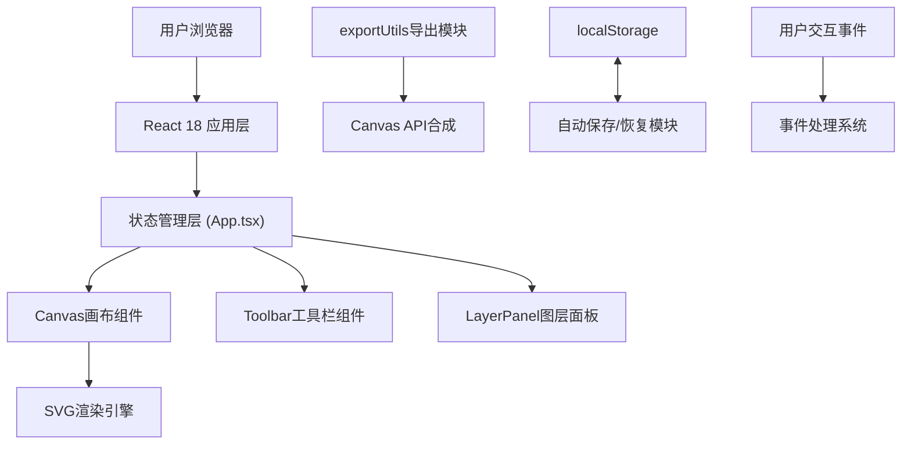

## 1. 架构设计

GraphiqueAnnotator 采用纯前端单页应用架构，无需后端服务，所有数据存储在浏览器本地。



## 2. 技术选型

### 2.1 技术栈

| 类别 | 技术 | 版本 | 说明 |
|------|------|------|------|
| 前端框架 | React | 18.x | 组件化UI开发 |
| 前端语言 | TypeScript | 5.x | 类型安全的JavaScript超集 |
| 构建工具 | Vite | 5.x | 快速开发构建工具 |
| 渲染技术 | SVG + Canvas API | - | SVG用于交互渲染，Canvas用于导出合成 |
| 存储 | localStorage | - | 浏览器本地存储 |
| 样式 | 原生CSS + CSS变量 | - | 轻量级样式方案 |

### 2.2 依赖说明

```json
{
  "dependencies": {
    "react": "^18.2.0",
    "react-dom": "^18.2.0"
  },
  "devDependencies": {
    "@vitejs/plugin-react": "^4.2.0",
    "@types/react": "^18.2.0",
    "@types/react-dom": "^18.2.0",
    "typescript": "^5.3.0",
    "vite": "^5.0.0"
  }
}
```

### 2.3 初始化方式

使用 Vite 官方 React + TypeScript 模板初始化项目：
```bash
npm create vite@latest . -- --template react-ts
```

## 3. 文件结构设计

```
d:\VersionFastPro\tasks\auto81\
├── package.json              # 项目依赖与脚本
├── index.html                # 入口HTML
├── vite.config.ts            # Vite配置
├── tsconfig.json             # TypeScript配置
└── src\
    ├── App.tsx               # 主组件，全局状态管理
    ├── CanvasCanvas.tsx      # 核心画布组件
    ├── Toolbar.tsx           # 工具栏组件
    ├── LayerPanel.tsx        # 图层面板组件（新增）
    ├── types.ts              # 类型定义（新增）
    └── exportUtils.ts        # 导出工具模块
```

## 4. 数据模型与类型定义

### 4.1 核心类型定义

```typescript
// 工具类型
export type ToolType = 'select' | 'anchor' | 'text' | 'arrow' | 'ruler';

// 标注元素基础类型
export interface BaseElement {
  id: string;
  type: 'anchor' | 'text' | 'arrow' | 'ruler';
  x: number;
  y: number;
}

// 锚点元素
export interface AnchorElement extends BaseElement {
  type: 'anchor';
}

// 文本框元素
export interface TextElement extends BaseElement {
  type: 'text';
  content: string;
  fontSize: number;  // 10-32px
  color: string;     // 6种预设颜色之一
  width?: number;
  height?: number;
}

// 箭头元素
export interface ArrowElement extends BaseElement {
  type: 'arrow';
  endX: number;
  endY: number;
  color: string;
  lineWidth: number;
}

// 量尺元素
export interface RulerElement extends BaseElement {
  type: 'ruler';
  endX: number;
  endY: number;
  color: string;
  lineWidth: number;
}

// 联合类型
export type AnnotationElement = AnchorElement | TextElement | ArrowElement | RulerElement;

// 应用状态
export interface AppState {
  image: string | null;           // base64图片数据
  imagePosition: { x: number; y: number; scale: number };
  elements: AnnotationElement[];
  selectedId: string | null;
  currentTool: ToolType;
  currentColor: string;
  currentFontSize: number;
}

// 预设颜色
export const PRESET_COLORS = [
  '#000000', // 黑
  '#e53935', // 红
  '#1e88e5', // 蓝
  '#43a047', // 绿
  '#fb8c00', // 橙
  '#8e24aa', // 紫
];
```

### 4.2 localStorage 存储格式

```typescript
interface SavedState {
  version: '1.0';
  savedAt: number;
  image: string | null;
  imagePosition: { x: number; y: number; scale: number };
  elements: AnnotationElement[];
}
```

## 5. 核心功能实现方案

### 5.1 状态管理

- 使用 React `useState` 和 `useReducer` 管理全局状态
- 状态提升至 `App.tsx`，通过 props 传递给子组件
- 自动保存使用 `useEffect` + 防抖函数实现

### 5.2 画布渲染

- 使用 SVG 作为主要渲染技术，支持良好的交互性
- 图片使用 `<image>` 元素渲染
- 各类标注元素使用对应的 SVG 元素：
  - 锚点：`<circle>`
  - 文本框：`<foreignObject>` + `<div>`（支持编辑）
  - 箭头：`<line>` + `<polygon>`（箭头头部）
  - 量尺：`<line>` + `<text>`（刻度值）

### 5.3 拖拽交互

- 使用 React 鼠标事件（`onMouseDown`, `onMouseMove`, `onMouseUp`）
- 拖拽状态使用 `useRef` 存储，避免频繁重渲染
- 性能优化：使用 `requestAnimationFrame` 处理高频拖拽事件

### 5.4 自动保存

```typescript
// 防抖函数实现
function debounce<T extends (...args: any[]) => any>(
  fn: T,
  delay: number
): (...args: Parameters<T>) => void {
  let timer: number | null = null;
  return (...args: Parameters<T>) => {
    if (timer) clearTimeout(timer);
    timer = window.setTimeout(() => fn(...args), delay);
  };
}

// 保存到 localStorage
const saveToLocalStorage = debounce((state: SavedState) => {
  try {
    localStorage.setItem('graphique_annotator_state', JSON.stringify(state));
  } catch (e) {
    console.error('保存失败:', e);
  }
}, 3000);
```

### 5.5 导出实现

使用 Canvas API 进行离屏渲染合成：

1. 创建离屏 Canvas 元素
2. 绘制背景图片
3. 依次绘制所有标注元素
4. 使用 `toDataURL` 生成图片数据
5. 创建 `<a>` 元素触发下载

SVG 导出：直接序列化 SVG 元素并添加 XML 声明。

## 6. 组件划分与职责

### 6.1 App.tsx - 主组件

**职责**：
- 管理全局应用状态
- 加载/恢复 localStorage 数据
- 处理图片上传
- 集成所有子组件
- 处理键盘事件（Delete键删除）

**核心方法**：
- `handleImageUpload`: 处理图片文件上传
- `handleAddElement`: 添加新标注元素
- `handleUpdateElement`: 更新元素属性
- `handleDeleteElement`: 删除选中元素
- `handleSelectElement`: 选中元素
- `handleToolChange`: 切换当前工具

### 6.2 CanvasCanvas.tsx - 画布组件

**职责**：
- 渲染背景图片和所有标注元素
- 处理画布上的鼠标交互
- 处理元素拖拽
- 处理图片拖拽移动

**核心 Props**：
```typescript
interface CanvasProps {
  image: string | null;
  imagePosition: { x: number; y: number; scale: number };
  elements: AnnotationElement[];
  selectedId: string | null;
  currentTool: ToolType;
  currentColor: string;
  currentFontSize: number;
  onImagePositionChange: (pos: { x: number; y: number; scale: number }) => void;
  onAddElement: (element: AnnotationElement) => void;
  onUpdateElement: (id: string, updates: Partial<AnnotationElement>) => void;
  onSelectElement: (id: string | null) => void;
}
```

### 6.3 Toolbar.tsx - 工具栏组件

**职责**：
- 提供工具选择按钮
- 提供颜色选择器
- 提供字号选择器
- 提供图片上传按钮

**核心 Props**：
```typescript
interface ToolbarProps {
  currentTool: ToolType;
  currentColor: string;
  currentFontSize: number;
  onToolChange: (tool: ToolType) => void;
  onColorChange: (color: string) => void;
  onFontSizeChange: (size: number) => void;
  onImageUpload: (file: File) => void;
}
```

### 6.4 LayerPanel.tsx - 图层面板组件

**职责**：
- 列出所有标注元素
- 显示元素类型和编号
- 点击选中对应元素

**核心 Props**：
```typescript
interface LayerPanelProps {
  elements: AnnotationElement[];
  selectedId: string | null;
  onSelectElement: (id: string) => void;
}
```

### 6.5 exportUtils.ts - 导出工具模块

**职责**：
- 提供 PNG/JPG/SVG 导出函数
- 处理 Canvas 合成逻辑

**核心函数**：
```typescript
export async function exportToPNG(
  svgElement: SVGSVGElement,
  image: string,
  imagePosition: { x: number; y: number; scale: number },
  canvasWidth: number,
  canvasHeight: number
): Promise<void>;

export async function exportToJPG(
  svgElement: SVGSVGElement,
  image: string,
  imagePosition: { x: number; y: number; scale: number },
  canvasWidth: number,
  canvasHeight: number
): Promise<void>;

export function exportToSVG(
  svgElement: SVGSVGElement,
  image: string
): void;
```

## 7. 性能优化策略

### 7.1 拖拽性能优化

- 使用 `useRef` 存储拖拽状态，避免 state 更新触发重渲染
- 使用 `requestAnimationFrame` 批量处理位置更新
- 对元素列表使用 `React.memo` 避免不必要的重渲染

### 7.2 渲染优化

- 图片加载完成后缓存尺寸信息
- 使用 CSS `transform` 进行元素定位，避免重排
- 文本框编辑时使用 `contentEditable`，减少 React 状态更新

### 7.3 自动保存优化

- 3秒防抖间隔，避免频繁写入
- 图片数据较大时考虑仅在图片变更时保存完整数据
- 使用 try-catch 处理存储异常（如超出配额）

## 8. 路由定义

本应用为单页应用，无需多路由配置。

| 路由 | 用途 |
|------|------|
| / | 主工作页面 |

## 9. 启动脚本

```json
{
  "scripts": {
    "dev": "vite",
    "build": "tsc && vite build",
    "preview": "vite preview"
  }
}
```

运行方式：
```bash
npm install
npm run dev
```
