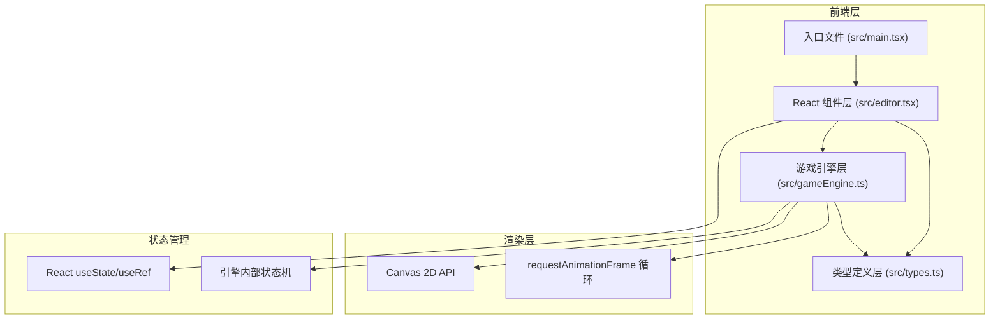

## 1. 架构设计



## 2. 技术说明

- **前端框架**：React 18 + TypeScript 5
- **构建工具**：Vite 5 + @vitejs/plugin-react
- **渲染引擎**：Canvas 2D API（原生，无第三方游戏引擎）
- **状态管理**：React Hooks（useState/useRef/useCallback/useEffect）
- **初始化方式**：使用 vite-init react-ts 模板

## 3. 文件结构

```
auto82/
├── package.json
├── index.html
├── vite.config.ts
├── tsconfig.json
└── src/
    ├── main.tsx          # React 入口
    ├── types.ts          # 类型定义（工具枚举、元素接口、路径节点）
    ├── editor.tsx        # 编辑器核心组件（UI + 编辑逻辑）
    └── gameEngine.ts     # 游戏引擎（模拟模式渲染循环）
```

## 4. 核心数据模型

### 4.1 类型定义 (src/types.ts)

```typescript
// 工具类型枚举
enum ToolType {
  SELECT = 'select',
  ENEMY_SPAWN = 'enemy_spawn',
  COVER = 'cover',
  AMMO_BOX = 'ammo_box',
  EXIT = 'exit'
}

// 场景元素基础接口
interface SceneElement {
  id: string;
  type: string;
  x: number;
  y: number;
}

// 敌人出生点
interface EnemySpawn extends SceneElement {
  type: 'enemy_spawn';
  pathNodes: PathNode[];
  patrolSpeed: number;
}

// 巡逻路径节点
interface PathNode {
  id: string;
  x: number;
  y: number;
}

// 掩体
interface Cover extends SceneElement {
  type: 'cover';
  width: number;
  height: number;
}

// 弹药箱
interface AmmoBox extends SceneElement {
  type: 'ammo_box';
}

// 出口
interface Exit extends SceneElement {
  type: 'exit';
}

// 关卡数据
interface LevelData {
  elements: SceneElement[];
}
```

### 4.2 游戏引擎状态 (src/gameEngine.ts)

```typescript
interface Player {
  x: number;
  y: number;
  radius: number;
  speed: number;
}

interface Bullet {
  id: string;
  x: number;
  y: number;
  vx: number;
  vy: number;
  radius: number;
}

interface Enemy {
  id: string;
  x: number;
  y: number;
  pathNodes: { x: number; y: number }[];
  currentNodeIndex: number;
  speed: number;
  flashTimer: number;
}

interface Particle {
  id: string;
  x: number;
  y: number;
  vx: number;
  vy: number;
  life: number;
  maxLife: number;
  color: string;
  radius: number;
}

interface GameState {
  player: Player;
  bullets: Bullet[];
  enemies: Enemy[];
  particles: Particle[];
  keys: Record<string, boolean>;
  mouseX: number;
  mouseY: number;
}
```

## 5. 核心流程

### 5.1 编辑模式流程
1. React 组件渲染工具面板 + Canvas
2. 用户选择工具 → 更新 useState 中的 currentTool
3. Canvas 监听鼠标事件 → 根据 currentTool 执行放置/选择/拖拽
4. 场景元素数据存储在 useState 中 → 触发重新渲染 Canvas

### 5.2 模拟模式流程
1. 点击"测试运行" → gameEngine.start()
2. 克隆当前关卡数据 → 初始化 GameState（玩家、敌人、子弹数组）
3. requestAnimationFrame 启动循环：
   - 更新玩家位置（WASD输入）
   - 更新子弹位置
   - 更新敌人沿路径巡逻
   - 碰撞检测（子弹-掩体，子弹-敌人）
   - 粒子生成与更新
   - Canvas 重绘所有元素
4. 按 Esc → gameEngine.stop() → 恢复编辑器状态
