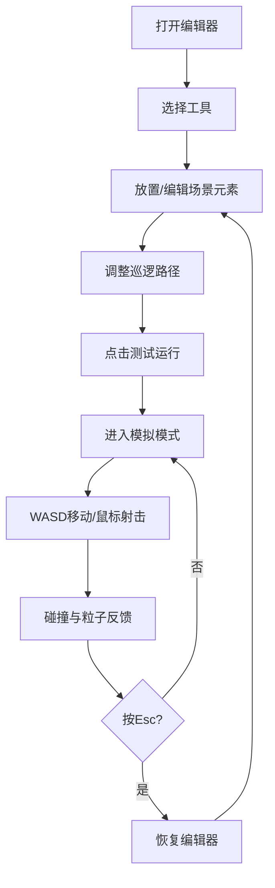

## 1. 产品概述

2D横版射击游戏关卡编辑器，帮助游戏开发者在浏览器中快速构建、编辑和测试关卡场景，解决手工配置敌人巡逻路径、掩体位置和资源掉落点效率低下、难以即时验证的问题。

- 核心用户：独立游戏开发者、关卡设计师
- 产品价值：可视化拖拽编辑 + 即时模拟测试，大幅提升关卡设计迭代效率

## 2. 核心功能

### 2.1 功能模块
1. **关卡编辑器主界面**：左侧工具面板、中央画布区、顶部控制栏
2. **场景元素编辑**：敌人出生点、掩体、弹药箱、出口的放置与调整
3. **巡逻路径编辑**：敌人AI巡逻路径节点的创建、拖拽与闭合
4. **视线遮挡计算**：掩体放置后自动计算并可视化视线阻挡范围
5. **模拟测试模式**：实时玩家操控、弹道物理、碰撞检测、粒子特效

### 2.2 功能详情

| 模块名称 | 子模块 | 功能描述 |
|---------|--------|----------|
| 工具面板 | 工具选择 | 5种工具切换：选择、敌人出生点、掩体、弹药箱、出口 |
| 工具面板 | 交互效果 | 按钮悬停放大1.05倍，颜色渐变过渡0.2s |
| 画布区 | 平移缩放 | 鼠标拖拽平移（1:1），滚轮缩放（0.5-2.0倍，以鼠标为中心） |
| 画布区 | 网格系统 | 40px间距网格线，#1a1a2e色，1px线宽 |
| 巡逻路径 | 节点创建 | 敌人出生点自动生成路径节点，蓝色虚线连接 |
| 巡逻路径 | 路径闭合 | 形成闭合多边形后敌人AI沿路径匀速移动 |
| 掩体编辑 | 尺寸调整 | 宽60-120px，高40-80px可调节 |
| 掩体编辑 | 视线阻挡 | 自动计算扇形遮挡区域，浅红色半透明遮罩 |
| 模拟模式 | 玩家控制 | WASD键移动蓝色圆形（速度200px/s） |
| 模拟模式 | 射击系统 | 鼠标点击发射白色子弹（500px/s），直径6px |
| 模拟模式 | 碰撞检测 | 子弹与掩体碰撞消失+火花粒子，与敌人碰撞敌人闪烁消失 |
| 模拟模式 | 粒子效果 | 6个黄色火花粒子，持续0.3s，上限50个活跃粒子 |
| 模拟模式 | 脉冲发光 | 画布边框#4fc3f7脉冲动画，周期2s |
| 退出机制 | Esc退出 | 按Esc键退出模拟，恢复编辑器状态 |

## 3. 核心流程

开发者打开编辑器 → 选择工具在画布上放置场景元素 → 拖拽调整位置和尺寸 → 添加敌人巡逻路径节点 → 点击"测试运行"进入模拟模式 → 操控角色测试关卡 → 按Esc退出并继续编辑

## 4. 用户界面设计

### 4.1 设计风格
- **主色调**：深色科技感主题
  - 主背景：#0d0d15
  - 面板背景：#1e1e2e
  - 文字：#e0e0e0
  - 工具按钮：#3a3a4e，选中态#ff6b6b
  - 测试按钮：#4fc3f7，悬停#29b6f6
- **按钮风格**：圆角设计（工具按钮6px，测试按钮8px）
- **布局风格**：三栏式布局（左工具面板 + 中央画布 + 顶部控制栏），画布居中自适应
- **动效设计**：所有可交互元素transition: all 0.2s ease

### 4.2 界面布局

| 区域 | 模块 | UI元素 |
|------|------|--------|
| 左侧工具面板(200px) | 工具选择区 | 5个40x40px图标按钮，垂直排列，间距均匀 |
| 左侧工具面板 | 工具提示 | 按钮下方显示当前选中工具名称 |
| 中央画布区 | 网格背景 | #0d0d15背景，40px间距网格 |
| 中央画布区 | 场景元素 | 敌人出生点（带路径节点）、掩体（带遮挡扇形）、弹药箱、出口 |
| 顶部控制栏 | 测试按钮 | 100x40px蓝色圆角按钮，白色文字"测试运行" |
| 模拟模式 | 画布边框 | #4fc3f7脉冲发光动画，2s周期 |

### 4.3 响应式设计
- 桌面端优先，支持1440x900至1920x1080分辨率
- 画布区自适应居中，工具面板固定200px宽度
- 最小分辨率下保证所有元素完整可见

### 4.4 性能指标
- 模拟模式帧率：≥ 60FPS
- 活跃粒子上限：≤ 50个
- 使用 requestAnimationFrame 驱动渲染循环
