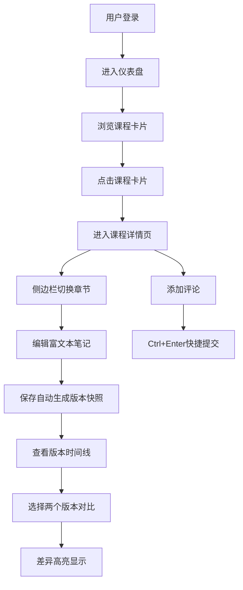

## 1. 产品概述

NoteNest是一款面向教师和学生的在线异步课堂笔记协作应用，支持在不同课程下创建、编辑和评论结构化的课程笔记，笔记支持富文本格式和版本对比功能。

- 核心价值：解决异步教学场景下笔记共享、协作编辑和知识沉淀的痛点
- 目标用户：高校教师、在线课程学习者、教学团队

## 2. 核心功能

### 2.1 用户角色

| 角色 | 说明 | 核心权限 |
|------|------|----------|
| 教师 | 课程创建者和管理者 | 创建课程、管理章节、发布笔记、查看所有版本 |
| 学生 | 课程参与者 | 浏览课程、编辑笔记、添加评论、查看版本历史 |

### 2.2 功能模块

1. **仪表盘页面**：课程卡片网格展示、新建课程入口
2. **课程详情页**：章节侧边栏导航、笔记编辑区、版本历史、评论区
3. **富文本笔记编辑器**：多级标题、有序/无序列表、代码块、图片嵌入
4. **版本管理系统**：自动版本快照、时间线展示、双版本并排差异对比
5. **评论协作系统**：笔记评论、实时展示、快捷键提交

### 2.3 页面详情

| 页面名称 | 模块名称 | 功能描述 |
|-----------|-------------|---------------------|
| Dashboard | 顶部导航栏 | 品牌Logo、新建课程按钮 |
| Dashboard | 课程卡片网格 | 展示课程名、教师名、未读评论数，点击进入详情 |
| 课程详情 | 侧边栏章节列表 | 展示所有章节，状态色条标识更新情况 |
| 课程详情 | 富文本编辑器 | 工具栏+编辑区域，支持多种格式 |
| 课程详情 | 版本时间线 | 竖直时间线展示历史版本 |
| 课程详情 | 版本对比面板 | 并排展示两版差异，增删内容高亮 |
| 课程详情 | 评论区 | 评论列表展示+评论输入框 |

## 3. 核心流程

用户登录后进入仪表盘，查看所有参与的课程。点击课程卡片进入课程详情页，通过左侧侧边栏切换章节，在右侧编辑富文本笔记。每次保存自动生成版本快照，可在底部时间线查看历史版本，选择两个版本进行并排差异对比。用户可在笔记底部添加评论，支持Ctrl+Enter快捷提交。

## 4. 用户界面设计

### 4.1 设计风格

- 主色调：深蓝 `#2c3e50`，点缀亮蓝 `#3498db`
- 辅助色：柔和灰 `#ecf0f1`、浅灰背景 `#f8f9fa`
- 状态色：新增绿 `#d4edda`、删除红 `#f8d7da`
- 按钮风格：圆角8px，平滑过渡0.2s ease，悬停背景变浅
- 卡片风格：圆角8-12px，柔和阴影（0 2px 10px rgba(0,0,0,0.05)），悬停阴影加深
- 字体：正文使用系统字体，代码使用 'Fira Code'
- 布局：桌面端左右分栏，移动端侧边栏收起+汉堡菜单
- 图标：使用 lucide-react 图标库

### 4.2 页面设计概览

| 页面名称 | 模块名称 | UI元素 |
|-----------|-------------|-------------|
| Dashboard | 顶部导航栏 | 高度56px，深蓝背景，左右内边距24px，白色文字 |
| Dashboard | 课程卡片 | 宽280px，圆角12px，白底，柔和阴影，悬停阴影加深过渡0.25s |
| 课程详情 | 侧边栏 | 宽220px，浅灰背景，每章节高48px，左侧色条标识状态 |
| 课程详情 | 编辑器工具栏 | 高40px，浅灰背景，30x30px圆角按钮，悬停高亮 |
| 课程详情 | 版本时间线 | 右侧竖直灰线2px，直径10px圆点节点 |
| 课程详情 | 评论头像 | 40x40px圆形，随机柔和背景色 |
| 课程详情 | 评论输入框 | 圆角8px，聚焦边框变亮蓝 |

### 4.3 响应式

桌面端优先设计，平板和手机端：
- 侧边栏默认收起，左上角汉堡图标（24x24px SVG）滑入显示
- 课程卡片网格自适应列数
- 版本对比面板上下堆叠显示

### 4.4 动画效果

- 页面切换：章节内容淡入（opacity 0→1，0.3s）
- 新评论插入：translateY(-10px)→0，opacity 0→1
- 卡片悬停：阴影加深过渡0.25s ease
- 按钮悬停：背景色过渡0.2s
