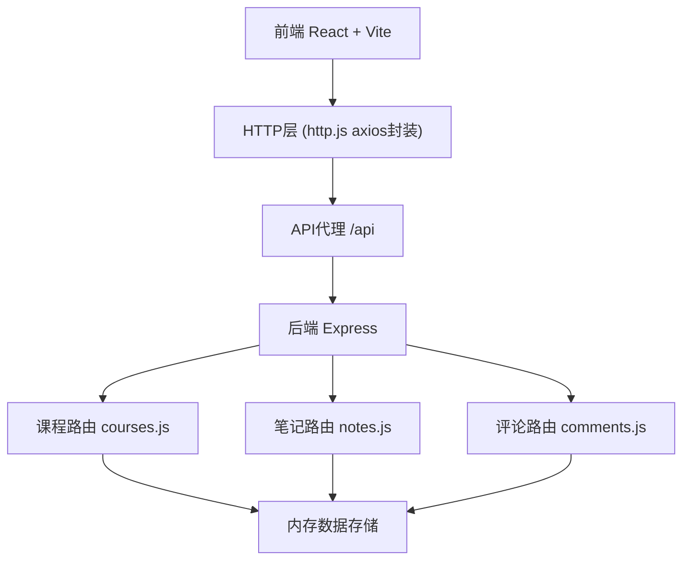
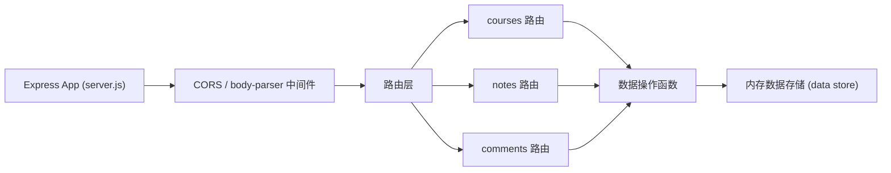

## 1. 架构设计



## 2. 技术描述

- **前端**：React 18 + TypeScript + Vite
- **初始化工具**：vite-init (react-express-ts 模板)
- **后端**：Node.js + Express 4
- **HTTP客户端**：axios (统一封装在 src/http.js)
- **状态管理**：React Context API
- **路由**：react-router-dom
- **图标库**：lucide-react
- **数据存储**：内存存储（开发演示用，uuid生成唯一ID）
- **富文本编辑**：基于 contenteditable 实现轻量富文本编辑器

## 3. 路由定义

| 前端路由 | 用途 |
|-------|---------|
| / | 仪表盘页面，展示课程列表 |
| /course/:id | 课程详情页，笔记编辑+版本+评论 |

## 4. API定义

### 4.1 课程相关API

| 方法 | 路径 | 描述 | 请求/响应 |
|------|------|------|----------|
| GET | /api/courses | 获取用户课程列表 | Response: Course[] |
| GET | /api/courses/:id | 获取单个课程详情 | Response: Course |
| POST | /api/courses | 创建新课程 | Request: {name, teacher} |
| PUT | /api/courses/:id | 更新课程信息 | Request: {name, teacher} |
| DELETE | /api/courses/:id | 删除课程 | Response: {success} |

### 4.2 笔记相关API

| 方法 | 路径 | 描述 | 请求/响应 |
|------|------|------|----------|
| GET | /api/courses/:courseId/chapters | 获取章节列表 | Response: Chapter[] |
| GET | /api/notes/:chapterId | 获取章节笔记（最新版） | Response: Note |
| POST | /api/notes | 创建/保存笔记（自动生成版本） | Request: {chapterId, content} |
| GET | /api/notes/:noteId/versions | 获取笔记版本历史 | Response: NoteVersion[] |
| GET | /api/notes/versions/:versionId | 获取特定版本内容 | Response: NoteVersion |

### 4.3 评论相关API

| 方法 | 路径 | 描述 | 请求/响应 |
|------|------|------|----------|
| GET | /api/notes/:noteId/comments | 获取笔记评论列表 | Response: Comment[] |
| POST | /api/comments | 添加评论 | Request: {noteId, userId, userName, content} |

### 4.4 TypeScript类型定义

```typescript
interface Course {
  id: string;
  name: string;
  teacher: string;
  unreadComments: number;
  chapters: Chapter[];
  createdAt: string;
}

interface Chapter {
  id: string;
  courseId: string;
  name: string;
  order: number;
  hasUpdate: boolean;
}

interface Note {
  id: string;
  chapterId: string;
  content: string;
  currentVersionId: string;
}

interface NoteVersion {
  id: string;
  noteId: string;
  content: string;
  createdAt: string;
  versionNumber: number;
}

interface Comment {
  id: string;
  noteId: string;
  userId: string;
  userName: string;
  content: string;
  createdAt: string;
}
```

## 5. 后端服务架构



## 6. 文件结构

```
项目根目录/
├── package.json
├── index.html
├── vite.config.js
├── tsconfig.json
├── src/
│   ├── App.tsx              (主入口，路由+Context)
│   ├── http.js              (axios封装)
│   ├── index.css            (全局样式)
│   ├── main.tsx             (React入口)
│   ├── pages/
│   │   ├── Dashboard.tsx    (课程列表页)
│   │   └── NoteEditor.tsx   (课程详情+笔记编辑器)
│   ├── components/
│   │   ├── VersionDiffPanel.tsx  (版本对比面板)
│   │   ├── ChapterSidebar.tsx    (章节侧边栏)
│   │   ├── CommentSection.tsx    (评论区)
│   │   └── RichTextEditor.tsx    (富文本编辑器)
│   └── context/
│       └── AppContext.tsx   (全局状态Context)
└── backend/
    ├── server.js            (Express应用入口)
    ├── routes/
    │   ├── courses.js       (课程路由)
    │   ├── notes.js         (笔记路由)
    │   └── comments.js      (评论路由)
    └── store.js             (内存数据存储)
```

## 7. 性能优化策略

- **代码分割**：使用 React.lazy + Suspense 实现路由级代码分割
- **懒加载**：版本对比面板和富文本编辑器按需加载
- **防抖**：笔记自动保存使用防抖机制，避免频繁API调用
- **缓存**：课程列表和笔记内容使用React状态缓存
- **API响应**：后端使用内存存储，确保响应时间 < 200ms
