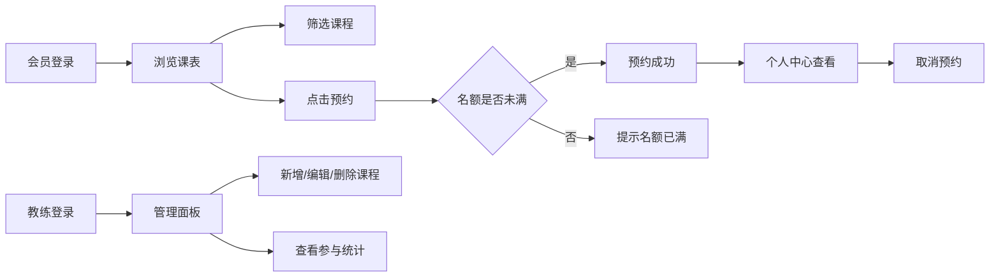

## 1. 产品概述

FitScheduler 是一款面向小型健身工作室的课程预约与个人训练追踪应用，解决会员通过微信群接龙和 Excel 表格管理课程预约效率低下、易出错的问题。

- 目标用户：健身工作室会员（浏览/预约课程、查看训练记录）和教练（发布课程、查看预约统计）
- 核心价值：数字化课程管理、实时预约状态、个人训练数据追踪

## 2. 核心功能

### 2.1 用户角色

| 角色 | 登录方式 | 核心权限 |
|------|----------|----------|
| 会员 | 默认登录（硬编码用户ID） | 浏览课表、预约/取消课程、查看训练记录 |
| 教练 | 硬编码教练ID切换 | 发布/编辑/删除课程、查看参与人数和会员列表 |

### 2.2 功能模块

1. **课表页面**：课程列表展示、类型筛选、教练筛选、预约功能
2. **个人中心**：已预约课程列表、取消预约、训练记录展示
3. **管理面板**：课程增删改、参与人数统计、会员列表查看
4. **全局组件**：顶部导航、Toast 提示、加载状态

### 2.3 页面详情

| 页面名称 | 模块名称 | 功能描述 |
|----------|----------|----------|
| 课表页 | 筛选区 | 按课程类型（瑜伽/力量/HIIT等）和教练筛选，0.3s 过渡动画 |
| 课表页 | 课程网格 | 7行x6列网格布局，展示课程名/时间/教练/剩余名额，点击预约 |
| 课表页 | 预约按钮 | 未满时预约成功，按钮变"已预约"（#4caf50→#ff9800）；满员提示"名额已满" |
| 个人中心 | 预约列表 | 已预约课程展示，取消预约按钮 |
| 个人中心 | 训练记录 | 近30天完成课程，时间倒序，毛玻璃卡片效果 |
| 管理面板 | 课程管理 | 添加/编辑/删除课程（弹窗表单） |
| 管理面板 | 参与统计 | 每门课程参与人数、参与会员表格列表 |

## 3. 核心流程

### 3.1 会员预约流程
会员进入首页 → 浏览本周课表（可选筛选） → 点击课程卡片"预约" → 检查名额 → 预约成功（按钮状态更新）→ 可在个人中心查看/取消

### 3.2 教练管理流程
教练进入管理面板 → 查看课程列表 → 新增/编辑/删除课程 → 查看每门课参与人数和会员名单

## 4. 用户界面设计

### 4.1 设计风格
- **主色调**：渐变背景 #0f0c29 → #302b63 → #24243e（夜场健身房氛围）
- **卡片背景**：#1e1e2e，圆角 16px，阴影 0 8px 32px rgba(0,0,0,0.3)
- **按钮主色**：#4caf50（可预约），#ff9800（已预约）
- **毛玻璃效果**：backdrop-filter: blur(10px)，背景 rgba(255,255,255,0.15)
- **字体**：现代无衬线字体，清晰可读
- **导航栏**：高度 60px，背景 rgba(0,0,0,0.6)，毛玻璃效果

### 4.2 页面设计概览

| 页面名称 | 模块名称 | UI 元素 |
|----------|----------|---------|
| 课表页 | 顶部导航 | 毛玻璃效果，Logo + 导航链接（课表/个人中心/管理面板） |
| 课表页 | 筛选栏 | 类型下拉、教练下拉，横向排列 |
| 课表页 | 课程卡片 | 深色主题，悬停 Y 轴抬升 4px，0.25s ease-out 过渡 |
| 个人中心 | 预约列表 | 卡片式布局，取消按钮带涟漪动画 |
| 个人中心 | 训练记录 | 毛玻璃卡片，时间倒序，卡路里展示 |
| 管理面板 | 课程表单 | 弹窗形式，表单输入，确认/取消按钮 |
| 管理面板 | 参与表格 | 会员列表表格，清晰易读 |

### 4.3 响应式设计
- **移动端**：课程列表单列垂直滚动，卡片宽度 100%
- **平板**：2 列网格布局
- **桌面**：3 列网格布局
- 触摸优化：按钮最小尺寸 44px，适当间距

### 4.4 动效与交互
- 课程卡片悬停：Y 轴抬升 4px，阴影加深
- 筛选切换：0.3s ease 流畅过渡
- 按钮点击：涟漪动画（伪元素实现）
- Toast 提示：从右侧滑入，停留 3 秒后淡出
- 页面切换：平滑过渡效果
