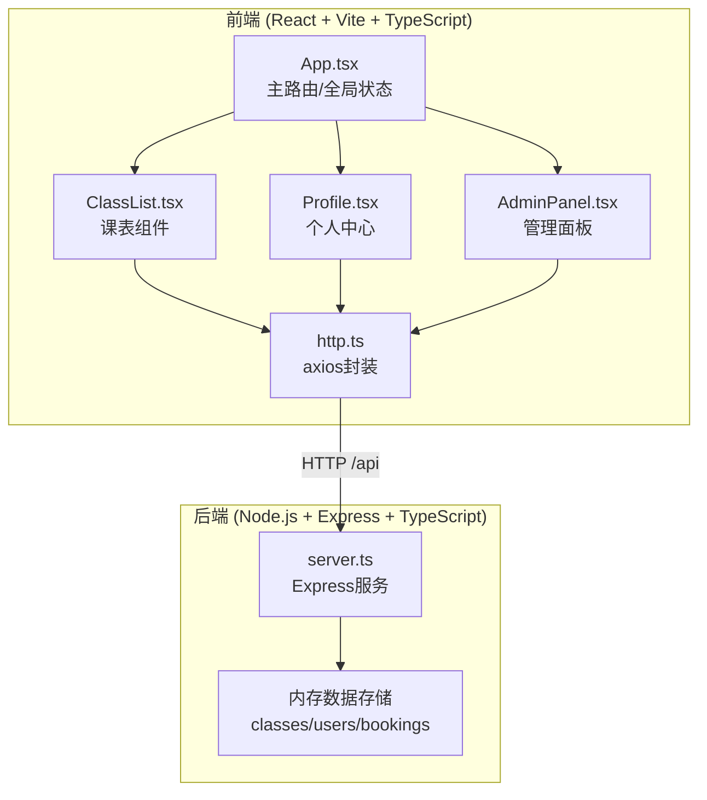
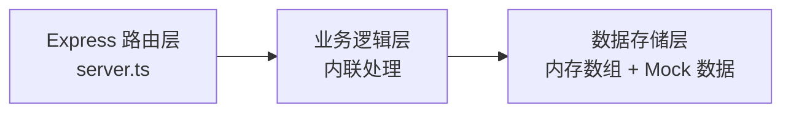
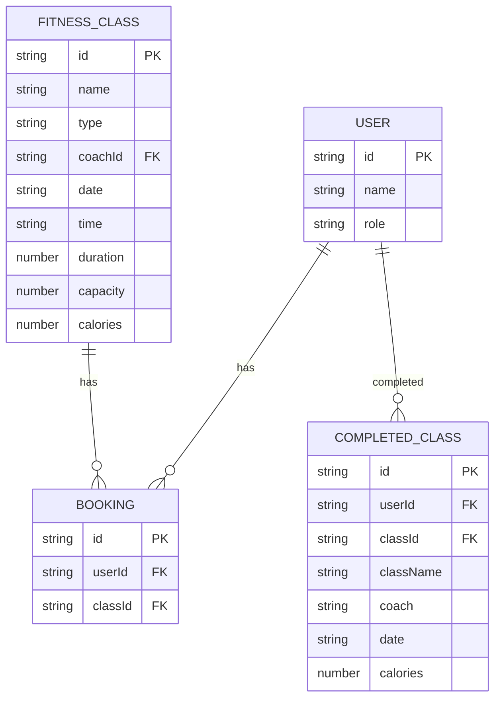

## 1. 架构设计



## 2. 技术选型

- **前端**：React@18 + TypeScript + Vite
- **状态管理**：React useState / useEffect（简单场景，无需额外状态库）
- **HTTP客户端**：axios（封装请求/响应拦截）
- **后端**：Express@4 + TypeScript
- **数据存储**：内存数组（模拟数据，含初始Mock数据）
- **构建工具**：Vite（配置代理转发 /api 请求）
- **样式方案**：原生CSS（CSS Modules），不使用Tailwind（按用户需求）

## 3. 路由定义

| 路由 | 页面/组件 | 用途 |
|------|-----------|------|
| / | ClassList | 课表首页，浏览和预约课程 |
| /profile | Profile | 个人中心，已预约和训练记录 |
| /admin | AdminPanel | 教练管理面板 |

## 4. API 定义

### 4.1 类型定义

```typescript
// 课程类型
interface FitnessClass {
  id: string;
  name: string;
  type: string;       // 瑜伽、力量训练、HIIT等
  coach: string;
  coachId: string;
  date: string;       // YYYY-MM-DD
  time: string;       // HH:mm
  duration: number;   // 分钟
  capacity: number;   // 总名额
  participants: string[];  // 会员ID列表
  calories: number;   // 消耗卡路里估算
}

// 用户类型
interface User {
  id: string;
  name: string;
  role: 'member' | 'coach';
  bookings: string[];     // 预约的课程ID
  completedClasses: CompletedClass[];
}

// 已完成课程记录
interface CompletedClass {
  classId: string;
  className: string;
  coach: string;
  date: string;
  calories: number;
}
```

### 4.2 API 端点

| 方法 | 路径 | 描述 | 请求体 | 响应 |
|------|------|------|--------|------|
| GET | /api/classes | 获取课程列表（支持筛选） | query: type, coach | FitnessClass[] |
| POST | /api/classes | 新增课程（教练） | {name, type, coachId, date, time, duration, capacity, calories} | FitnessClass |
| PUT | /api/classes/:id | 更新课程（教练） | {name, type, date, time, duration, capacity, calories} | FitnessClass |
| DELETE | /api/classes/:id | 删除课程（教练） | - | {success: true} |
| POST | /api/classes/:id/book | 预约课程 | {userId} | {success: true, message} |
| POST | /api/classes/:id/cancel | 取消预约 | {userId} | {success: true} |
| GET | /api/classes/:id/participants | 获取课程参与者列表 | - | {participants: User[]} |
| GET | /api/profile | 获取用户信息（含预约和训练记录） | query: userId | User |

## 5. 后端架构



后端采用简化的单层架构（因项目规模小），所有逻辑在 `server.ts` 中处理，数据以内存数组形式存储。

## 6. 数据模型

### 6.1 ER 图



### 6.2 初始 Mock 数据

- **课程**：生成约 42 节课程（7天 × 6节/天），覆盖瑜伽、力量训练、HIIT、普拉提、动感单车等类型
- **教练**：3-4 名教练
- **会员**：1 名默认会员（user-001），含部分历史训练记录
- **预约**：部分课程已有预约，用于展示满员等状态

## 7. 性能优化

- **虚拟滚动**：课程列表使用虚拟滚动（或分页加载 20 条），确保滚动 FPS ≥ 50
- **首屏加载**：模拟网络延迟 50ms，目标首屏加载 < 800ms
- **缓存策略**：课程列表可短期缓存，减少重复请求
- **响应式优化**：使用 CSS Grid + 媒体查询实现自适应布局
