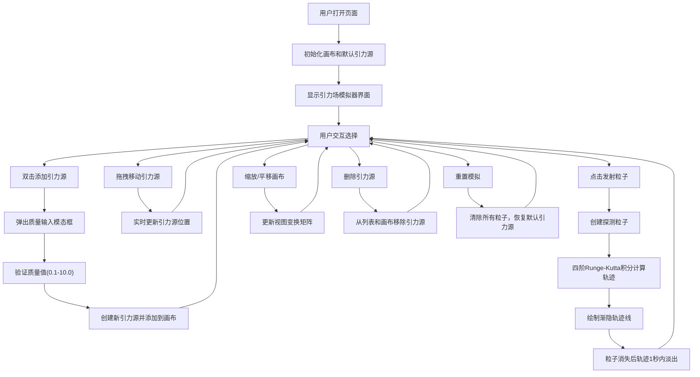

## 1. 产品概述

GravField 是一个基于浏览器的二维引力场模拟器，用户可以通过可视化方式直观地理解引力物理现象。通过在画布上放置不同质量的引力源，发射探测粒子并观察其运动轨迹，将抽象的物理公式转化为生动的视觉体验。

- 核心价值：让物理学习更直观，通过交互式模拟帮助用户理解多体引力系统
- 目标用户：学生、物理爱好者、教育工作者
- 应用场景：物理教学辅助、个人学习探索、科普展示

## 2. 核心功能

### 2.1 用户角色
无角色区分，所有用户享有完整功能权限。

### 2.2 功能模块
1. **主画布区域**：引力场模拟可视化核心区域，展示引力源、粒子及轨迹
2. **引力源管理**：添加、拖拽移动、删除引力源，调节质量参数
3. **粒子系统**：发射探测粒子，实时计算运动轨迹，轨迹渐隐效果
4. **控制面板**：粒子发射按钮、重置按钮、引力源列表管理
5. **视图控制**：鼠标滚轮缩放、拖拽平移画布

### 2.3 页面详情
| 页面名称 | 模块名称 | 功能描述 |
|---------|---------|---------|
| 主页面 | Canvas画布 | 中央显示，背景#0a0a14，占80%视口高度，两侧各留10%空白 |
| 主页面 | 默认引力源 | 质量1.0灰色引力源(#888888，半径20px) + 质量3.0红色引力源(#e74c3c，半径30px) |
| 主页面 | 粒子起点 | 粒子默认起始位置在画布左上角 |
| 主页面 | 双击添加 | 画布空白处双击弹出模态框，输入质量值(0.1-10.0，步长0.1) |
| 主页面 | 引力源拖拽 | 已放置的引力源可鼠标拖拽移动，拖拽时光标grab，释放时default |
| 主页面 | 轨迹绘制 | 半透明线段，颜色从#00d2ff渐变到#ff6b6b，透明度随寿命衰减(每帧-0.002) |
| 主页面 | 控制面板 | 右下角240px宽，背景#161b22，圆角12px，边框1px solid #30363d |
| 主页面 | 发射按钮 | 宽100%，高44px，圆角8px，背景#238636，悬停#2ea043，过渡0.2s ease |
| 主页面 | 重置按钮 | 背景#da3633的重置按钮 |
| 主页面 | 引力源列表 | 每项高36px，显示质量和坐标，右侧36x36px红色圆形删除按钮 |
| 主页面 | 提示文字 | 页面底部居中，半透明白色文字，font-size 14px，opacity 0.6 |
| 主页面 | 悬停效果 | 引力源悬停放大1.2倍并显示质量标签 |
| 主页面 | 缩放平移 | 鼠标滚轮缩放(0.5-2.0范围)，拖拽平移画布 |

## 3. 核心流程

## 4. 用户界面设计

### 4.1 设计风格
- **整体风格**：深色科幻风格，模拟宇宙太空环境
- **主色调**：深空蓝黑色背景 (#0a0a14)
- **强调色**：科技蓝 (#00d2ff)、警示红 (#ff6b6b, #e74c3c)、成功绿 (#238636)
- **辅助色**：灰色引力源 (#888888)、面板背景 (#161b22, #1e1e2e)
- **按钮风格**：圆角矩形，0.2s ease过渡动画，悬停变色
- **字体**：现代无衬线字体，清晰易读
- **布局**：中央画布 + 右下角浮动控制面板
- **动效**：所有交互元素统一0.2s ease过渡

### 4.2 页面设计概述
| 页面名称 | 模块名称 | UI元素 |
|---------|---------|-------|
| 主页面 | Canvas画布 | 全屏背景#0a0a14，中央80%视口高度画布，两侧各10%边距 |
| 主页面 | 引力源 | 圆形，质量越大半径越大、红色越深，悬停放大1.2倍+质量标签 |
| 主页面 | 粒子轨迹 | 渐变色线段(#00d2ff→#ff6b6b)，透明度随时间衰减 |
| 主页面 | 模态框 | 背景#1e1e2e，圆角12px，边框1px solid #333，数值输入框 |
| 主页面 | 控制面板 | 右下角固定，240px宽，阴影效果，包含按钮和列表 |
| 主页面 | 引力源列表 | 竖向排列，每项36px高，左侧质量/坐标，右侧删除按钮 |
| 主页面 | 底部提示 | 居中显示，半透明文字，14px字号 |
| 主页面 | 删除按钮 | 36x36px红色圆形，悬停效果 |

### 4.3 响应性
- 桌面端优先设计
- Canvas画布自适应视口大小
- 控制面板固定右下角位置
- 支持窗口大小变化时重绘画布

### 4.4 性能要求
- 模拟帧率不低于 55fps
- 粒子数量上限 200 个
- 超过粒子上限时自动移除最早发射的粒子
- 使用四阶Runge-Kutta积分保证物理精度
- 轨迹线段渐隐效果通过透明度衰减实现
