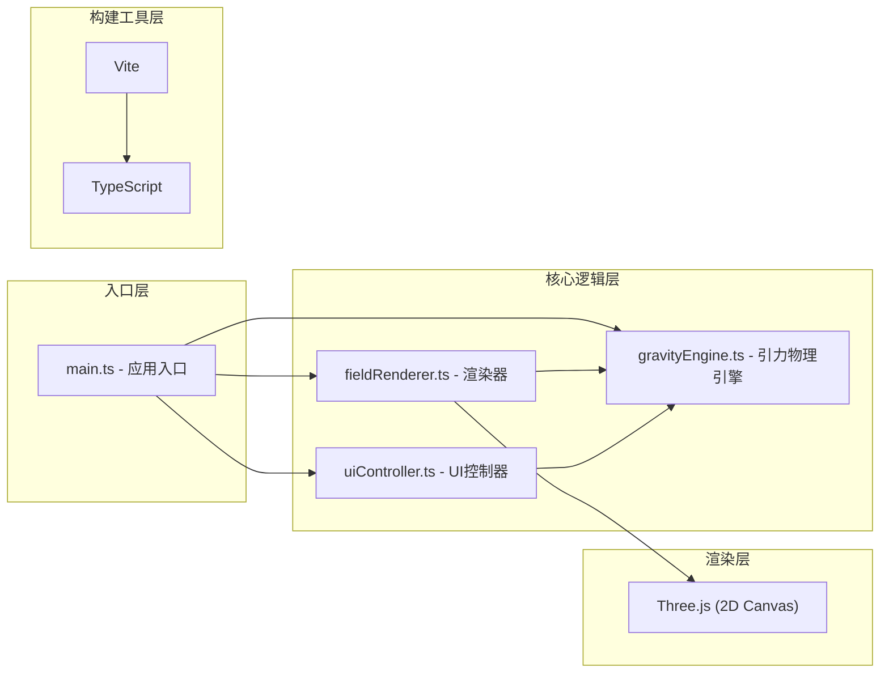

## 1. 架构设计



## 2. 技术描述

- **前端框架**：原生 TypeScript（无前端框架）
- **渲染引擎**：Three.js（使用 2D Canvas 渲染模式）
- **构建工具**：Vite
- **编程语言**：TypeScript（strict: true, target: ES2020）
- **样式**：原生 CSS + CSS 变量
- **物理模拟**：四阶 Runge-Kutta 积分器
- **无后端**：纯前端应用，所有计算在浏览器端完成

## 3. 文件结构

| 文件路径 | 用途说明 |
|---------|---------|
| `package.json` | 项目依赖配置和启动脚本 |
| `index.html` | 入口 HTML 页面，包含 div#app 和 meta viewport |
| `tsconfig.json` | TypeScript 编译配置（strict: true, target: ES2020） |
| `vite.config.js` | Vite 基础配置 |
| `src/main.ts` | 应用入口，初始化画布、粒子系统、UI面板 |
| `src/gravityEngine.ts` | 引力物理引擎，计算引力加速度，四阶RK4积分器 |
| `src/fieldRenderer.ts` | 渲染器，绘制引力源、粒子轨迹、网格背景，绑定鼠标交互 |
| `src/uiController.ts` | UI控制器，创建控制面板元素和事件绑定 |

## 4. 核心数据模型

### 4.1 引力源 (GravitySource)
```typescript
interface GravitySource {
  id: string;
  x: number;
  y: number;
  mass: number;
  radius: number;
  color: string;
}
```

### 4.2 粒子 (Particle)
```typescript
interface Particle {
  id: string;
  x: number;
  y: number;
  vx: number;
  vy: number;
  age: number;
  maxAge: number;
  trail: TrailPoint[];
}
```

### 4.3 轨迹点 (TrailPoint)
```typescript
interface TrailPoint {
  x: number;
  y: number;
  alpha: number;
}
```

## 5. 核心算法

### 5.1 引力计算
- 牛顿万有引力定律：F = G * m1 * m2 / r²
- 引力加速度：a = F / m = G * M / r²
- 软ening因子：避免粒子距离过近时加速度无穷大

### 5.2 四阶Runge-Kutta积分 (RK4)
- k1 = f(tn, yn)
- k2 = f(tn + h/2, yn + h*k1/2)
- k3 = f(tn + h/2, yn + h*k2/2)
- k4 = f(tn + h, yn + h*k3)
- yn+1 = yn + h*(k1 + 2*k2 + 2*k3 + k4)/6

### 5.3 视图变换
- 缩放：鼠标滚轮控制缩放比例（0.5 - 2.0）
- 平移：鼠标拖拽画布实现视口平移
- 坐标转换：屏幕坐标 ↔ 世界坐标

## 6. 性能优化策略

1. **粒子数量限制**：最多200个粒子，超过时移除最早的
2. **轨迹长度限制**：每条轨迹保留有限数量的轨迹点
3. **透明度衰减**：轨迹点透明度随时间衰减，老的轨迹点逐渐消失
4. **帧率控制**：使用 requestAnimationFrame 保证流畅动画
5. **Canvas 优化**：使用 Three.js 的 CanvasRenderer 进行 2D 渲染
6. **对象池**：考虑粒子对象复用（视需要实现）
