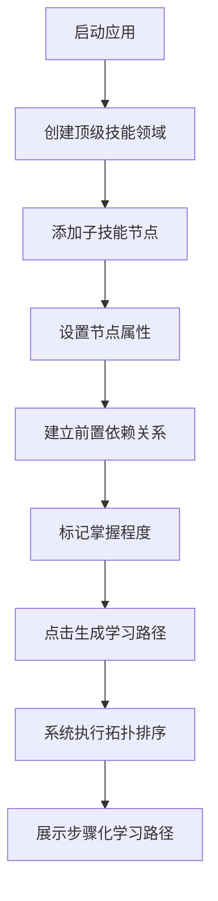

## 1. 产品概述

SkillTrove是一款个人技能树与学习路径规划应用，帮助用户系统化地管理学习目标、可视化技能依赖关系，并基于当前掌握程度智能生成推荐学习路径。面向自学者、开发者和任何希望结构化提升技能的用户。

核心价值：将零散的学习目标转化为结构化的技能树，通过依赖关系分析消除学习路径的困惑。

## 2. 核心功能

### 2.1 用户角色
| 角色 | 注册方式 | 核心权限 |
|------|----------|----------|
| 个人用户 | 无需注册，直接使用 | 创建/编辑/删除技能节点、建立依赖关系、生成学习路径、重置数据 |

### 2.2 功能模块
1. **技能树面板**：可视化展示技能层级树结构，支持无限嵌套，带颜色标识掌握程度
2. **节点编辑面板**：添加、删除、更新技能节点，设置节点属性和依赖关系
3. **学习路径生成器**：基于拓扑排序算法，根据依赖关系和当前掌握程度生成步骤化学习路径

### 2.3 页面详情
| 页面名称 | 模块名称 | 功能描述 |
|-----------|-------------|---------------------|
| 主页面 | 顶部导航栏 | 品牌Logo、一键重置按钮 |
| 主页面 | 技能树面板 | 递归渲染节点树、颜色条标注掌握程度、悬停动效、依赖箭头可视化 |
| 主页面 | 节点编辑面板 | 节点属性表单（名称、描述、掌握程度、预计时长）、添加子节点、建立依赖关系 |
| 主页面 | 学习路径面板 | 生成路径按钮、步骤列表展示、预计耗时统计、前置要求展示 |

## 3. 核心流程

用户启动应用后，从空的技能树开始。首先创建顶级技能领域（如"前端开发"），然后逐层添加子技能节点（如"HTML"→"CSS"→"JavaScript"→"React"）。在相关节点间建立前置依赖关系，标记各节点当前掌握程度。最后点击"生成学习路径"，系统通过拓扑排序输出最优学习序列。

## 4. 用户界面设计

### 4.1 设计风格
- **主色调**：导航栏#2c3e50（深蓝灰），技能树背景#f8f9fa（浅灰白），白色卡片
- **掌握程度色条**：未学习#e0e0e0、学习中#64b5f6（天蓝）、已掌握#81c784（草绿）
- **依赖箭头**：#90a4ae（蓝灰）线宽2px
- **卡片风格**：圆角8px，基础阴影0 1px 3px rgba(0,0,0,0.12)，悬停上移2px加深阴影，过渡0.2s ease
- **字体**：Sans-serif系列，Logo使用粗体白色

### 4.2 页面设计概述
| 页面名称 | 模块名称 | UI元素 |
|-----------|-------------|-------------|
| 主页面 | 导航栏 | 64px高度深色背景、左侧SkillTrove Logo、右侧重置按钮 |
| 主页面 | 技能树面板 | 420px固定宽度、flex布局递归树、缩进层级、白色节点卡片、顶部颜色条、SVG依赖箭头 |
| 主页面 | 编辑/路径面板 | 占据剩余空间、Tab切换编辑模式与路径模式、表单控件、步骤列表 |

### 4.3 响应式
- **桌面端（>768px）**：左右分栏布局，技能树420px固定在左，编辑面板在右
- **移动端（≤768px）**：上下堆叠布局，技能树占全宽在上，编辑面板在下
- **触摸优化**：按钮和可点击区域最小高度44px，适当增加触摸间距

## 5. 性能指标
- 200+节点初始渲染≤500ms
- 增删改操作重渲染延迟<100ms
- 拓扑排序计算响应即时
