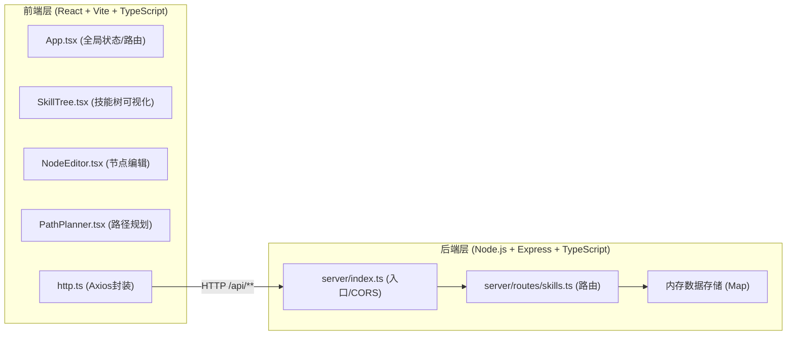
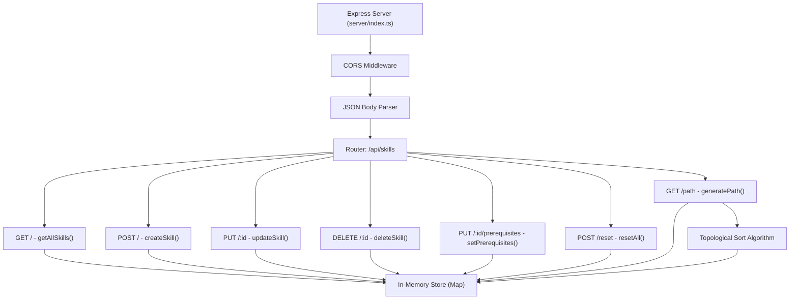
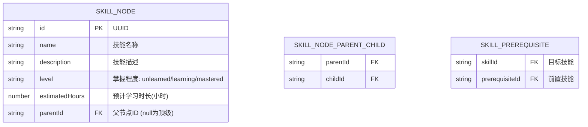

## 1. 架构设计



## 2. 技术描述
- **前端框架**：React@18 + TypeScript@5 + Vite@5
- **前端构建**：Vite + @vitejs/plugin-react
- **后端框架**：Express@4 + TypeScript@5（ts-node运行）
- **HTTP通信**：Axios@1 统一封装，请求/响应拦截
- **状态管理**：React useState/useEffect（轻量级，无需额外库）
- **数据存储**：服务端内存（Map对象，不持久化）
- **唯一ID**：uuid@9
- **跨域处理**：cors@2.8 + Vite代理

## 3. 路由定义
| 路由 | 用途 |
|-------|---------|
| / | 主应用页面（单页应用，所有组件在App内渲染） |

## 4. API 定义

### 4.1 数据类型定义

```typescript
type MasteryLevel = 'unlearned' | 'learning' | 'mastered';

interface SkillNode {
  id: string;
  name: string;
  description: string;
  level: MasteryLevel;
  estimatedHours: number;
  parentId: string | null;
  childrenIds: string[];
  prerequisites: string[];
}

interface LearningStep {
  nodeId: string;
  name: string;
  description: string;
  estimatedHours: number;
  prerequisites: string[];
  prerequisiteNames: string[];
}

interface LearningPath {
  steps: LearningStep[];
  totalHours: number;
  remainingHours: number;
}
```

### 4.2 端点定义

| 方法 | 路径 | 说明 | 请求体 | 响应体 |
|------|------|------|--------|--------|
| GET | /api/skills | 获取所有技能节点 | - | SkillNode[] |
| POST | /api/skills | 创建新节点 | Partial\<SkillNode\> | SkillNode |
| PUT | /api/skills/:id | 更新节点 | Partial\<SkillNode\> | SkillNode |
| DELETE | /api/skills/:id | 删除节点（级联删除子节点） | - | { deleted: string[] } |
| PUT | /api/skills/:id/prerequisites | 更新依赖列表 | { prerequisites: string[] } | SkillNode |
| POST | /api/skills/reset | 重置所有数据 | - | { reset: true } |
| GET | /api/skills/path | 生成学习路径 | - | LearningPath |

## 5. 服务器架构图



## 6. 数据模型

### 6.1 数据模型定义



### 6.2 内存存储结构（TypeScript）

```typescript
// server/routes/skills.ts 内定义
interface Store {
  nodes: Map<string, SkillNode>;
}
let store: Store = { nodes: new Map() };
```

## 7. 项目文件结构

```
auto89/
├── package.json                 # 根依赖（前后端统一）
├── index.html                   # Vite入口HTML
├── vite.config.ts              # Vite配置（代理/api）
├── tsconfig.json               # TS配置（ES2020, 严格模式）
├── src/
│   ├── main.tsx               # React入口
│   ├── App.tsx                # 顶层组件（全局状态/布局）
│   ├── components/
│   │   ├── SkillTree.tsx      # 技能树（递归渲染+SVG箭头）
│   │   ├── NodeEditor.tsx     # 节点编辑面板
│   │   └── PathPlanner.tsx    # 学习路径规划器
│   └── utils/
│       └── http.ts            # Axios实例封装
└── server/
    ├── index.ts               # Express入口
    └── routes/
        └── skills.ts          # /api/skills 路由（含拓扑排序算法）
```

## 8. 启动方式

- **开发命令**：`npm run dev`（需要在 package.json 中配置并发启动 Vite + Express）
- **Vite 端口**：默认 5173
- **Express 端口**：3001（Vite 代理 /api → http://localhost:3001）
