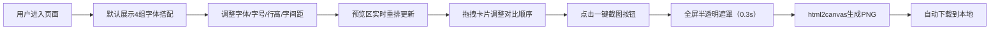

## 1. 产品概述

字体对比工具是一款面向前端开发者和设计师的在线辅助工具，帮助用户在设计阶段快速对比不同字体搭配在真实页面上的视觉效果。
- 解决设计师频繁切换字体组合、手动截图比对效率低的问题
- 直观展示中英文混排时字体对齐和字距差异

## 2. 核心功能

### 2.1 用户角色

| 角色 | 注册方式 | 核心权限 |
|------|----------|----------|
| 前端开发者/设计师 | 无需注册，直接使用 | 字体选择、参数调整、截图对比 |

### 2.2 功能模块

1. **控制面板**：字体预览、字体选择（标题/正文）、字号调整、行高调整、字间距调整、一键截图
2. **预览区域**：4 组字体搭配卡片展示、拖拽重排、悬浮交互

### 2.3 页面详情

| 页面名称 | 模块名称 | 功能描述 |
|----------|----------|----------|
| 主页面 | 字体预览区 | 展示当前选中标题字体的36px"中英混排 AaBbCc"字样，1px虚线边框，圆角8px |
| 主页面 | 字体选择器 | 从内置30种Web安全字体和Google Fonts中选择标题和正文字体组合 |
| 主页面 | 字号滑块 | 12px-48px，步长1px，实时显示当前值（颜色#1e293b） |
| 主页面 | 行高滑块 | 1.0-2.0，步长0.1，实时显示当前值（颜色#475569） |
| 主页面 | 字间距滑块 | -2px到4px，步长0.5px，实时显示当前值（颜色#6366f1） |
| 主页面 | 文本输入框 | 支持用户自定义测试文本，默认使用25字宋词 |
| 主页面 | 截图按钮 | 使用html2canvas截取预览区，自动下载PNG |
| 主页面 | 字体卡片网格 | 4个卡片展示不同字体搭配，支持拖拽排序，悬停上浮效果 |

## 3. 核心流程

用户打开应用 → 默认展示4组字体搭配 → 调整字体/字号/行高/字间距 → 预览区实时更新（60FPS）→ 拖拽卡片调整对比顺序 → 点击截图按钮 → 全屏遮罩（0.3秒）→ 自动下载PNG对比图

## 4. 用户界面设计

### 4.1 设计风格
- 主色调：主题蓝 #3b82f6
- 左侧面板背景：#f8fafc，右侧预览区背景：#ffffff
- 卡片：圆角12px，默认阴影0 2px 8px rgba(0,0,0,0.06)，悬停上浮3px阴影0 8px 24px rgba(0,0,0,0.12)
- 字体名称标签：字号12px，背景#f3f4f6，圆角4px
- 分隔线：1px #e2e8f0

### 4.2 页面设计概览

| 页面名称 | 模块名称 | UI元素 |
|----------|----------|--------|
| 主页面 | 左右分栏布局 | 左320px控制区，剩余宽度预览区，最小宽度900px |
| 主页面 | 控制项布局 | 每项间1px #e2e8f0分隔线，滑块上方显示当前数值 |
| 主页面 | 卡片网格 | 自动折行，卡片380x300px，间距16px，900-1200px时卡片宽300px，低于900px堆叠 |
| 主页面 | 加载动画 | 字体加载时中心扩散环形动画，主题蓝#3b82f6，≤0.8秒 |
| 主页面 | 截图遮罩 | rgba(0,0,0,0.3)全屏半透明，持续0.3秒 |

### 4.3 响应式设计
- 桌面优先（Desktop-first）
- ≥1200px：卡片宽380px
- 900-1200px：卡片宽300px，缩小字号范围
- <900px：卡片垂直堆叠排列
- 所有操作响应≥60FPS，截图生成≤500ms
