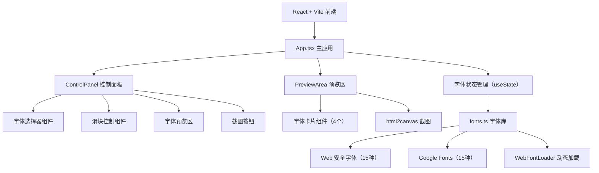

## 1. 架构设计



## 2. 技术描述

- 前端：React@18 + TypeScript + Vite@5
- 构建工具：Vite，target ES2020
- 字体加载：webfontloader
- 截图：html2canvas
- 拖拽：原生 HTML5 Drag and Drop API
- 状态管理：React useState/useCallback（无额外状态库）
- 样式：原生 CSS + CSS 变量，不使用 Tailwind/UI 框架（保持轻量）

## 3. 文件结构

| 文件路径 | 用途 |
|----------|------|
| package.json | 项目依赖与启动脚本 |
| index.html | Vite 入口页面 |
| tsconfig.json | TypeScript 严格模式配置，target ES2020 |
| vite.config.js | Vite + React 插件配置，build target es2020 |
| src/App.tsx | 主应用组件，左右分栏布局，全局状态管理 |
| src/ControlPanel.tsx | 控制面板：字体选择、滑块、预览、截图按钮 |
| src/PreviewArea.tsx | 预览区：4个字体卡片网格、拖拽排序、截图功能 |
| src/fonts.ts | 30种字体列表、字族、分类、加载函数 |
| src/main.tsx | React 应用入口 |
| src/index.css | 全局样式与 CSS 变量 |

## 4. 类型定义

```typescript
interface FontConfig {
  name: string;
  family: string;
  category: 'web-safe' | 'google';
  weights?: number[];
}

interface FontPair {
  title: FontConfig;
  body: FontConfig;
}

interface TextStyle {
  fontSize: number;    // 12-48 px
  lineHeight: number;  // 1.0-2.0
  letterSpacing: number; // -2 到 4 px
}
```

## 5. 性能优化策略

- **字体加载**：使用 WebFontLoader 异步加载 Google Fonts，加载期间显示环形动画（≤0.8s 超时）
- **滑块重排**：使用 requestAnimationFrame 确保 60FPS 渲染，避免闪烁
- **截图优化**：html2canvas 配置 useCORS、scale:2 提高清晰度，限制生成时间 ≤500ms
- **拖拽优化**：使用原生 Drag API，避免高频 setState，拖拽结束后才更新顺序
