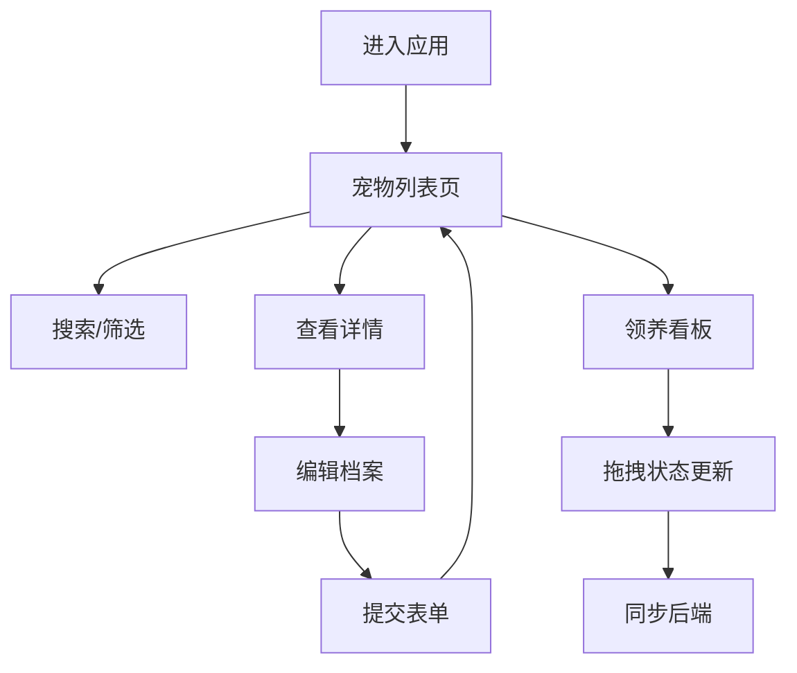

## 1. 产品概述

PetPal 是一款宠物领养信息管理应用，专为宠物收容所员工设计，用于管理待领养宠物档案、记录领养申请状态，并提供领养审核进度看板。通过直观的界面和高效的工作流，帮助收容所提升领养管理效率。

- 目标用户：宠物收容所员工、动物救助组织工作人员
- 核心价值：数字化宠物档案管理、领养流程可视化、工作效率提升

## 2. 核心功能

### 2.1 用户角色

| 角色 | 注册方式 | 核心权限 |
|------|---------|---------|
| 收容所员工 | 系统预设 | 管理宠物档案、处理领养申请、查看看板 |

### 2.2 功能模块

1. **宠物列表页**：卡片网格展示、搜索筛选、分页加载、宠物详情入口
2. **宠物详情页**：照片轮播、性格描述、健康记录、领养历史时间线、编辑功能
3. **宠物档案表单**：新增/编辑宠物信息、照片上传、表单验证
4. **领养申请看板**：三列水槽布局、拖拽状态更新、申请卡片展示

### 2.3 页面详情

| 页面名称 | 模块名称 | 功能描述 |
|---------|---------|---------|
| 宠物列表页 | 卡片网格 | 展示宠物照片、名字、品种、年龄、状态标签，悬停动画效果 |
| 宠物列表页 | 搜索筛选 | 关键词搜索、品种下拉筛选，实时过滤过渡动画 |
| 宠物列表页 | 分页加载 | 每页12张，滚动到底部自动加载下一页 |
| 宠物详情页 | 照片轮播 | 多张照片左右滑动，圆点指示器 |
| 宠物详情页 | 健康记录 | 展示宠物健康信息 |
| 宠物详情页 | 领养历史 | 垂直时间线展示领养记录 |
| 宠物档案表单 | 表单字段 | 宠物名、品种、年龄、性格描述、健康备注、照片上传 |
| 宠物档案表单 | 表单验证 | 必填验证、年龄正整数验证 |
| 宠物档案表单 | 照片上传 | 拖拽/点击上传、预览缩略图、最多5张 |
| 领养看板 | 三列布局 | 待审核、审核中、已领养三列水槽 |
| 领养看板 | 拖拽交互 | 拖拽卡片改变状态，异步更新 |

## 3. 核心流程

### 3.1 宠物档案管理流程

收容所员工登录系统 → 查看宠物列表 → 点击宠物详情 → 编辑/新增宠物档案 → 提交表单 → 返回列表

### 3.2 领养申请处理流程

员工查看领养看板 → 拖拽申请卡片到对应状态列 → 系统自动更新状态 → 实时同步后端

## 4. 用户界面设计

### 4.1 设计风格

- **主色调**：#4a90d9（按钮、链接、选中状态）
- **辅助色**：#f5a623（强调色、标签、通知）
- **背景色**：#f9fafb（页面背景）
- **卡片背景**：#ffffff
- **字体**：系统默认无衬线（-apple-system, 'Segoe UI', Roboto）
- **圆角**：统一8px
- **交互过渡**：0.2s ease

### 4.2 页面设计概览

| 页面名称 | 模块名称 | UI元素 |
|---------|---------|--------|
| 全局 | 顶部导航栏 | 高度56px、白色背景、底部边框、Logo和导航链接、当前页下划线 |
| 宠物列表页 | 卡片网格 | 220px宽卡片、圆角12px、阴影效果、悬停上移动画 |
| 宠物列表页 | 搜索栏 | 左侧搜索框（240px）、右侧品种下拉 |
| 宠物详情页 | 照片轮播 | CSS滑动、圆点指示器 |
| 宠物详情页 | 时间线 | 垂直圆点连接线 |
| 领养看板 | 三列水槽 | 背景#f0f2f5、间距16px、各列不同底色 |

### 4.3 响应式设计

- 桌面端：卡片网格多列布局，最大宽度1200px居中，左右边距24px
- 移动端（<768px）：卡片单列，导航栏变为汉堡菜单，从右向左滑入，半透明遮罩
- 触控优化：增大点击区域，适配触摸操作

### 4.4 动效设计

- 卡片悬停：上移4px、加深阴影、0.25s ease-out
- 列表过滤：透明度0→1、持续0.3s
- 输入框聚焦：边框变主色、0.2s过渡
- 页面切换：平滑过渡动画
