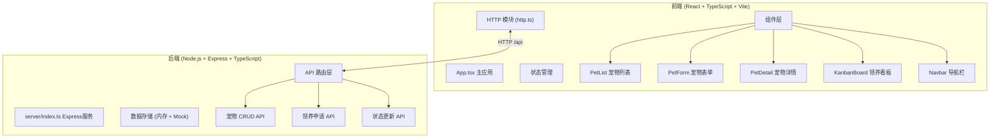
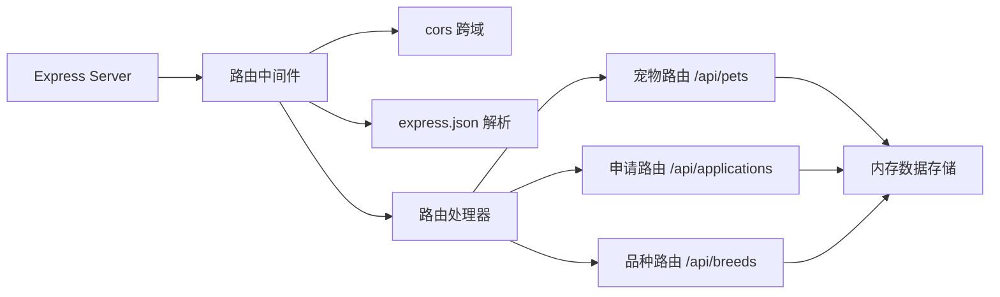

## 1. 架构设计



## 2. 技术选型说明

### 2.1 前端技术栈
- **框架**：React 18 + TypeScript
- **构建工具**：Vite 5
- **HTTP 客户端**：Axios
- **路由**：React Router DOM v6
- **状态管理**：React useState + useContext（轻量级场景）
- **样式方案**：原生 CSS + CSS Modules（按需求自定义设计系统）
- **图标**：Lucide React

### 2.2 后端技术栈
- **运行时**：Node.js
- **框架**：Express 4
- **语言**：TypeScript
- **跨域**：cors 中间件
- **数据存储**：内存数据 + Mock 数据（演示用）

### 2.3 开发工具
- **包管理器**：npm
- **代码规范**：TypeScript 严格模式
- **目标版本**：ES2020

## 3. 项目结构

```
petpal/
├── package.json              # 项目依赖和脚本
├── index.html               # HTML 入口
├── tsconfig.json            # TypeScript 配置
├── vite.config.ts           # Vite 构建配置
├── src/
│   ├── App.tsx              # 主应用组件（路由、状态、导航）
│   ├── main.tsx             # React 入口
│   ├── index.css            # 全局样式
│   ├── http.ts              # 统一 HTTP 请求封装
│   ├── types/               # TypeScript 类型定义
│   │   └── index.ts
│   ├── components/          # 组件目录
│   │   ├── Navbar.tsx       # 顶部导航栏
│   │   ├── PetList.tsx      # 宠物列表
│   │   ├── PetCard.tsx      # 宠物卡片
│   │   ├── PetDetail.tsx    # 宠物详情
│   │   ├── PetForm.tsx      # 宠物表单
│   │   ├── KanbanBoard.tsx  # 领养看板
│   │   ├── KanbanColumn.tsx # 看板列
│   │   └── PhotoUpload.tsx  # 照片上传组件
│   ├── hooks/               # 自定义 Hooks
│   │   ├── usePets.ts       # 宠物数据 Hook
│   │   └── useInfiniteScroll.ts # 无限滚动 Hook
│   └── utils/               # 工具函数
│       └── mockData.ts      # Mock 数据
└── server/
    ├── index.ts             # Express 后端入口
    └── data.ts              # 内存数据存储
```

## 4. 路由定义

| 路由路径 | 页面/组件 | 说明 |
|---------|----------|------|
| `/` | PetList | 宠物列表页（首页） |
| `/pets/:id` | PetDetail | 宠物详情页 |
| `/pets/new` | PetForm | 新增宠物档案 |
| `/pets/:id/edit` | PetForm | 编辑宠物档案 |
| `/kanban` | KanbanBoard | 领养申请看板 |

## 5. API 接口定义

### 5.1 数据类型定义

```typescript
// 宠物状态
type PetStatus = 'pending' | 'reviewing' | 'adopted';

// 宠物档案
interface Pet {
  id: string;
  name: string;
  breed: string;
  age: number;
  description: string;
  healthNotes?: string;
  photos: string[];
  status: PetStatus;
  createdAt: string;
  adoptionHistory: AdoptionRecord[];
}

// 领养记录
interface AdoptionRecord {
  id: string;
  applicantName: string;
  date: string;
  status: PetStatus;
  notes?: string;
}

// 领养申请
interface AdoptionApplication {
  id: string;
  petId: string;
  petName: string;
  applicantName: string;
  applicationDate: string;
  status: PetStatus;
}
```

### 5.2 宠物 API

| 方法 | 路径 | 说明 | 请求体 | 响应 |
|------|------|------|--------|------|
| GET | `/api/pets` | 获取宠物列表（分页） | query: page, limit, search, breed | `{ data: Pet[], total: number, page: number }` |
| GET | `/api/pets/:id` | 获取宠物详情 | - | `Pet` |
| POST | `/api/pets` | 新增宠物 | `Omit<Pet, 'id' | 'createdAt' | 'adoptionHistory'>` | `Pet` |
| PUT | `/api/pets/:id` | 更新宠物 | `Partial<Pet>` | `Pet` |
| DELETE | `/api/pets/:id` | 删除宠物 | - | `{ success: boolean }` |

### 5.3 领养申请 API

| 方法 | 路径 | 说明 | 请求体 | 响应 |
|------|------|------|--------|------|
| GET | `/api/applications` | 获取领养申请列表 | query: status | `AdoptionApplication[]` |
| PATCH | `/api/applications/:id/status` | 更新申请状态 | `{ status: PetStatus }` | `AdoptionApplication` |

### 5.4 品种 API

| 方法 | 路径 | 说明 | 请求体 | 响应 |
|------|------|------|--------|------|
| GET | `/api/breeds` | 获取所有品种列表 | - | `string[]` |

## 6. 服务器架构



## 7. 前端状态管理

### 7.1 状态分层
- **全局状态**：导航状态、Toast 通知（React Context）
- **页面状态**：列表筛选条件、分页状态（组件内 useState）
- **数据状态**：宠物数据、申请数据（通过自定义 Hook 管理 + SWR/缓存）
- **表单状态**：表单值、验证状态（组件内 useState）

### 7.2 HTTP 模块设计
- 基于 axios 封装
- 统一的错误处理
- 请求/响应拦截器
- 基础路径配置（/api）

## 8. 性能优化策略

1. **图片优化**：使用占位图、懒加载、适当尺寸
2. **列表性能**：Intersection Observer 实现无限滚动
3. **组件优化**：React.memo 避免不必要重渲染
4. **构建优化**：Vite 代码分割、Tree Shaking
5. **动画优化**：使用 CSS transform 和 opacity，避免重排重绘
