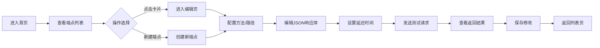

## 1. 产品概述

StubBubble是一款在线API接口模拟与协作标注应用，旨在帮助前端开发者在后端API未就绪时，快速创建返回模拟数据的假端点，加速前后端并行开发进程。

- **核心价值**：解决前后端开发进度不匹配问题，让前端开发者无需等待后端接口就绪即可进行功能开发和联调测试
- **目标用户**：前端开发工程师、全栈开发者、接口测试人员
- **市场定位**：面向开发团队的轻量级API Mock工具，支持团队协作和接口共享

## 2. 核心功能

### 2.1 用户角色

| 角色 | 注册方式 | 核心权限 |
|------|----------|----------|
| 普通用户 | 无需注册，本地使用 | 创建、编辑、删除模拟端点，发送测试请求 |

### 2.2 功能模块

1. **端点管理页**：展示用户创建的模拟端点列表，提供新建入口，支持卡片式网格展示
2. **端点编辑器**：左侧配置面板（方法、路径、状态码、延迟），右侧JSON响应体编辑器，实时预览测试结果
3. **数据持久化**：服务端JSON文件存储，支持CRUD操作和模拟请求处理

### 2.3 页面详情

| 页面名称 | 模块名称 | 功能描述 |
|----------|----------|----------|
| 端点管理页 | 端点卡片网格 | 以卡片形式展示所有模拟端点，显示HTTP方法、路径、最后修改时间，支持点击进入编辑 |
| 端点管理页 | 新建按钮 | 快速创建新的模拟端点，跳转到编辑页面 |
| 端点编辑器 | 配置面板 | 设置HTTP方法（GET/POST/PUT/DELETE）、接口路径、响应状态码、延迟响应时间 |
| 端点编辑器 | JSON编辑器 | 编写和编辑响应体JSON数据，支持语法高亮 |
| 端点编辑器 | 测试请求 | 点击"发送测试"按钮发起实际请求，显示返回的JSON数据和HTTP状态码 |
| 侧边导航栏 | 导航模块 | 显示Logo、"新建端点"按钮，提供页面切换功能 |

## 3. 核心流程

**主要用户流程**：
用户进入应用首页 → 浏览已有模拟端点列表 → 点击卡片进入编辑页 或 点击"新建端点"创建新端点 → 在编辑页配置方法、路径、响应体和延迟 → 点击"发送测试"验证接口 → 保存修改 → 返回列表页查看更新

## 4. 用户界面设计

### 4.1 设计风格

**主题风格**：深色科技风，适合开发者工具场景

- **主色调**：#3498db（蓝色），用于主要按钮、滑块手柄、聚焦边框
- **方法标签色**：GET-#27ae60（绿）、POST-#f39c12（橙）、PUT-#2980b9（蓝）、DELETE-#e74c3c（红）
- **背景色**：#1c1c2a（主背景）、#12121e（导航栏）、#2c2c3a（输入框）
- **文字色**：白色#ffffff、灰色#7f8c8d（辅助文字）
- **字体**：Logo使用Inter（24px粗体），代码使用Fira Code（14px等宽）
- **按钮风格**：圆角8px，背景#3498db，悬停变亮#5dade2，过渡0.2s
- **卡片风格**：圆角12px，悬停时阴影加深并上移4px，过渡0.25s ease
- **JSON语法高亮**：键名#9b59b6（紫）、字符串#27ae60（绿）、数字#e67e22（橙）

### 4.2 页面设计概述

| 页面名称 | 模块名称 | UI元素 |
|----------|----------|--------|
| 端点管理页 | 侧边导航栏 | 宽240px，背景#12121e，Logo白色24px粗体，"新建端点"按钮宽80% |
| 端点管理页 | 卡片网格 | 响应式网格（2-4列），卡片最小宽度320px，悬停动画效果 |
| 端点管理页 | 端点卡片 | 方法彩色标签（圆角4px）、路径等宽字体14px、修改时间灰色相对时间 |
| 端点编辑器 | 双栏布局 | 左右比例45:55，可拖动分隔线（2px宽#2a2a3a） |
| 端点编辑器 | 配置面板 | 方法下拉选择、路径输入框、状态码输入、延迟滑块（0-5000ms） |
| 端点编辑器 | JSON编辑器 | Fira Code字体14px，语法高亮，深色背景 |
| 端点编辑器 | 测试按钮 | 宽100px，高36px，圆角8px，蓝色背景 |

### 4.3 响应式设计

- **设计原则**：Desktop-first，移动端自适应
- **断点**：768px
- **适配规则**：屏幕宽度小于768px时，端点编辑页从左右双栏切换为上下布局；侧边导航栏保持固定宽度
- **触摸优化**：按钮最小点击区域44px，滑块手柄增大触摸面积

### 4.4 性能指标

- 端点列表页：50个端点卡片首次渲染耗时 ≤ 300ms
- 输入响应：路径和JSON编辑器键盘事件响应延迟 ≤ 100ms
